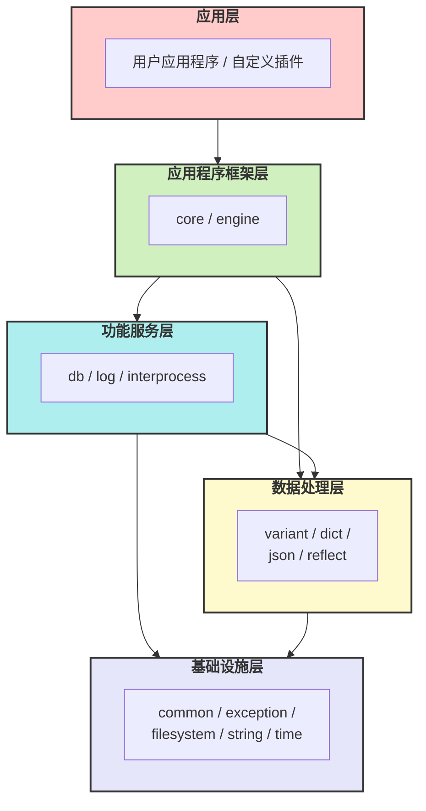
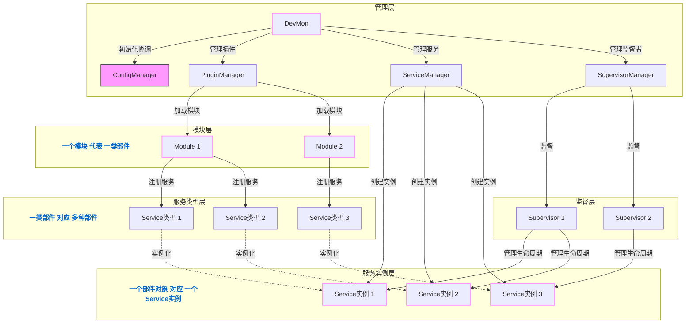

# libmcpp 项目概览

## 1. 项目简介

libmcpp 是一个现代 C++ 开发框架，旨在提供高效、安全、易用的 C++ 开发环境。该框架采用模块化设计，遵循现代 C++ 最佳实践，主要面向嵌入式系统和服务器应用程序开发。框架提供了丰富的基础设施和功能组件，使开发人员能够快速构建可靠的应用程序。

## 2. 核心设计理念

- **安全性优先**：采用 RAII 和智能指针等现代 C++ 技术确保内存安全
- **模块化架构**：通过清晰的模块划分和依赖管理提升代码可维护性
- **高性能**：针对性能关键场景进行优化，确保高效执行
- **跨平台**：支持多种操作系统和硬件平台
- **可扩展性**：插件化架构设计，支持功能扩展

## 3. 模块层次关系

## 4. 主要模块介绍

### 4.1 基础设施层

#### 4.1.1 通用工具（common）

提供基础的通用工具和类型定义，包括：
- 编译器和平台检测宏
- 条件分支预测优化宏
- 拷贝控制类（noncopyable、nonmovable）
- 随机数生成器
- 字节序转换工具
- 类型特性工具

#### 4.1.2 异常处理（exception）

提供统一的异常处理机制，支持：
- 异常层次结构
- 异常信息格式化
- 异常捕获和处理工具

#### 4.1.3 文件系统（filesystem）

文件系统操作封装，提供比 std::filesystem 更丰富的功能：
- 文件和目录操作
- 文件权限管理
- 路径操作和解析
- 文件监控

#### 4.1.4 字符串处理（string）

增强的字符串处理功能：
- 字符串格式化
- 字符串分割和连接
- 字符串转换（大小写、编码等）
- 正则表达式支持

#### 4.1.5 时间工具（time）

时间相关功能：
- 时间点和时间段表示
- 定时器
- 时间格式化
- 时区处理

### 4.2 数据处理层

#### 4.2.1 变体类型（variant）

类似于 std::any 的动态类型，但提供更多功能：
- 支持基本类型和复合类型
- 类型安全的访问接口
- 序列化和反序列化支持
- 类型转换和比较操作

#### 4.2.2 字典类型（dict 和 mutable_dict）

键值对容器，具有以下特性：
- 保持插入顺序
- 支持多种类型的键和值
- 支持嵌套结构
- 高效的查找和迭代
- 共享数据模型（copy-on-write）

#### 4.2.3 JSON 处理（json）

JSON 格式支持：
- JSON 解析和生成
- JSON 模式验证
- 与 variant 和 dict 类型的无缝转换
- 格式化输出

#### 4.2.4 反射系统（reflect）

运行时类型信息和反射功能：
- 类型注册和查询
- 属性访问
- 方法调用
- 序列化支持

### 4.3 进程间通信层（interprocess）

提供进程间通信机制：
- 共享内存
- 互斥锁和读写锁
- 消息队列
- 事件通知

### 4.4 日志系统（log）

灵活的日志记录系统：
- 多级日志
- 多目标输出
- 格式自定义
- 日志过滤
- 结构化日志

### 4.5 数据库系统（db）

基于共享内存的对象数据库：
- 树形结构组织对象
- 多进程共享访问
- 引用计数和生命周期管理
- 事务支持

### 4.6 应用程序框架（core）

模块化的应用程序框架：
- 插件管理
- 服务管理
- 配置管理
- 事件处理
- 依赖注入
- 生命周期管理

### 4.7 引擎框架（engine）

高性能计算引擎：
- 任务调度
- 并行计算
- 资源管理
- 事件驱动

## 5. 设计架构

### 5.1 应用程序架构

libmcpp 采用插件 + 服务的架构设计模式，主要组件包括：

**插件机制原理**：插件（Module）通过动态加载方式注册服务类型，服务类型实例化为具体服务实例，整个过程由管理层协调并通过监督树管理生命周期，实现了组件化、可扩展的系统架构。

工作流程：
1. 应用程序加载配置并初始化
2. 根据配置加载模块
3. 模块注册服务类型
4. 创建监督树并初始化服务
5. 服务启动并运行业务逻辑

### 5.2 数据库架构

基于共享内存的对象数据库系统设计：

- 树形结构组织对象
- 中心化管理进程架构
- 客户端通过 API 访问对象
- 支持对象引用计数和生命周期管理
- 进程崩溃恢复机制

### 5.3 日志系统架构

模块化的日志系统设计：

- LogManager：中央管理器
- Logger：日志记录器
- Appender：日志输出目标
- Formatter：格式化器
- Filter：过滤器

## 6. 开发状态

当前项目处于持续开发中，各模块完成度不同：

- 基础设施层：基本完成
- 数据处理层：基本完成
- 进程间通信层：部分完成
- 日志系统：基本完成
- 数据库系统：开发中
- 应用程序框架：部分完成
- 引擎框架：规划中

## 7. 未来规划

### 7.1 短期计划

- 完善数据库模块功能
- 增强应用程序框架的错误处理
- 提供更多示例和文档

### 7.2 长期规划

- 热插拔支持
- 分布式配置
- 监控和管理接口
- 安全机制增强
- 性能优化

## 8. 总结

libmcpp 项目提供了一套完整的 C++ 开发框架，通过模块化设计和现代 C++ 技术，为开发人员提供了高效、安全、易用的开发环境。该框架适用于各种应用场景，特别是嵌入式系统和服务器应用程序开发。
