# libmcpp 项目概览

## 1. 项目简介

libmcpp 是一个现代 C++ 开发框架，旨在提供高效、安全、易用的 C++ 开发环境。该框架采用模块化设计，遵循现代 C++ 最佳实践，主要面向嵌入式系统和服务器应用程序开发。框架提供了丰富的基础设施和功能组件，使开发人员能够快速构建可靠的应用程序。

## 2. 核心设计理念

- **安全性优先**：采用 RAII 和智能指针等现代 C++ 技术确保内存安全
- **模块化架构**：通过清晰的模块划分和依赖管理提升代码可维护性
- **高性能**：针对性能关键场景进行优化，确保高效执行
- **跨平台**：支持多种操作系统和硬件平台
- **可扩展性**：插件化架构设计，支持功能扩展

## 3. 模块层次关系

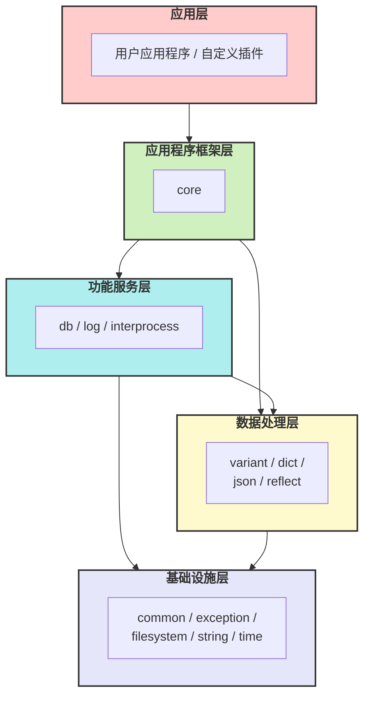

## 4. 主要模块介绍

### 4.1 基础设施层

#### 4.1.1 通用工具（common）

提供基础的通用工具和类型定义，包括：
- 编译器和平台检测宏
- 条件分支预测优化宏
- 拷贝控制类（noncopyable、nonmovable）
- 随机数生成器
- 字节序转换工具
- 类型特性工具

#### 4.1.2 异常处理（exception）

提供统一的异常处理机制，支持：
- 异常层次结构
- 异常信息格式化
- 异常捕获和处理工具

#### 4.1.3 文件系统（filesystem）

文件系统操作封装，提供比 std::filesystem 更丰富的功能：
- 文件和目录操作
- 文件权限管理
- 路径操作和解析
- 文件监控

#### 4.1.4 字符串处理（string）

增强的字符串处理功能：
- 字符串格式化
- 字符串分割和连接
- 字符串转换（大小写、编码等）
- 正则表达式支持

#### 4.1.5 时间工具（time）

时间相关功能：
- 时间点和时间段表示
- 定时器
- 时间格式化
- 时区处理

#### 4.1.6 错误与异常（error / exception / result）

统一的错误与异常建模：
- `mc/exception.h`：异常层次与抛出宏（推荐使用 `MC_THROW`、`MC_MAKE_EXCEPTION`）
- `mc/error.h`、`mc/error_engine.h`：错误码/错误域
- `mc/result.h`：结果类型（携带值或错误），便于无异常场景

#### 4.1.7 并发同步（sync）

轻量级的并发原语封装：
- `mc/sync/small_mutex.h`、`mc/sync/shared_mutex.h`、`mc/sync/mutex_box.h`
- 适配多线程读写与低开销场景

#### 4.1.8 内存与智能指针（memory）

增强的共享对象模型：
- `mc/memory/shared_ptr.h`、`mc/memory/weak_ptr.h`、`mc/memory/shared_base.h`
- 自定义 `mc/memory/allocator.h` 以支持特定内存区域（如共享内存）

#### 4.1.9 I/O 抽象（io）

基础 I/O 缓冲与流：
- `mc/io/io_buffer.h`、`mc/io/io_stream.h`

#### 4.1.10 加密校验（crypto）

常用校验算法：
- `mc/crypto/crc8.h`、`mc/crypto/crc32.h`

### 4.2 数据处理层

#### 4.2.1 variant

类似于 std::any 的动态类型，但提供更多功能：
- 支持基本类型和复合类型
- 类型安全的访问接口
- 序列化和反序列化支持
- 类型转换和比较操作

- 头文件：`mc/variant.h`（聚合）、`mc/variant/variant_base.h`、`mc/variant/variant_common.h`
- 扩展：`mc/variant/variant_dict.inl`、`mc/variant/container_convert.inl`
- I/O 支持：`mc/variant/io.h`
- C 语言接口：`mc/variant_c_api.h`（便于 C 项目集成）

#### 4.2.2 dict

键值对容器，具有以下特性：
- 保持插入顺序
- 支持多种类型的键和值
- 支持嵌套结构
- 高效的查找和迭代
- 共享数据模型（copy-on-write）

- 头文件：`mc/dict.h`（聚合）、`mc/dict/dict.h`、`mc/dict/entry.h`

#### 4.2.3 JSON 处理（json）

JSON 格式支持：
- JSON 解析和生成
- JSON 模式验证
- 与 variant 和 dict 类型的无缝转换
- 格式化输出

- 头文件：`mc/json.h`

#### 4.2.4 反射系统（reflect）

运行时类型信息和反射功能：
- 类型注册和查询
- 属性访问
- 方法调用
- 序列化支持

- 头文件：`mc/reflect.h`（聚合）、`mc/reflect/reflection.h`、`mc/reflect/reflection_factory.h`
- 枚举反射：`mc/reflect/reflection_enum.h`
- 元数据：`mc/reflect/metadata.h`、`mc/reflect/metadata_info.h`

#### 4.2.5 表达式引擎（expr）

轻量表达式解析与执行：
- 词法/语法：`mc/expr/lexer.h`、`mc/expr/parser.h`、`mc/expr/token.h`、`mc/expr/node.h`
- 执行环境：`mc/expr/engine.h`、`mc/expr/context.h`
- 内置函数：`mc/expr/builtin.h`、`mc/expr/function.h`

#### 4.2.6 运行时与任务（runtime / futures）

跨组件的执行与任务模型：
- 运行时：`mc/runtime.h`（聚合）、`mc/runtime/runtime_context.h`、`mc/runtime/any_executor.h`、`mc/runtime/executor.h`
- 立即执行环境：`mc/runtime/immediate_context.h`
- 任务与期物：`mc/future.h`、`mc/futures/state.h`、`mc/futures/status.h`、`mc/futures/exceptions.h`

### 4.3 进程间通信层（interprocess）

提供进程间通信机制：
- 共享内存
- 互斥锁和读写锁
- 消息队列
- 事件通知

- 头文件：`mc/interprocess/shared_memory.h`、`mc/interprocess/shared_memory_manager.h`、`mc/interprocess/shared_memory_allocator.h`
- 指针与同步：`mc/interprocess/offset_ptr.h`、`mc/interprocess/mutex.h`、`mc/interprocess/mutex/*.h`

### 4.4 日志系统（log）

灵活的日志记录系统：
- 多级日志
- 多目标输出
- 格式自定义
- 日志过滤
- 结构化日志

- 头文件：`mc/log.h`（聚合）、`mc/log/log_manager.h`、`mc/log/logger.h`、`mc/log/appender.h`、`mc/log/appender_factory.h`
- 日志级别：`mc/log/log_level.h`
- 日志消息：`mc/log/log_message.h`
- 日志宏：建议使用 `ilog`/`wlog`/`elog` 等统一宏（参见项目规则与 `mc/format.h`）

### 4.5 数据库系统（db）

基于共享内存的对象数据库：
- 树形结构组织对象
- 多进程共享访问
- 引用计数和生命周期管理
- 事务支持

- 头文件：`mc/db/database.h`、`mc/db/table.h`、`mc/db/table_base.h`、`mc/db/table_op.h`
- 键与索引：`mc/db/key.h`、`mc/db/index.h`、`mc/db/index_tag.h`、`mc/db/key_extractor.h`
- 事务与遍历：`mc/db/transaction.h`、`mc/db/iterator.h`

### 4.6 应用程序框架（core）

模块化的应用程序框架：
- 插件管理
- 服务管理
- 配置管理
- 事件处理
- 依赖注入
- 生命周期管理

- 头文件：
  - 应用主体：`mc/core/application.h`
  - 配置：`mc/core/config_manager.h`、`mc/core/config_schema.h`
  - 服务：`mc/core/service.h`、`mc/core/service_factory.h`、`mc/core/service_manager.h`
  - 插件：`mc/core/plugin.h`、`mc/core/plugin_manager.h`
  - 监督：`mc/core/supervisor.h`、`mc/core/supervisor_manager.h`
  - 计时器：`mc/core/timer.h`

### 4.7 模块/插件系统（module / plugin）

提供模块化与插件化能力：
- 运行时加载插件（参见 `docs/3.2.plugin_manager.md`）
- 通过 `mc::core::plugin_manager` 管理插件生命周期
- 通过 `mc::module::module_manager`（独立子系统）支持更细粒度模块加载

- 头文件：`mc/module/module_base.h`、`mc/module/module_manager.h`

### 4.8 DBus 通信（dbus）

系统级通信总线集成：
- 连接与消息：`mc/dbus/connection.h`、`mc/dbus/message.h`
- 错误与校验：`mc/dbus/error.h`、`mc/dbus/validator.h`、`mc/dbus/enums.h`
- 信号：`mc/dbus/signal.h`
- 共享内存支持：`mc/dbus/shm/*`

### 4.9 引擎系统（engine）

反射/服务导向的轻量引擎组件：
- 核心：`mc/engine/engine.h`、`mc/engine/base.h`、`mc/engine/context.h`
- 接口与对象：`mc/engine/interface.h`、`mc/engine/object.h`、`mc/engine/std_interface.h`
- 元数据与属性：`mc/engine/metadata.h`、`mc/engine/property.h`、`mc/engine/property/*`
- 信号：`mc/engine/signal_info.h`
- 调用与工具：`mc/engine/call_stack.h`、`mc/engine/path.h`、`mc/engine/path_iterator.h`、`mc/engine/utils.h`

### 4.10 导出头文件总览

为便于快速引入，项目提供若干聚合头与基础头：
- 聚合头：`mc/variant.h`、`mc/dict.h`、`mc/json.h`、`mc/reflect.h`、`mc/log.h`、`mc/module.h`、`mc/engine.h`、`mc/memory.h`、`mc/runtime.h`
- 基础设施：`mc/filesystem.h`、`mc/string.h`、`mc/time.h`、`mc/format.h`、`mc/traits.h`、`mc/pretty_name.h`、`mc/signal_slot.h`、`mc/singleton.h`、`mc/atomic_ref.h`
- 错误与结果：`mc/error.h`、`mc/error_engine.h`、`mc/exception.h`、`mc/result.h`
- C 语言互操作：`mc/variant_c_api.h`

## 5. 设计架构

### 5.1 应用程序架构

libmcpp 采用插件 + 服务的架构设计模式，主要组件包括：

**插件机制原理**：插件（Module）通过动态加载方式注册服务类型，服务类型实例化为具体服务实例，整个过程由管理层协调并通过监督树管理生命周期，实现了组件化、可扩展的系统架构。

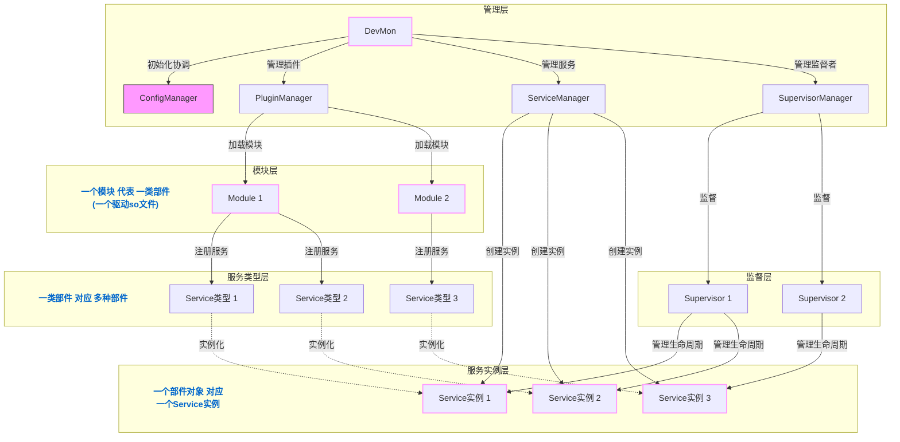

工作流程：
1. 应用程序加载配置并初始化
2. 根据配置加载模块
3. 模块注册服务类型
4. 创建监督树并初始化服务
5. 服务启动并运行业务逻辑

#### 5.1.1 模块层Lua实现

模块层可选择性地使用Lua语言实现，以提高开发效率和降低修改难度：

- **接口定义**：核心系统通过C API导出函数(类似C语言库导出函数)
- **插件注册**：Lua模块通过标准化接口向PluginManager注册
- **服务类型**：使用Lua表描述服务类型，转换为C++服务类型
- **优化策略**：
  - 使用LuaJIT提升性能
  - 预编译Lua字节码减少加载时间
  - 缓存频繁使用的对象避免跨语言调用开销

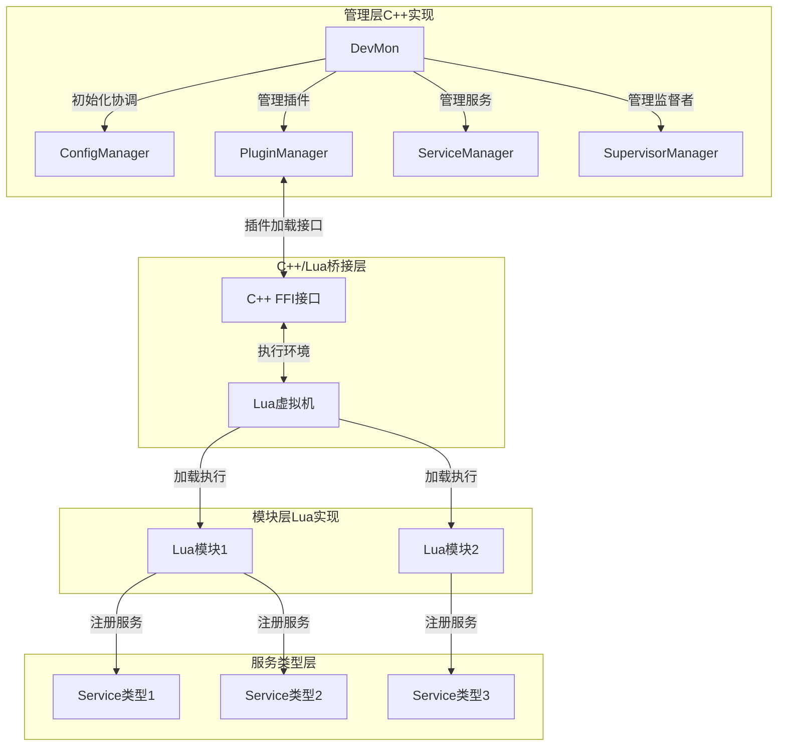

**实际开发范例**：

```lua
-- 模块定义示例 (module1.lua)
local module = {}

-- 注册模块(类似C语言中的模块初始化函数)
function module:register(plugin_manager)
    -- 注册服务类型1
    plugin_manager:register_service({
        name = "service1",
        version = "1.0",
        create = function(config)
            -- 返回服务实例（会被C++层管理）
            return {
                start = function() print("服务1启动") end,
                stop = function() print("服务1停止") end
            }
        end
    })
    
    return true
end

return module
```

该方案保持系统性能的关键是限制Lua仅用于模块定义和配置，而服务实例的核心功能仍由C++实现。

#### 5.1.2 统一插件加载机制

为同时支持C++和Lua两种插件类型，PluginManager采用统一的插件加载机制：

- **插件类型识别**：通过文件扩展名或清单文件识别插件类型
  - `.so`/`.dll`：C++原生插件（类似C语言动态库）
  - `.lua`/`.luac`：Lua脚本插件

- **统一加载接口**：PluginManager提供通用接口加载不同类型插件
```cpp
// 插件加载抽象接口(类似C语言函数指针接口)
class IPluginLoader {
public:
    virtual bool load_plugin(const std::string& path) = 0;
    virtual ~IPluginLoader() = default;
};

// 注册不同类型的插件加载器
void register_plugin_loader(const std::string& ext, std::shared_ptr<IPluginLoader> loader);
```

- **插件加载流程**：
  1. 根据插件路径识别插件类型
  2. 选择相应的插件加载器
  3. 执行插件加载
  4. 注册服务类型
  5. 验证插件依赖和兼容性

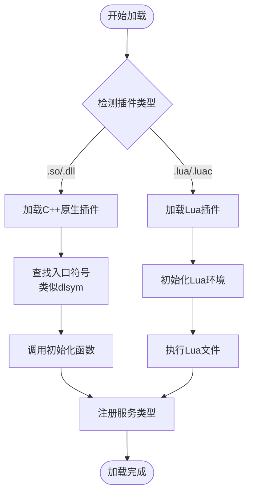

- **插件清单文件**：使用JSON格式的清单文件描述插件元数据
```json
{
  "name": "example_plugin",
  "version": "1.0.0",
  "type": "lua",  // 或 "native"
  "entry": "main.lua",  // 或 "libexample.so"
  "dependencies": [
    {"name": "core", "version": ">=1.0.0"}
  ],
  "services": [
    {"name": "example_service", "version": "1.0.0"}
  ]
}
```

- **混合插件开发**：支持在同一插件中结合C++和Lua
  - C++实现性能关键部分(类似C语言中的性能关键函数)
  - Lua实现业务逻辑和配置部分

这种统一的插件加载机制使开发者可以根据不同模块的特性选择最合适的实现语言，同时保持框架的一致性和可维护性。

#### 5.1.3 技术架构细节

从技术实现层面来看，系统的核心架构体现了驱动模块化和部件对象的组件化设计：

- **驱动so文件**：每个模块实际上是一个动态链接库（.so文件），通过dlopen等系统调用动态加载
- **部件对象组成**：每个部件对象由DDS（Device Description Schema）和CSR（Component Self-Description Record）两个核心组件组成
- **数据流控制**：DDS负责定义部件的接口规范和数据模型，CSR负责存储部件的自描述信息和运行时状态

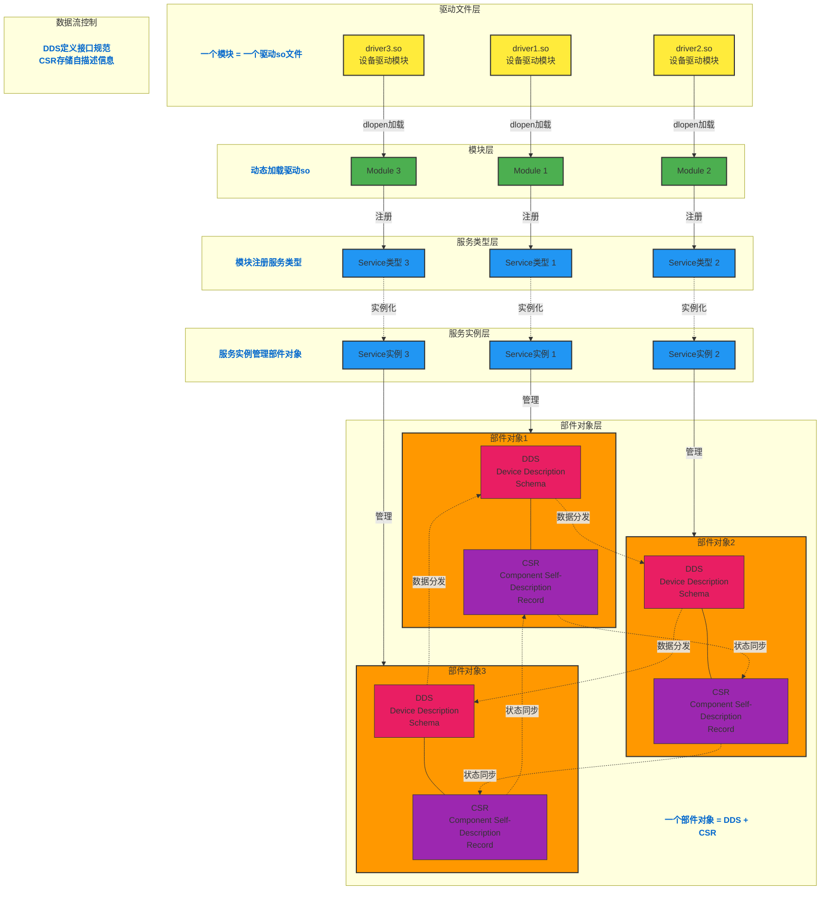

**关键技术特性**：

- **动态模块加载**：通过动态链接库机制实现插件的热加载和卸载
- **组件化部件设计**：
  - DDS组件：定义部件的设备描述规范，包括接口定义、属性声明和方法签名
  - CSR组件：存储部件的自描述记录，包含配置数据、运行时状态和元数据信息
- **服务实例管理**：每个服务实例负责管理一个或多个部件对象的生命周期
- **数据流架构**：
  - 接口规范：通过DDS组件定义部件间的标准化接口契约
  - 状态管理：通过CSR组件实现配置和状态的一致性管理

这种技术架构设计既保证了系统的模块化和可扩展性，又通过标准化的组件接口确保了各部件之间的互操作性。

#### 5.1.4 驱动so文件加载与部件对象管理机制

##### 驱动so文件加载原理

**核心原理概要**

驱动so文件是系统插件化架构的核心载体，采用动态链接技术实现运行时加载。加载机制分为四个关键阶段：

**加载阶段**：PluginManager根据配置文件调用dlopen()系统函数，将so文件加载到进程内存空间，完成符号解析和依赖库链接。

**符号查找阶段**：使用dlsym()定位so文件中的标准导出函数`register_device_driver`，该函数遵循C语言ABI规范（使用extern "C"声明），确保跨编译器兼容。

**注册阶段**：调用注册函数获取`device_driver_t`结构体数组，包含设备名称、路径模板及四个生命周期函数指针（ctor、init、start、stop），并将其注册到ServiceFactory作为对象创建工厂。

**实例化阶段**：ConfigManager解析配置后，按设备名称匹配驱动，调用ctor创建C++对象实例，调用init传入CSR配置数据完成初始化，最后调用start启动服务。

关键技术包括：符号可见性控制防止名称修饰、RTLD_NOW标志立即解析依赖、ABI稳定性保证版本兼容、句柄管理确保正确卸载。一个so文件可注册多种设备类型，每种类型可创建多个实例，DDS代码段在实例间共享，CSR数据独立存储，实现高效的内存利用。

**详细技术说明**

驱动so文件（共享对象文件）是系统实现插件化架构的核心载体，通过动态链接技术实现运行时加载和卸载。整个加载机制遵循以下技术原理：

**1. 动态加载技术栈**

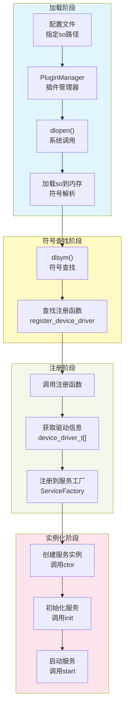

**2. 驱动so文件结构**

每个驱动so文件必须遵循标准的ABI（Application Binary Interface）定义，包含以下关键组件：

```cpp
// 驱动ABI核心结构
typedef struct device_driver {
    const char*        device_name;   // 设备类型名称
    const char*        path_pattern;  // 对象路径模板
    const driver_ctor  ctor;          // 构造函数：创建对象实例
    const driver_init  init;          // 初始化函数：配置对象
    const driver_start start;         // 启动函数：启动服务
    const driver_stop  stop;          // 停止函数：停止服务
} device_driver_t;

// 驱动导出函数（每个so文件必须实现）
extern "C" {
    status_t register_device_driver(
        device_driver_t** device_drivers,  // 输出：驱动数组
        uint8_t*          count            // 输出：驱动数量
    );
}
```

**3. 加载流程详解**

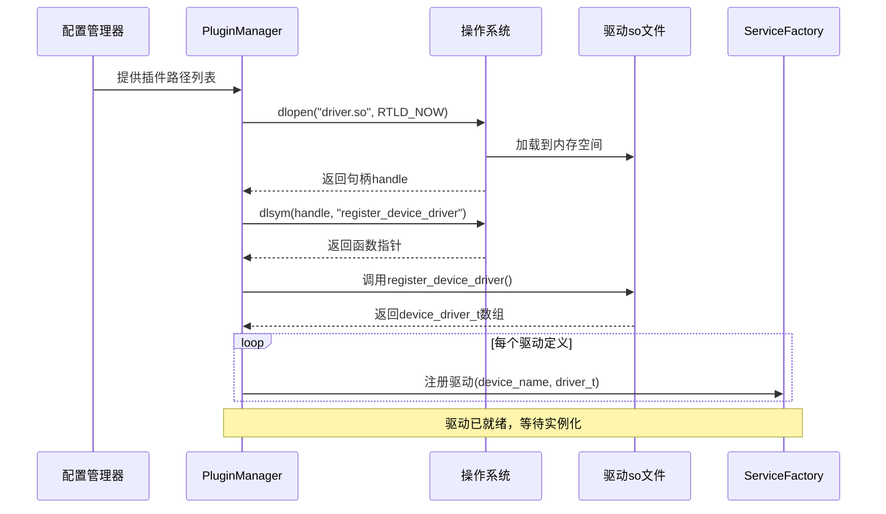

**4. 关键技术要点**

- **符号可见性**：使用`extern "C"`确保C++符号不被名称修饰(name mangling)
- **RTLD标志**：使用`RTLD_NOW`立即解析所有符号，确保加载时发现依赖问题
- **版本兼容性**：通过ABI稳定性保证不同编译器生成的so文件可互操作
- **生命周期管理**：PluginManager持有so句柄，确保卸载时正确调用dlclose()

##### 部件对象管理机制

**规范维度概要**

部件驱动管理建立在三层标准化规范之上：

**接口规范层**：通过DDS（Device Description Schema）定义部件的标准化接口契约，使用MC_INTERFACE宏声明接口元数据，MC_REFLECT宏实现属性反射，确保编译时类型安全和运行时元数据可访问性。

**数据规范层**：通过CSR（Component Self-Description Record）建立统一的部件自描述数据模型，采用mc::dict键值对结构存储，支持嵌套层次和动态扩展，实现配置数据的序列化、持久化和跨进程共享。

**生命周期规范层**：定义标准化的驱动ABI（Application Binary Interface），规定ctor/init/start/stop四阶段生命周期函数签名，由Supervisor实施监督策略，确保部件对象从创建到销毁的全过程可控可追溯。

三层规范协同工作：DDS定义"做什么"（接口契约），CSR存储"是什么"（状态数据），生命周期管理"怎么做"（执行过程），形成完整的部件管理标准体系，支撑多厂商驱动的即插即用和跨平台兼容。

**详细技术说明**

部件对象是系统中硬件设备的软件抽象表示，采用**DDS（Device Description Schema）+ CSR（Component Self-Description Record）**双组件架构实现统一管理。

**1. 部件对象组成结构**

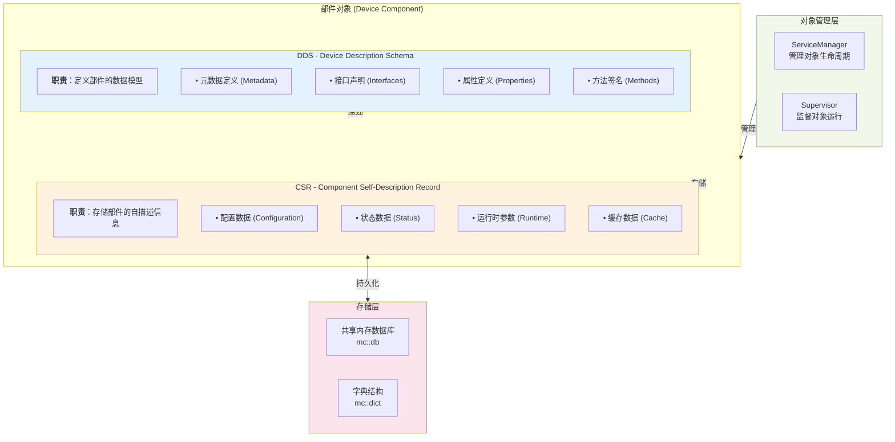

**2. DDS与CSR协同工作机制**

| 组件 | 核心职责 | 数据类型 | 存储位置 | 生命周期 |
|------|----------|----------|----------|----------|
| **DDS** | 定义部件的"是什么"<br/>（What it is） | 静态元数据<br/>接口定义<br/>类型信息 | 代码段<br/>（编译时确定） | 与驱动so生命周期一致 |
| **CSR** | 记录部件的"当前状态"<br/>（What it has） | 动态配置<br/>运行时状态<br/>实时数据 | 共享内存<br/>mc::dict结构 | 与服务实例生命周期一致 |

**3. 部件对象完整生命周期**

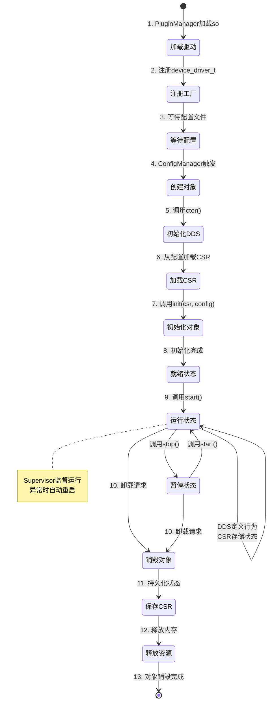

**4. DDS技术实现示例**

DDS通过C++类定义和反射宏实现：

```cpp
// DDS示例：网卡设备的元数据定义
class NetworkAdapter : public mc::engine::interface {
public:
    // 接口元数据声明
    MC_INTERFACE(NetworkAdapter, "NetworkAdapter", "1.0.0")
    
    // 属性定义（DDS规范）
    MC_REFLECT(
        NetworkAdapter,
        (std::string, DeviceName),      // 设备名称
        (std::string, MACAddress),      // MAC地址
        (uint32_t,    LinkSpeed),       // 链路速度
        (std::string, FirmwareVersion)  // 固件版本
    )
    
    // 方法声明（DDS接口）
    virtual bool ResetDevice() = 0;
    virtual bool UpdateFirmware(const std::string& path) = 0;
};
```

**5. CSR技术实现示例**

CSR使用mc::dict动态字典存储：

```cpp
// CSR示例：运行时配置和状态数据
mc::mutable_dict csr_object = {
    // 配置数据（Configuration）
    {"DeviceName", "eth0"},
    {"MACAddress", "00:11:22:33:44:55"},
    
    // 状态数据（Status）
    {"LinkSpeed", 10000},           // 当前链路速度 10Gbps
    {"LinkStatus", "Up"},           // 链路状态
    {"FirmwareVersion", "1.2.3"},
    
    // 运行时数据（Runtime）
    {"Temperature", 45.5},          // 当前温度
    {"PacketsReceived", 1234567},   // 接收包数
    {"PacketsTransmitted", 987654}, // 发送包数
    
    // 动态子对象（嵌套CSR）
    {"Ports", {
        {{"PortId", 0}, {"Status", "Active"}},
        {{"PortId", 1}, {"Status", "Inactive"}}
    }}
};
```

**6. 从驱动so到部件对象实例的完整流程**

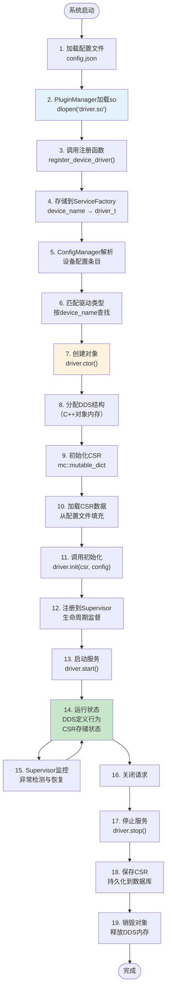

**7. 多实例管理机制**

一个驱动so文件可以创建多个部件对象实例，每个实例拥有独立的CSR：

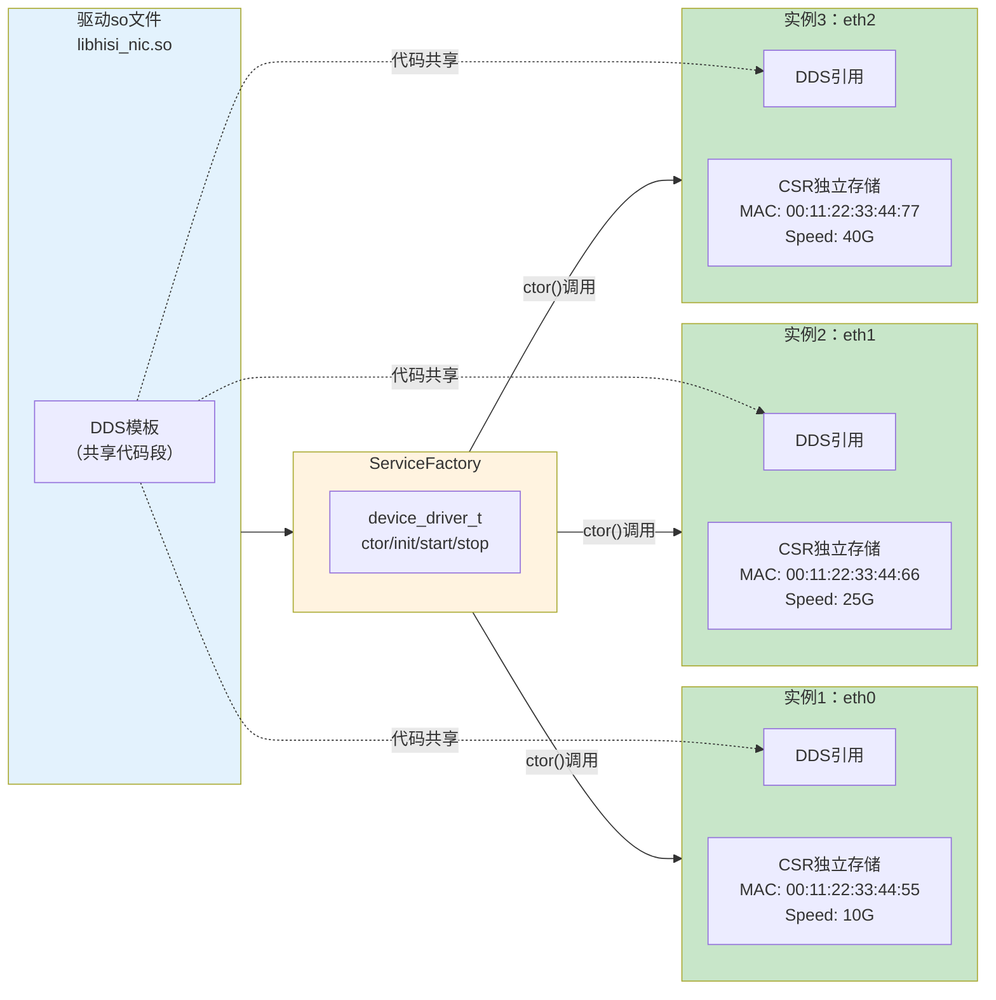

**8. 关键优势总结**

| 特性 | DDS组件 | CSR组件 | 协同效果 |
|------|---------|---------|----------|
| **代码复用** | 多实例共享DDS定义 | 每实例独立CSR数据 | 内存高效利用 |
| **类型安全** | 编译时类型检查 | 运行时动态类型 | 灵活且安全 |
| **可扩展性** | 接口继承与组合 | 字典嵌套结构 | 支持复杂设备 |
| **热更新** | DDS需重新加载so | CSR支持动态修改 | 部分热更新能力 |
| **持久化** | 无需持久化（代码） | 可持久化到数据库 | 状态可恢复 |
| **跨进程** | 通过共享内存共享代码 | 通过mc::db共享数据 | 多进程协同 |

这种DDS+CSR的双组件架构充分体现了"数据与行为分离"的设计哲学，既保证了系统的高性能和类型安全，又提供了灵活的配置管理和状态持久化能力，是实现复杂硬件设备管理的理想架构模式。

### 5.2 数据库架构

基于共享内存的对象数据库系统设计：

- 树形结构组织对象
- 中心化管理进程架构
- 客户端通过 API 访问对象
- 支持对象引用计数和生命周期管理
- 进程崩溃恢复机制

### 5.3 日志系统架构

模块化的日志系统设计：

- LogManager：中央管理器
- Logger：日志记录器
- Appender：日志输出目标
- Formatter：格式化器
- Filter：过滤器

## 6. 开发状态

当前项目处于持续开发中，各模块完成度不同：

- 基础设施层：基本完成
- 数据处理层：基本完成
- 进程间通信层：部分完成
- 日志系统：基本完成
- 数据库系统：开发中
- 应用程序框架：部分完成
- 引擎框架：部分完成

## 7. 未来规划

### 7.1 短期计划

- 完善数据库模块功能
- 增强应用程序框架的错误处理
- 提供更多示例和文档

### 7.2 长期规划

- 热插拔支持
- 分布式配置
- 监控和管理接口
- 安全机制增强
- 性能优化

## 8. 总结

libmcpp 项目提供了一套完整的 C++ 开发框架，通过模块化设计和现代 C++ 技术，为开发人员提供了高效、安全、易用的开发环境。该框架适用于各种应用场景，特别是嵌入式系统和服务器应用程序开发。
