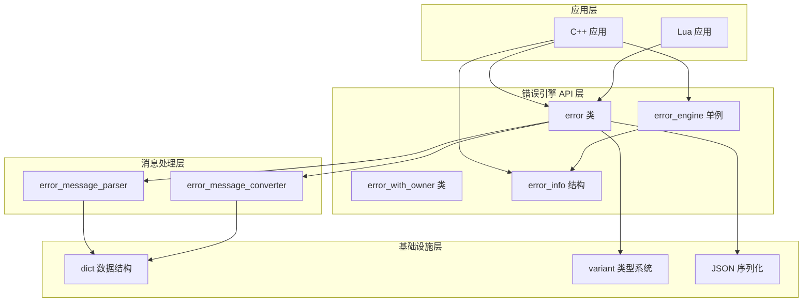

# 错误引擎设计文档

## 1. 概述

错误引擎（error_engine）是 libmcpp 提供的统一错误处理框架，旨在为 C++ 和 Lua 应用提供一致、灵活的错误定义、创建、传递和处理机制。该框架支持错误定义与代码分离、动态加载和本地化，同时提供丰富的错误信息和序列化能力。

## 2. 设计目标

- **统一性**：为 C++ 和 Lua 提供统一的错误处理机制
- **灵活性**：支持命名参数和位置参数两种格式
- **可扩展性**：支持动态错误定义和本地化
- **信息丰富**：提供详细的错误信息、调用栈和序列化能力
- **易用性**：提供简单易用的 API，简化错误的创建和处理
- **性能**：最小化错误处理对性能的影响

## 3. 核心组件

### 3.1 错误信息三层架构

错误引擎采用三层架构设计，从轻量级到完整功能：

**error_info** - 轻量级错误信息结构

```cpp
struct error_info {
    std::string_view name;      // 错误名称
    std::string_view format;    // 格式字符串
    error_level level;          // 错误级别

    bool is_valid();
    bool operator==(const error_info& other) const;
};
```

**error** - 完整错误对象

```cpp
struct error : public mc::enable_shared_from_this<error>, public error_info {
    mc::dict args;                       // 错误参数
    std::string registry_prefix;         // 注册表前缀
    mc::shared_ptr<error> prev_error;    // 前一个错误

    // 参数管理
    template <typename T>
    error& operator()(std::string_view key, T&& value);

    // 序列化
    std::string encode(...) const;
    static mc::shared_ptr<error> decode(...);

    // 调用栈
    void traceback();
    const std::string& get_traceback() const noexcept;

    // 消息格式化（懒加载）
    std::string get_message() const;

    // 异常集成
    static mc::shared_ptr<error> from_exception(...);
    [[noreturn]] void raise() const;
};
```

**error_with_owner** - 持有所有权的错误类

```cpp
class error_with_owner : public error {
public:
    error_with_owner(std::string name, std::string format);
};
```

### 3.2 错误引擎单例

```cpp
class error_engine : public mc::noncopyable_nonmovable {
public:
    static error_engine& get_instance();

    // 错误注册
    error_info register_const_error(...);
    error_info register_error(...);

    // 错误查询
    error_info get_error_info(std::string_view name);
    bool is_registered(std::string_view name);

    // 错误报告
    error_ptr report_error(...);
    error_ptr last_error();
    void reset_error();
};
```

### 3.3 消息解析器和转换器

**error_message_parser** - 消息格式化

- 支持 `${key}` 格式的命名参数
- 支持 `%1`, `%2` 格式的位置参数
- 懒加载机制，只在首次调用时格式化

**error_message_converter** - 消息转换和本地化

- 从 JSON 文件加载错误定义
- 支持基础定义和自定义定义的合并
- 提供消息 ID、严重级别等元信息

## 4. 架构设计



## 5. 关键设计决策

### 5.1 字符串生命周期管理

**决策**：`error_info` 使用 `std::string_view`，`error` 内部持有字符串副本

**理由**：

1. `error_info` 的轻量级设计
   - 主要用于错误传递和查询
   - 使用 `string_view` 避免字符串复制
   - 适用于短生命周期的场景

2. `error` 的所有权保证
   - 完整错误对象，生命周期可能很长
   - 内部持有字符串副本（`m_name_storage`, `m_format_storage`）
   - 避免悬垂引用问题

**权衡分析**：

| 方案 | 优点 | 缺点 |
|------|------|------|
| error_info 使用 string_view | 零拷贝，性能高 | 需要确保原始字符串生命周期 |
| error 持有字符串副本 | 生命周期安全，易于使用 | 有一次内存复制开销 |

### 5.2 懒加载消息格式化

**决策**：`get_message()` 采用懒加载，只在首次调用时格式化并缓存结果

**理由**：

1. 性能优化
   - 不是所有错误都需要格式化消息
   - 避免不必要的字符串操作
   - 减少内存分配

2. 缓存机制
   - 首次调用时格式化并缓存
   - 后续调用直接返回缓存
   - 参数变化时清除缓存

**实现**：

```cpp
class error {
    mutable std::optional<std::string> m_cached_message;

    std::string get_message() const {
        if (m_cached_message.has_value()) {
            return m_cached_message.value();
        }

        std::string formatted = format_message();
        m_cached_message = formatted;
        return formatted;
    }

    void invalidate_cache() {
        m_cached_message.reset();
    }
};
```

### 5.3 占位符转换机制

**决策**：支持两种占位符格式，并在内部统一处理

**支持的格式**：

1. 命名参数 - `${key}`
   - 可读性好，便于维护
   - 适用于大多数场景

2. 位置参数 - `%1`, `%2`
   - 与 printf 风格兼容
   - 适用于简单的位置替换

## 6. 关键实现

### 6.1 参数后处理

**目的**：将命名参数映射为位置索引，支持特定场景需求

**实现**：

```cpp
void error::post_process(const mc::dict& param_struct) {
    // param_struct 格式: {1: {name: "username"}, 2: {name: "age"}}
    // 将 args 中的参数名替换为位置索引

    for (const auto& entry : args) {
        std::string param_name = extract_param_name(entry.value);
        int pos = find_param_index(param_name, param_struct);

        if (pos >= 0) {
            new_args[pos] = extract_value(entry.value);
        }
    }

    args = new_args;
}
```

### 6.2 JSON 序列化

**支持的格式**：

```json
{
  "name": "error_name",
  "message": "格式化后的消息",
  "format": "原始格式字符串",
  "params": {
    "key1": "value1",
    "key2": "value2"
  },
  "registry_prefix": "前缀",
  "traceback": "调用栈信息"
}
```

### 6.3 异常集成

**与 C++ 异常集成**：

```cpp
// 从异常创建错误
auto err = mc::error::from_exception(std::current_exception());

// 将错误转换为异常
mc::exception ex;
err.to_exception(ex);

// 直接抛出异常
err.raise();  // 抛出 mc::error_exception
```

### 6.4 Lua 绑定

**设计要点**：

1. userdata 封装
   - 使用 `error_wrapper` 封装 `mc::error_ptr`
   - 通过 metatable 提供方法和属性访问

2. uservalue 机制
   - 额外字段存储在 uservalue 中
   - 不影响核心错误对象

3. 自动类型转换
   - Lua table 自动转换为 `mc::dict`
   - 支持数组和键值对两种格式

## 7. 使用场景

### 7.1 基本错误处理

```cpp
// 创建错误
auto err = mc::make_error("file_not_found", "文件 ${path} 不存在");
err("path", "/etc/config");

// 获取格式化消息
std::string msg = err.get_message();

// 序列化
std::string json = err.encode();
```

### 7.2 错误注册

```cpp
// 在初始化时注册错误
REGISTER_CONST_ERROR(FILE_NOT_FOUND, "file_not_found",
                     "文件 ${path} 不存在");

// 使用已注册的错误
auto err = mc::make_error(FILE_NOT_FOUND);
err("path", "/etc/config");
```

### 7.3 异常安全

```cpp
try {
    if (error_condition) {
        mc::error err("error", "操作失败");
        err.raise();
    }
} catch (const mc::error_exception& e) {
    auto err = mc::error::from_exception(e);
    std::cout << err->get_message() << std::endl;
}
```

### 7.4 Lua 互操作

```cpp
// C++ 创建错误
auto err = mc::make_error("error", "C++ 错误");
err("code", 100);

// 传递给 Lua
mc::lua::error::push_error(L, err);
```

```lua
-- Lua 中使用
local err = ...  -- C++ 传递的错误
print(err.name)
print(err.message)
```

## 8. 性能考虑

- 错误应该只用于真正的错误情况，不应该用于正常的控制流
- 懒加载机制避免了不必要的格式化开销
- 写时复制减少了参数传递时的内存复制
- 在性能关键的代码中，可以考虑使用 `error_info` 代替完整的 `error` 对象

## 9. 线程安全性

- `error` 对象本身不是线程安全的，需要在应用层同步
- `error_engine` 单例本身是线程安全的
- `last_error` 使用 thread_local，每个线程独立，无锁设计

## 10. 错误定义格式

### 10.1 JSON 格式定义

```json
{
  "errors": {
    "error_name": {
      "format": "错误格式字符串 ${param}",
      "message_id": "MSG001",
      "message_name": "Error Display Name",
      "message": "Localized error message: ${param}",
      "severity": "error"
    }
  }
}
```

### 10.2 命名规范

- 错误名称：使用小写字母和下划线，如 `file_not_found`
- 参数名称：使用小写字母和下划线，如 `file_path`
- 消息 ID：大写字母和下划线，如 `FILE_NOT_FOUND`

## 11. 与其他模块的集成

### 11.1 异常模块

错误引擎与异常模块紧密集成，支持从异常创建错误对象，也可以将错误对象转换为异常。

### 11.2 日志模块

错误对象可以转换为日志消息格式，便于记录到日志系统中。

### 11.3 JSON 模块

错误对象支持 JSON 序列化和反序列化，便于网络传输和持久化存储。
