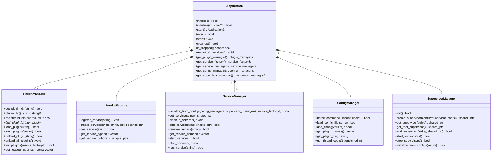
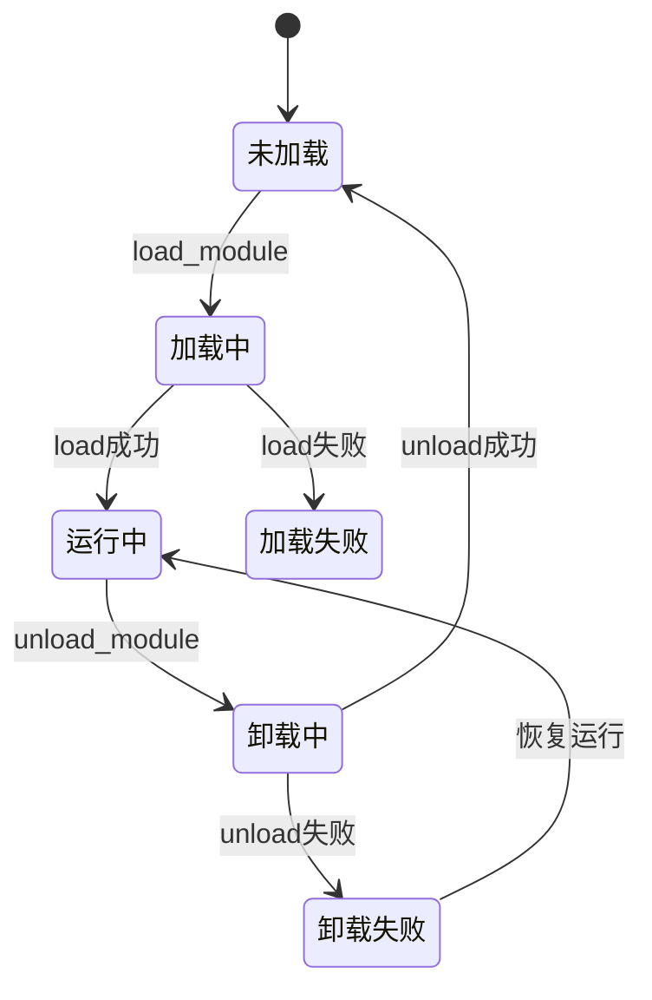
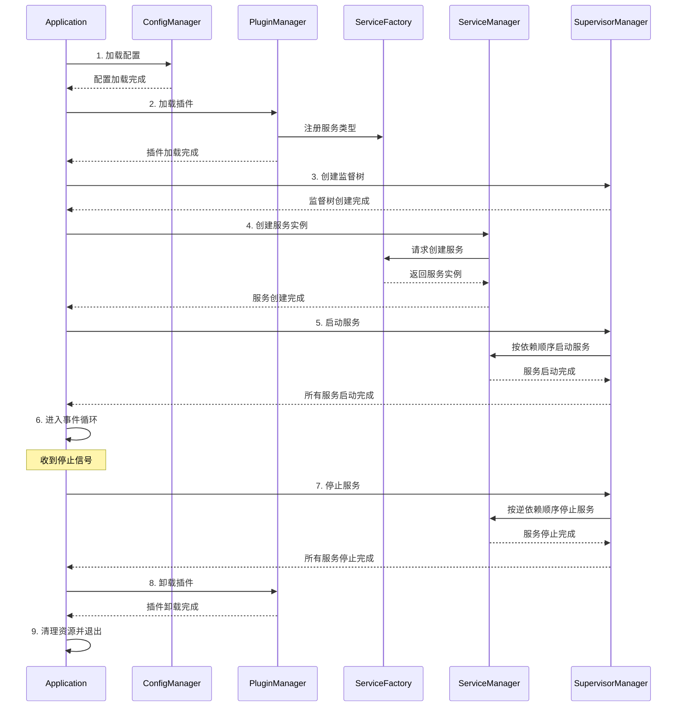
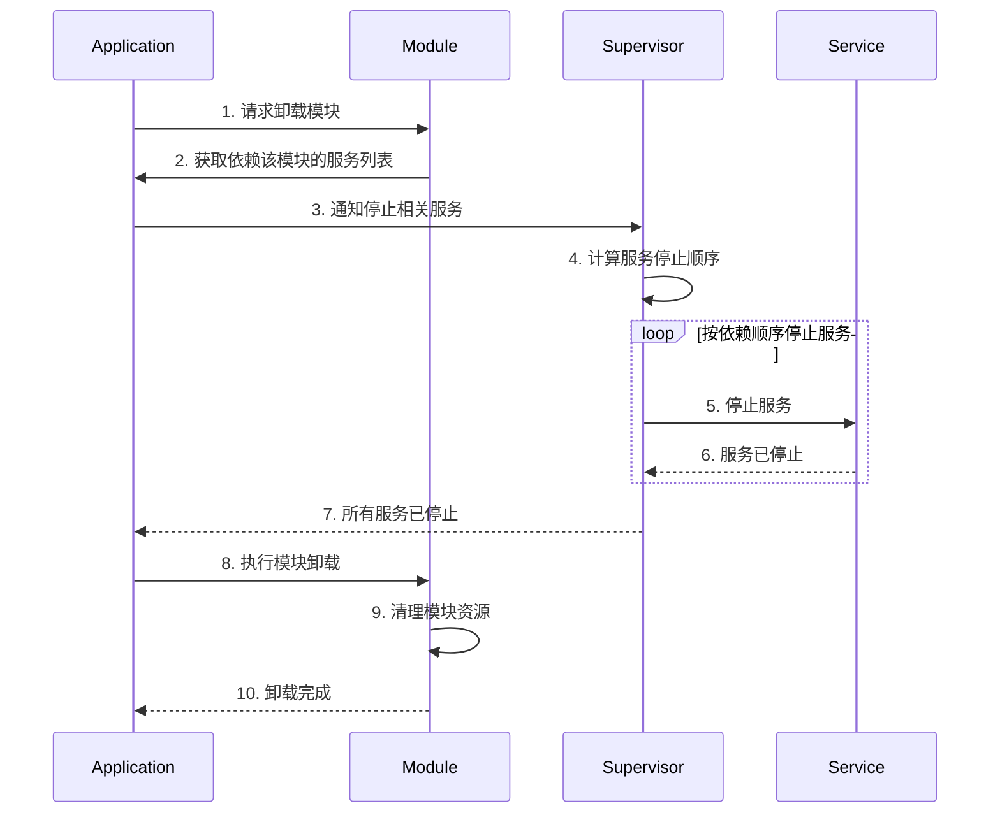
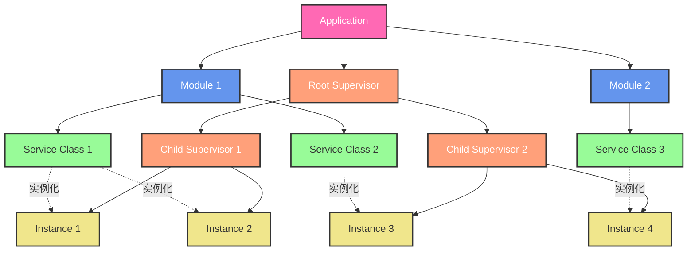
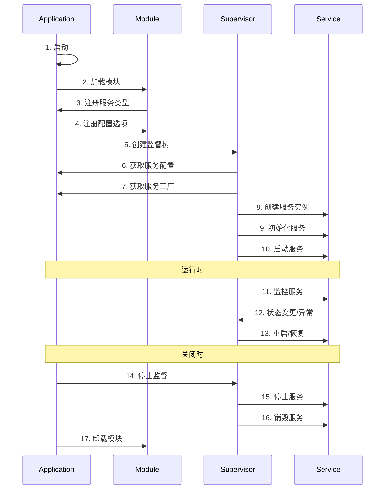

# 应用程序设计

## 1. 概述

应用程序框架（core）是 libmcpp 的核心模块，提供了一套完整的模块化应用程序开发框架。该框架采用插件 + 服务的架构模式，使应用程序可以通过松耦合的方式组合各种功能模块，提高代码的可维护性和可扩展性。

### 1.1 设计理念

应用程序框架的设计基于以下核心理念：

- **模块化**：通过插件机制将应用程序划分为多个独立模块
- **松耦合**：模块之间通过明确定义的接口交互，减少依赖
- **可扩展**：支持动态加载和卸载插件，实现功能扩展
- **可靠性**：采用监督树模式管理服务生命周期，提高系统可靠性
- **声明式配置**：使用统一的配置系统简化应用程序配置
- **单线程模型**：服务实例绑定到特定线程，简化并发编程
- **依赖管理**：支持自动解析和管理服务间依赖关系

### 1.2 特性优势

应用程序框架提供以下核心优势：

1. **模块独立性**：每个插件和服务都是独立的功能单元，可以单独开发、测试和维护
2. **动态扩展**：通过插件机制实现动态功能扩展，无需修改核心代码
3. **可靠性**：监督树模式提高系统稳定性，自动处理服务故障
4. **配置灵活**：统一的配置系统简化应用程序配置和部署
5. **依赖管理**：自动解析和管理模块间的依赖关系
6. **生命周期管理**：明确的生命周期定义，简化资源管理
7. **事件驱动**：通过事件系统实现松耦合的模块通信

### 1.3 应用场景

应用程序框架适用于以下场景：

- 复杂的服务器应用程序
- 分布式系统组件
- 需要高可靠性的嵌入式系统
- 需要动态功能扩展的应用
- 微服务架构组件

## 2. 核心组件

应用程序框架由以下核心组件组成，它们协同工作以提供完整的功能：

### 2.1 Application

Application 是应用程序的核心类，作为单例对象存在，负责协调各个管理器的工作。主要功能包括：

- 初始化和启动应用程序
- 管理应用程序生命周期
- 加载和管理配置
- 协调各管理器工作
- 处理系统级事件
- 提供应用程序级别的信号（started, stopped等）

Application 类通过**组合模式**集成了多个管理器，每个管理器负责特定领域的功能：

#### 2.1.1 管理器职责和功能范围

| 管理器 | 主要职责 | 功能范围 | 应用场景 |
|-------|---------|---------|---------|
| **PluginManager** | 动态加载和管理插件模块 | • 插件加载与卸载<br>• 管理插件依赖<br>• 初始化插件<br>• 插件信息查询 | • 应用程序启动时<br>• 动态扩展功能时<br>• 插件热更新时 |
| **ServiceFactory** | 服务类型注册和创建 | • 注册服务类型<br>• 创建服务实例<br>• 管理服务类型信息<br>• 提供服务选项配置 | • 插件注册服务时<br>• 创建服务实例前<br>• 服务元数据查询时 |
| **ServiceManager** | 管理服务实例的生命周期 | • 创建和管理服务实例<br>• 服务的启动和停止<br>• 服务依赖关系管理<br>• 服务实例查询 | • 服务初始化阶段<br>• 应用程序运行期间<br>• 服务访问和交互时 |
| **ConfigManager** | 应用程序配置的加载和管理 | • 命令行参数解析<br>• 配置文件加载<br>• 配置数据提供<br>• 插件和服务配置管理 | • 应用程序启动阶段<br>• 配置更改时<br>• 服务初始化时 |
| **SupervisorManager** | 监督器的创建和管理 | • 创建监督器层次结构<br>• 监控服务健康状态<br>• 故障检测和恢复<br>• 服务重启策略 | • 服务启动后<br>• 故障发生时<br>• 应用程序状态变更时 |



### 2.2 Plugin 系统

Plugin 系统负责动态加载和管理插件模块，是实现模块化的基础：

- **plugin**：插件基类，定义了插件接口
- **plugin_info**：包含插件名称、版本、依赖等信息
- **plugin_manager**：负责加载、初始化和管理插件

Plugin 系统支持以下功能：
- 插件动态加载和卸载
- 插件依赖管理
- 版本兼容性检查
- 插件初始化和清理

#### 2.2.1 Module 接口定义

```cpp
class module {
public:
    // 模块信息
    struct info {
        std::string name;            // 模块名称
        std::string version;         // 模块版本
        std::vector<std::string> dependencies;  // 模块依赖
        std::string min_app_version; // 最小应用版本要求
    };
    
    // 生命周期方法
    virtual bool load() = 0;                    // 加载模块
    virtual bool unload() = 0;                  // 卸载模块
    virtual void pre_unload() {}               // 卸载前处理
    virtual void post_load() {}                // 加载后处理
    
    // 配置管理
    virtual void register_options(options_description& cli_opts,
                                options_description& cfg_opts) {}
                                
    // 资源管理
    virtual void cleanup_resources() {}         // 清理资源
    
    // 状态查询
    virtual bool is_unloadable() const { return true; }  // 是否可以卸载
    virtual std::vector<std::string> get_active_services() const = 0;  // 获取活动服务
    
    // 版本和依赖
    virtual const info& get_info() const = 0;   // 获取模块信息
};
```

#### 2.2.2 Module 生命周期



### 2.3 Service 系统

Service 系统是应用程序的核心，提供了服务定义、创建和管理的机制：

- **service**：服务接口类，定义服务生命周期方法
- **service_config**：服务配置结构
- **service_factory**：服务工厂，负责注册和创建服务
- **service_manager**：服务管理器，负责管理服务实例

Service 系统的特点：
- 服务有明确的生命周期：初始化->启动->运行->停止->清理
- 服务可声明依赖关系
- 服务实例绑定到特定线程，简化并发编程
- 支持配置注入
- 支持健康检查

### 2.4 Supervisor 系统

Supervisor 系统负责监督和管理服务的生命周期，提高系统可靠性：

- **supervisor**：监督器接口类
- **default_supervisor**：默认监督器实现
- **supervisor_manager**：监督器管理器

Supervisor 系统基于 Erlang/OTP 的监督树模式，提供以下功能：
- 服务生命周期管理
- 服务启动顺序管理
- 服务失败恢复策略
- 服务依赖管理
- 服务健康监控

### 2.5 Config 系统

Config 系统提供统一的配置管理机制：

- **config_manager**：配置管理器
- **config_validator**：配置验证器
- **config_schema**：配置模式定义

Config 系统支持：
- 配置文件加载
- 命令行参数解析
- 配置验证
- 配置分发到各模块
- 多格式支持（JSON, YAML等）

### 2.6 Event 系统

Event 系统提供事件驱动机制：

- **event**：事件基类
- **event_handler**：事件处理器
- **event_dispatcher**：事件分发器

Event 系统支持：
- 异步事件处理
- 事件订阅
- 事件优先级
- 事件过滤

## 3. 工作流程

应用程序框架的工作流程阐述了各个组件之间的交互方式以及应用程序的生命周期管理。

### 3.1 应用程序启动流程

1. 解析命令行参数
2. 加载配置文件
3. 根据配置加载 Module
4. Module 注册服务类型
5. Application 从已注册服务类型收集配置选项
6. 验证配置完整性
7. 创建 Supervisor 树
8. Supervisor 创建和初始化服务实例
9. Supervisor 启动服务


### 3.1.1 服务注册与创建的区别

在应用程序架构中，"注册服务类型"和"创建服务实例"是两个不同的概念，它们有明确的职责区分：

| 特性 | 注册服务类型 | 创建服务实例 |
|------|------------|------------|
| **执行时机** | 插件加载阶段 | 应用初始化或运行时 |
| **执行者** | Plugin向ServiceFactory注册 | ServiceManager通过ServiceFactory创建 |
| **作用对象** | 服务类型（class模板） | 服务实例（对象） |
| **唯一性** | 每个类型只注册一次 | 同一类型可创建多个实例 |
| **配置依赖** | 不需要配置参数 | 需要具体配置信息 |
| **生命周期** | 应用程序整个生命周期 | 可动态创建和销毁 |

**注册服务类型的目的**：
- 向框架声明可用的服务类型
- 注册服务的配置选项和元数据
- 建立服务类型和创建函数的映射

**创建服务实例的目的**：
- 根据配置实例化具体服务对象
- 为服务分配资源和初始化状态
- 将服务纳入监督管理

这种分离设计带来以下好处：
1. **关注点分离**：类型注册关注"有什么"，实例创建关注"如何用"
2. **灵活性**：可以根据配置创建同一类型的多个不同实例
3. **延迟实例化**：只在需要时创建实例，优化资源使用
4. **动态管理**：支持运行时创建和销毁服务实例

以下是详细的启动时序图：



### 3.2 模块加载流程

1. 加载动态库
2. 调用 mc_module_load
3. 注册 Service 类型
4. 注册配置选项
5. 初始化模块资源

### 3.3 Module 卸载流程

模块卸载需要考虑依赖关系和正在运行的服务实例：



### 3.4 Service 生命周期

1. Supervisor 从 Application 获取服务工厂
2. Supervisor 创建服务实例
3. Supervisor 传入配置参数初始化服务
4. Supervisor 分配服务到执行线程
5. Supervisor 启动服务
6. 运行时由 Supervisor 监控和管理
7. 停止时由 Supervisor 清理和销毁

## 4. 组件详细设计

本节深入探讨系统各个组件的设计细节和实现考量。

### 4.1 组件层次关系

以下图表展示了应用程序框架中组件之间的层次关系：



### 4.2 组件职责说明

1. **Application（应用程序）**
   - 管理模块的加载/卸载
   - 提供服务注册表
   - 管理全局资源和配置
   - 创建根监督器

2. **Module（模块）**
   - 实现并注册服务类型
   - 管理服务类型的元数据
   - 不直接参与服务实例管理

3. **Supervisor（监督器）**
   - 支持树形层次结构
   - 可以管理子监督器和服务实例
   - 不同层级可以有不同的监督策略
   - 支持 one_for_one、one_for_all、rest_for_one 等策略
   - 按层级传播故障和恢复操作

4. **Service Class（服务类型）**
   - 定义服务接口和实现
   - 声明配置项和依赖关系
   - 提供实例化方法

5. **Service Instance（服务实例）**
   - 服务类型的运行时实例
   - 包含具体配置和状态
   - 由特定层级的 Supervisor 管理生命周期

### 4.3 生命周期交互关系

以下是应用程序生命周期中各组件之间的交互关系：



### 4.4 关键特性

#### 4.4.1 单线程执行模型

- Service 实例绑定到特定线程
- 避免多线程并发问题
- 简化编程模型

#### 4.4.2 配置管理

- Service 类通过静态接口定义配置选项
- Application 直接从已注册的服务类型收集配置
- 支持命令行和配置文件选项
- 配置验证在服务初始化阶段完成

#### 4.4.3 依赖管理

- Service 可以声明依赖
- 支持运行时依赖检查
- 确保启动顺序正确

#### 4.4.4 生命周期管理

- Application 负责加载和初始化
- Supervisor 负责运行时管理
- Service 专注于业务逻辑

## 5. 示例代码

以下示例展示如何使用应用程序框架实现自定义服务和插件。

### 5.1 Service 实现示例

以下是一个简单的服务实现示例：

```cpp
// 定义服务类
class my_service : public mc::service_base<my_service> {
public:
    // 定义服务类型名
    static const char* service_type() { return "example.my_service"; }
    
    // 注册配置选项
    static void register_options(mc::po::options_description& cfg_opts) {
        cfg_opts.add_options()
            ("my_service.timeout", mc::po::value<int>()->default_value(30), "超时时间(秒)")
            ("my_service.retry_count", mc::po::value<int>()->default_value(3), "重试次数");
    }
    
    // 声明依赖
    static const std::vector<std::string>& dependencies() {
        static std::vector<std::string> deps = {"logger", "database"};
        return deps;
    }
    
    // 初始化方法
    bool init(mc::dict args) override {
        m_timeout = args.get("my_service.timeout").as<int>();
        m_retry_count = args.get("my_service.retry_count").as<int>();
        return true;
    }
    
    // 启动服务
    bool start() override {
        set_state(mc::service_state::starting);
        
        // 服务启动逻辑...
        
        set_state(mc::service_state::running);
        return true;
    }
    
    // 停止服务
    bool stop() override {
        set_state(mc::service_state::stopping);
        
        // 服务停止逻辑...
        
        set_state(mc::service_state::stopped);
        return true;
    }
    
    // 清理资源
    void cleanup() override {
        // 资源清理逻辑...
    }
    
    // 健康检查
    bool is_healthy() const override {
        // 健康状态检查逻辑...
        return true;
    }
    
private:
    int m_timeout;
    int m_retry_count;
};
```

### 5.2 Module 实现示例

```cpp
class example_plugin : public mc::plugin {
public:
    // 获取插件信息
    const mc::plugin_info& get_info() const override {
        static mc::plugin_info info = {
            .name = "example",
            .version = "1.0.0",
            .dependencies = {"core", "logger"}
        };
        return info;
    }
    
    // 初始化插件
    bool init(mc::service_factory& factory) override {
        // 注册服务类型
        factory.register_service<my_service>();
        return true;
    }
};

// 导出插件
MC_EXPORT_PLUGIN(example_plugin)
```

### 5.3 配置示例

```json
{
  "app": {
    "plugins": ["example"],
    "threads": 4
  },
  "services": [
    {
      "name": "my_service_instance",
      "type": "example.my_service",
      "config": {
        "my_service.timeout": 60,
        "my_service.retry_count": 5
      }
    }
  ],
  "supervisors": [
    {
      "name": "main_supervisor",
      "strategy": "one_for_one",
      "services": ["my_service_instance"]
    }
  ]
}
```

## 6. 实现状态

本节总结各组件的当前实现状态和后续计划。

### 6.1 基础框架 [已完成]
1. **Application 核心框架**
   - [x] 实现 `application` 单例类
   - [x] 实现基本的事件循环
   - [x] 实现命令行参数解析
   - [x] 实现配置文件加载
   - [x] 单元测试覆盖

### 6.2 Module 系统 [部分完成]
1. **Module 基础功能**
   - [x] 实现 `module` 基类
   - [ ] 实现动态库加载机制
   - [x] 实现模块注册机制
   - [x] 实现模块依赖管理
   - [x] 单元测试覆盖

### 6.3 Service 框架 [已完成]
1. **Service 基础功能**
   - [x] 实现 `service` 基类
   - [x] 实现服务生命周期管理
   - [x] 实现服务配置机制
   - [x] 实现服务依赖管理
   - [x] 单元测试覆盖

### 6.4 Supervisor 系统 [部分完成]
1. **Supervisor 基础功能**
   - [x] 实现 `supervisor` 基类
   - [x] 实现基本监督策略
   - [x] 实现服务实例管理
   - [ ] 实现更多高级监督策略
   - [x] 实现默认监督器 `default_supervisor`
   - [ ] 实现错误处理和恢复
   - [x] 单元测试覆盖

### 6.5 错误引擎 [未开始]
1. **错误引擎功能**
   - [ ] 实现错误定义系统
   - [ ] 实现错误传播机制
   - [ ] 实现错误处理器
   - [ ] 实现错误日志
   - [ ] 单元测试覆盖

### 6.6 示例和文档 [未开始]
1. **示例实现**
   - [ ] 实现日志服务示例
   - [ ] 实现配置服务示例
   - [ ] 实现监控服务示例
2. **文档完善**
   - [ ] 编写开发指南
   - [ ] 编写使用手册
   - [ ] 编写 API 文档

## 7. 未来规划

### 7.1 热插拔支持

- 运行时动态加载和卸载插件
- 插件状态迁移和数据保存/恢复

### 7.2 分布式配置

- 支持从远程配置中心加载配置
- 配置变更实时推送

### 7.3 监控和管理接口

- 提供REST API或命令行工具监控应用状态
- 支持远程管理插件和配置

### 7.4 安全机制

- 插件签名验证
- 配置加密存储
- 访问控制和权限管理

### 7.5 错误引擎设计

错误引擎是一个集中式的错误处理系统，由 Application 在启动时加载。主要功能包括：
- 统一的错误定义和管理
- 错误传播和升级机制
- 错误处理和恢复策略
- 错误日志和分析

错误引擎将分为以下阶段实现：

#### 阶段一：基础错误定义（预计耗时：1-2天）
1. **实现错误信息结构**
   - 实现 `error_info` 结构体
   - 实现错误定义宏 `MC_DEFINE_ERROR`
   - 添加基本系统错误定义
   
2. **单元测试**
   - 测试错误信息创建
   - 测试错误信息序列化
   - 测试错误定义宏使用

#### 阶段二：错误链实现（预计耗时：2-3天）
1. **实现错误链功能**
   - 实现 `error_chain_builder` 类
   - 实现错误上下文管理
   - 实现错误链构建和遍历

#### 阶段三：错误引擎核心（预计耗时：3-4天）
1. **实现错误引擎基础功能**
   - 实现 `error_engine` 类
   - 实现错误处理器注册机制
   - 实现基本错误处理流程

#### 阶段四：服务集成（预计耗时：2-3天）
1. **集成到服务框架**
   - 在 `service` 类中添加错误处理接口
   - 实现服务间错误传播机制
   - 实现错误处理回调

#### 阶段五：配置和日志（预计耗时：2-3天）
1. **实现配置和日志功能**
   - 实现错误引擎配置加载
   - 实现错误日志记录
   - 实现基本错误分析

### 7.6 总体计划里程碑

1. **第一个里程碑**（2周）
   - 完成基础框架
   - 完成模块系统
   - 通过基本功能测试

2. **第二个里程碑**（4周）
   - 完成服务框架
   - 完成监督系统
   - 通过集成测试

3. **第三个里程碑**（6周）
   - 完成错误引擎
   - 完成示例开发
   - 完成文档编写
   - 通过系统测试
