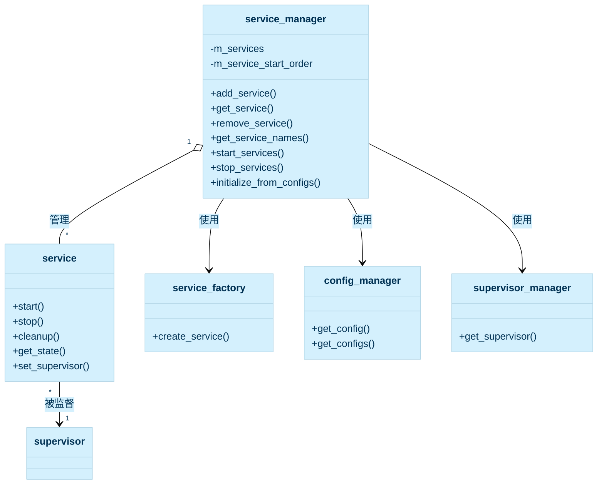
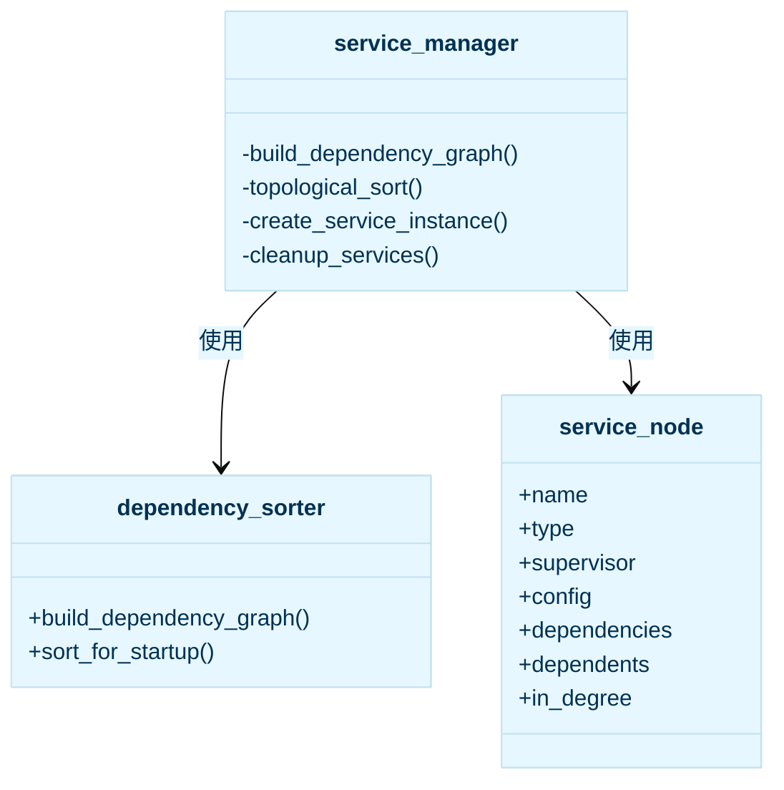
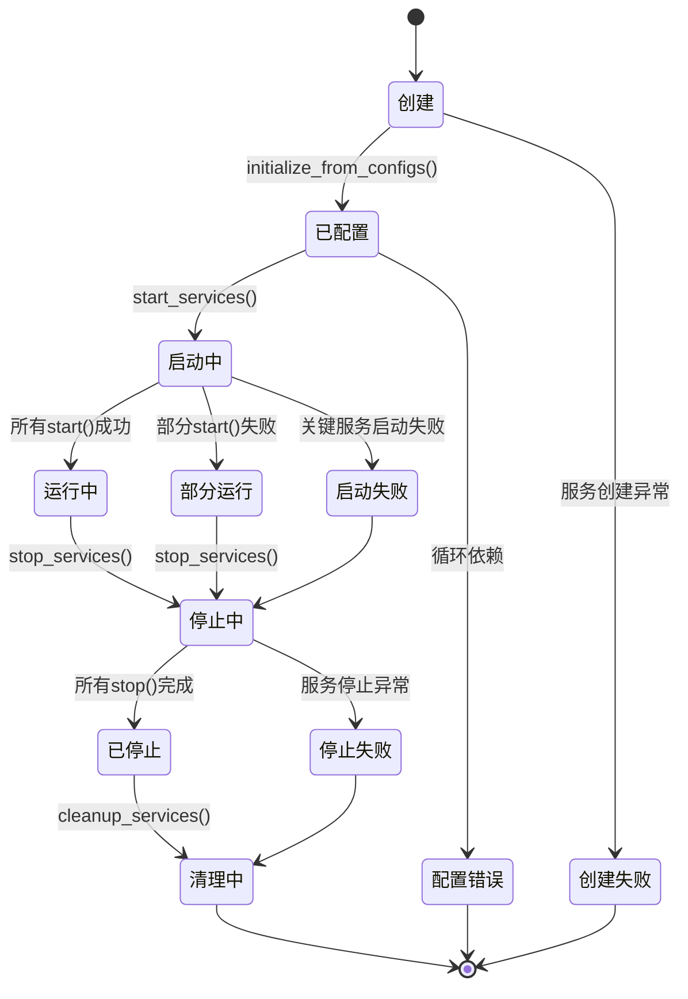

# 服务管理器设计文档

## 1. 概述

服务管理器(`service_manager`)是libmcpp框架中的核心组件，负责服务的生命周期管理、依赖关系管理和启动顺序控制。它通过基于依赖图的拓扑排序算法，确保服务按照正确的顺序启动和停止，同时提供统一的服务实例注册、查询和管理接口。服务管理器与配置管理器、监督器管理器和服务工厂紧密集成，共同构成了libmcpp的服务架构基础。

## 2. 核心功能

服务管理器提供以下核心功能：

1. **服务实例管理**：添加、获取和移除服务实例
2. **依赖关系处理**：构建服务依赖图并进行拓扑排序
3. **生命周期控制**：按照依赖顺序启动和停止服务
4. **配置驱动**：从配置初始化服务实例
5. **资源清理**：安全地清理服务资源
6. **监督器集成**：将服务与监督器关联

## 3. 类设计



### 服务依赖管理



## 4. 依赖管理与启动顺序

### 4.1 依赖图构建

服务依赖图的构建过程如下：

1. 从配置管理器获取服务配置
2. 提取每个服务的依赖关系
3. 构建依赖图，包括服务之间的依赖和被依赖关系
4. 计算每个节点的入度（直接依赖的数量）

依赖图的节点结构（`service_node`）包含：
- 服务名称和类型
- 监督器名称
- 服务配置
- 依赖的服务集合
- 依赖当前服务的服务集合
- 入度计数

### 4.2 拓扑排序

服务管理器使用拓扑排序算法确定服务的启动顺序，确保依赖的服务先于依赖它们的服务启动。排序步骤如下：

1. 找出入度为0的节点（没有依赖的服务）
2. 将这些节点加入结果列表
3. 移除这些节点及其关联的边
4. 更新受影响节点的入度
5. 重复步骤1-4，直到处理完所有节点或发现循环依赖

对于停止顺序，使用启动顺序的逆序，确保依赖于某服务的所有服务先被停止。

## 5. 服务生命周期

服务在系统中的生命周期如下：



## 6. 配置驱动初始化

服务管理器支持从配置驱动的方式初始化服务，步骤如下：

1. 从配置管理器获取所有服务配置
2. 构建服务依赖图并进行拓扑排序
3. 按照排序后的顺序创建服务实例
4. 为每个服务分配监督器
5. 启动所有服务

服务配置示例：

```json
{
  "meta": {
    "name": "database_service",
    "labels": {
      "supervisor": "main_supervisor"
    }
  },
  "type": "database",
  "dependencies": ["logger_service", "config_service"],
  "properties": {
    "db_path": "/var/lib/app/data",
    "max_connections": 10,
    "timeout": 30
  }
}
```

## 7. 错误处理

服务管理器实现了全面的错误处理机制：

1. **异常捕获**：捕获服务操作中的所有异常
2. **日志记录**：使用框架的日志系统记录操作和错误
3. **失败容忍**：一个服务的失败不会阻止其他服务的处理
4. **清理保证**：即使在错误情况下也确保资源被正确清理
5. **依赖验证**：检测循环依赖并提供明确错误信息

## 8. 使用示例

### 8.1 基本使用

```cpp
// 创建服务管理器
mc::service_manager manager;

// 手动添加服务
auto logger_service = std::make_shared<my_logger_service>();
manager.add_service("logger", logger_service);

// 获取服务
auto logger = manager.get_service<my_logger_service>("logger");
if (logger) {
    // 使用服务...
}

// 启动所有服务
manager.start_services();

// 获取所有服务名称
auto service_names = manager.get_service_names();

// 停止所有服务
manager.stop_services();
```

### 8.2 配置驱动初始化

```cpp
// 创建相关组件
mc::config_manager config_mgr;
mc::supervisor_manager supervisor_mgr;
mc::service_factory factory;

// 加载配置
config_mgr.load_configs("/path/to/configs");

// 注册服务创建函数
factory.register_service_creator("database", 
    [](const std::string& name, const mc::variant& config) {
        return std::make_shared<database_service>(name, config);
    });

// 从配置初始化服务（与实现一致）
mc::core::service_manager manager;
manager.initialize_from_configs(config_mgr, supervisor_mgr, factory);

// 启动所有服务
try {
    manager.start_services();
    ilog("所有服务启动成功", ());
} catch (const mc::exception& e) {
    elog("服务启动异常: ${message}", ("message", e.what()));
}
```

## 9. 与其他组件的集成

### 9.1 与配置管理器的集成

服务管理器从配置管理器获取服务配置，包括：
- 服务元数据（名称、标签等）
- 服务类型
- 服务依赖关系
- 服务属性

### 9.2 与监督器管理器的集成

服务管理器从监督器管理器获取监督器实例，并将其分配给相应的服务，使监督器能够：
- 监控服务状态
- 处理服务异常
- 在必要时重启服务
- 执行服务恢复策略

### 9.3 与服务工厂的集成

服务管理器使用服务工厂创建服务实例：
- 根据服务类型创建对应的服务实例
- 传递服务名称和配置属性
- 支持服务的注册和发现机制

## 10. 设计优势

1. **依赖管理**：自动处理服务间复杂的依赖关系
2. **配置驱动**：支持从配置文件声明式定义服务
3. **生命周期管理**：提供统一的服务生命周期控制
4. **错误隔离**：一个服务的故障不影响其他服务
5. **可扩展性**：易于添加新的服务类型和实例
6. **集中管理**：提供服务的中央注册和查询机制
7. **资源安全**：确保服务资源被正确释放

## 11. 未来扩展

1. **动态重载**：支持在运行时重新加载服务配置
2. **健康检查**：内置服务健康检查机制
3. **服务网格**：支持跨进程和跨机器的服务发现
4. **中断恢复**：改进服务的中断恢复能力
5. **监控与统计**：增强服务运行状态的监控和统计
6. **资源限制**：增加服务资源使用的限制和控制
7. **条件依赖**：支持基于条件的服务依赖
