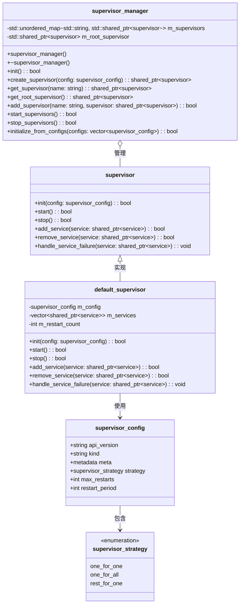
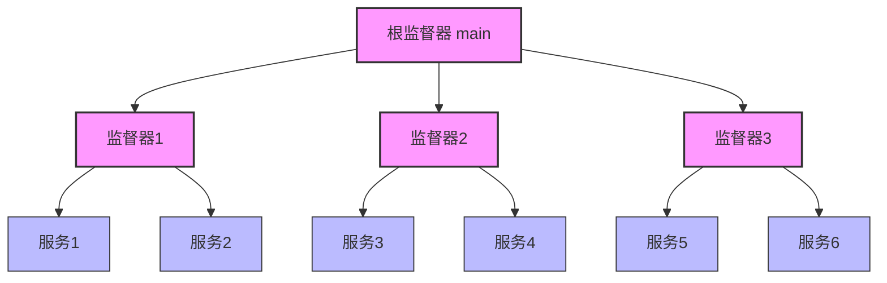
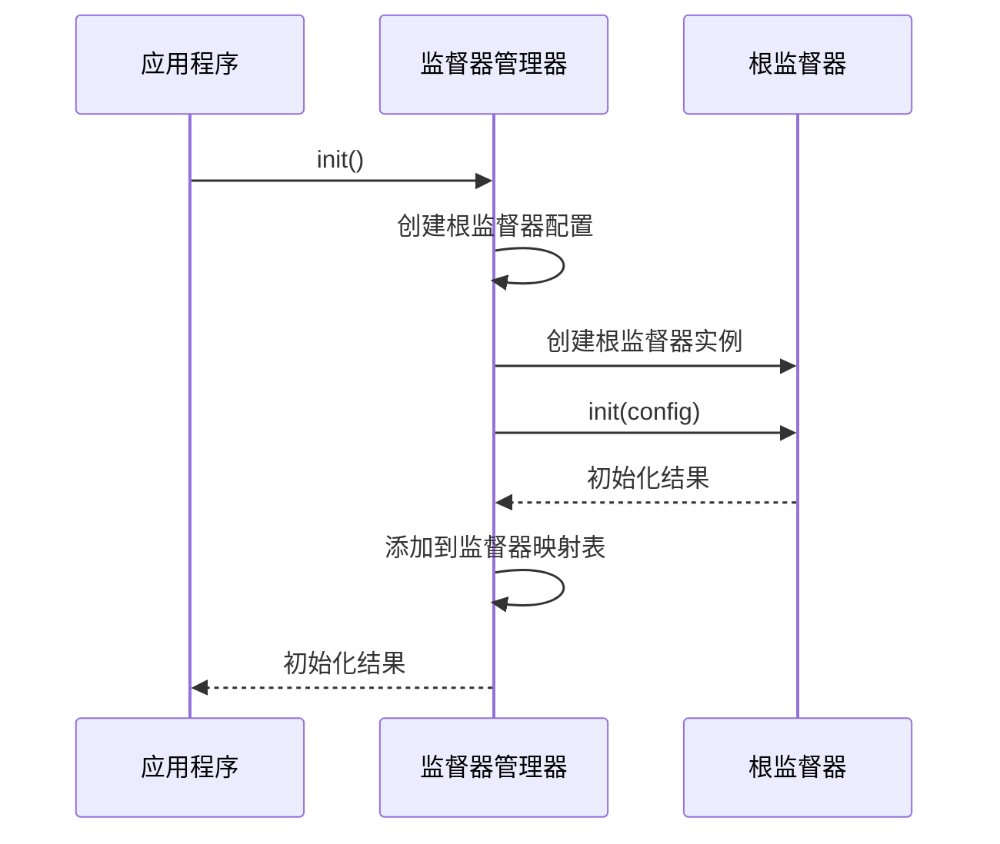
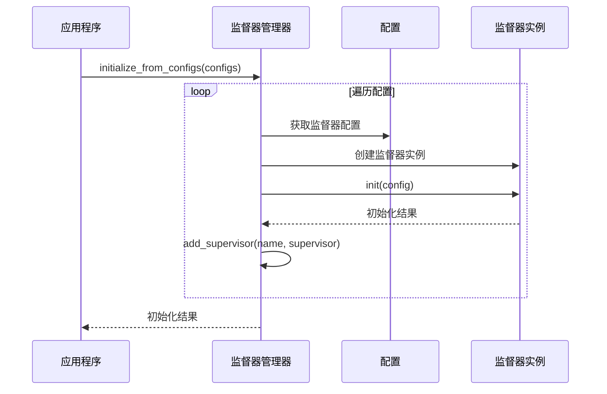
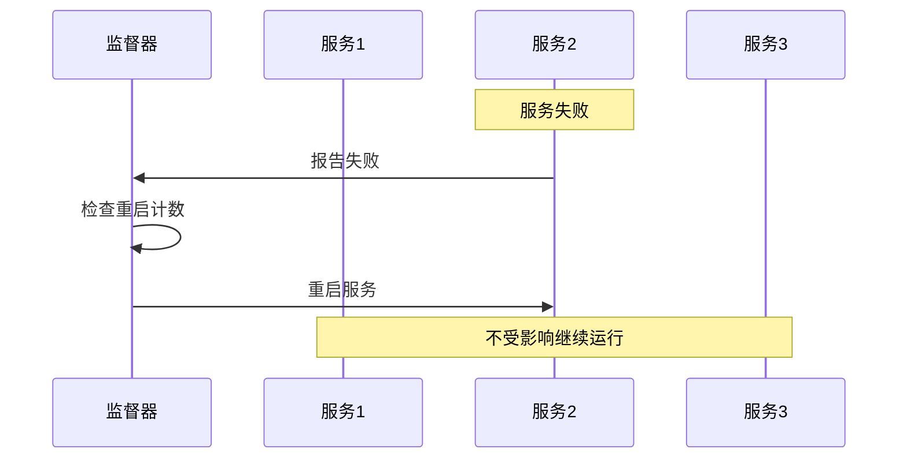
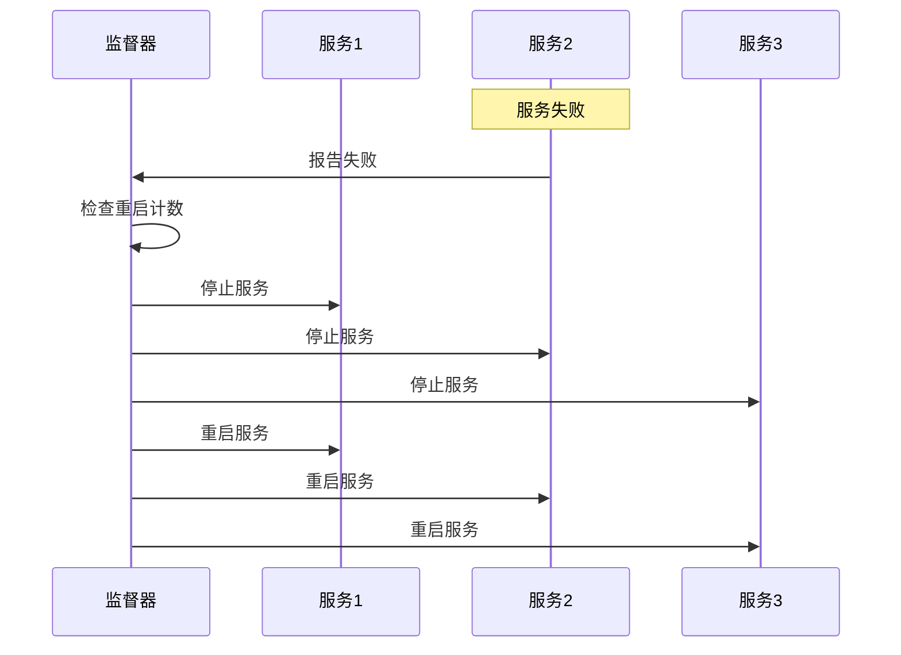
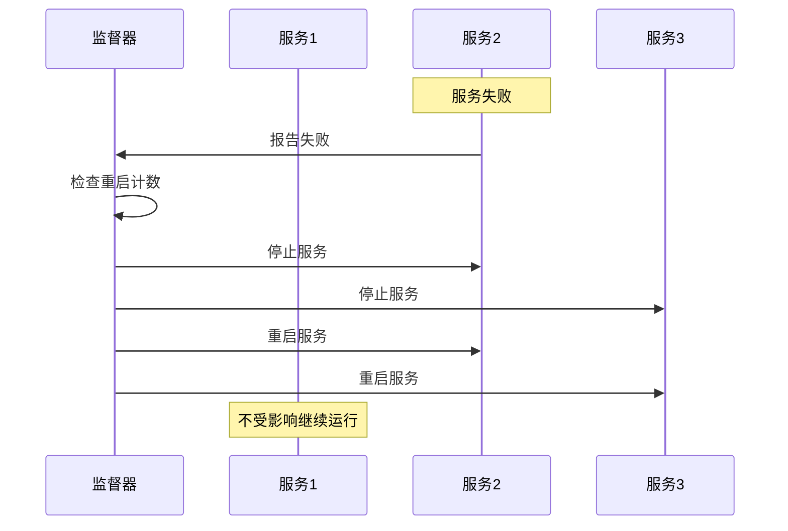
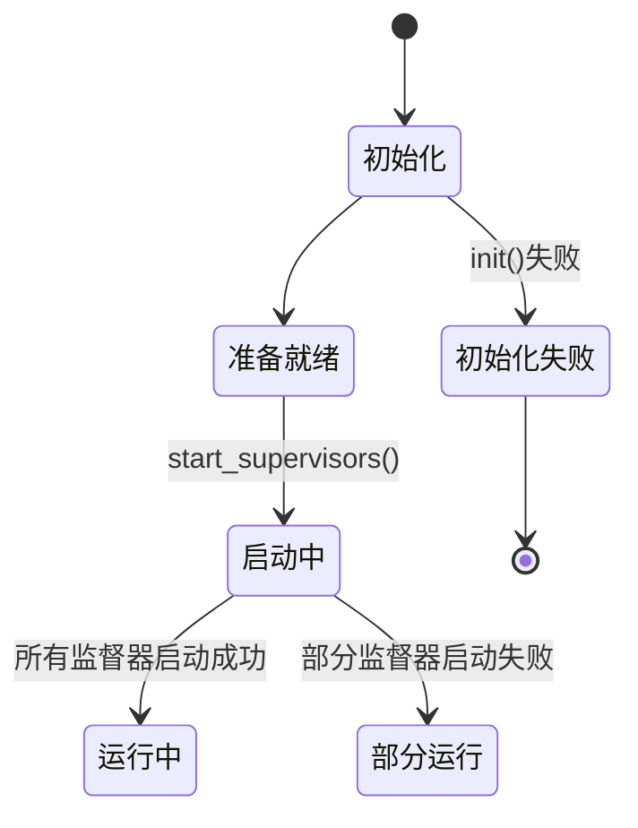
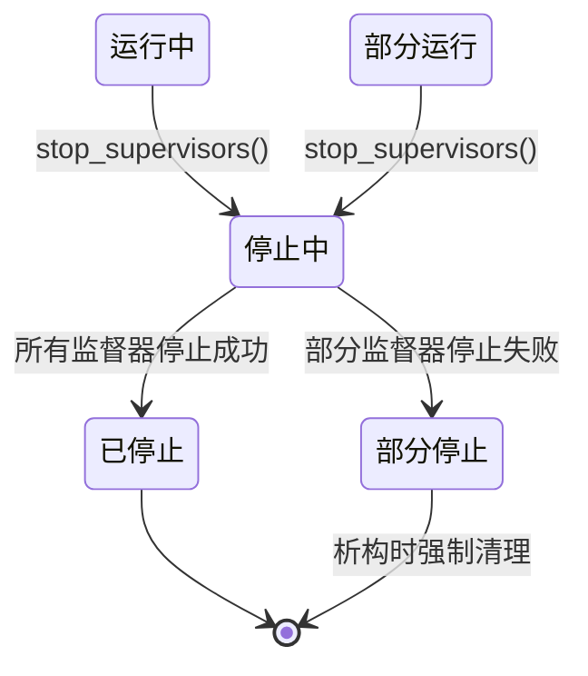
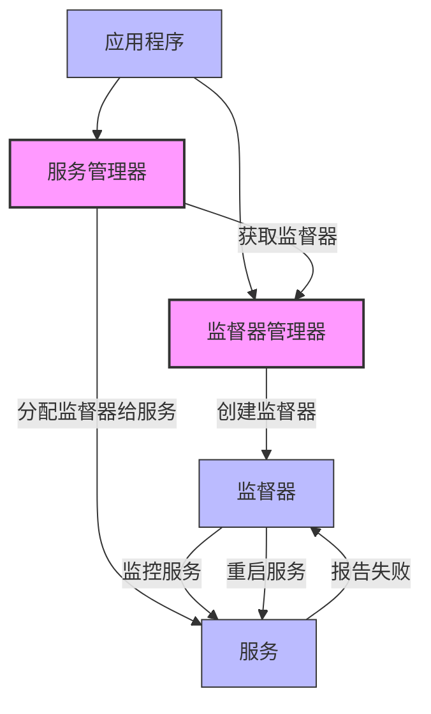

# 监督器管理器设计文档

## 1. 概述

监督器管理器(`supervisor_manager`)是libmcpp框架中的重要组件，负责监督器的创建、管理和生命周期控制。监督器是系统中负责监控服务运行状态、处理服务故障和实施恢复策略的组件。监督器管理器提供层次化的监督结构，以根监督器为顶点，构建可靠的服务监控体系，确保系统在服务失败时能够按照预定策略进行恢复，提高整体可靠性和容错能力。

## 2. 核心功能

监督器管理器提供以下核心功能：

1. **监督器创建**：创建不同类型的监督器实例
2. **监督器管理**：添加、获取和初始化监督器
3. **根监督器维护**：创建和管理根监督器
4. **生命周期控制**：启动和停止监督器
5. **配置驱动**：从配置初始化监督器
6. **层次管理**：维护监督器的层次结构

## 3. 类设计



## 4. 监督器层次结构

监督器在系统中构成树形结构，以根监督器为顶点：



每个监督器负责监控一组服务，当服务发生故障时，监督器根据配置的策略决定如何处理：

1. **One-for-One策略**：只重启失败的服务
2. **One-for-All策略**：重启该监督器下的所有服务
3. **Rest-for-One策略**：重启失败服务及其后启动的所有服务


### 策略备注

这些术语源自Erlang/OTP系统，命名格式是"X-for-Y"，其中：
- X表示"受影响的服务范围"
- for表示"为了"
- Y表示"触发故障的服务范围"

按此理解：

1. **One-for-One**：一个服务(One)为了一个故障服务(One)而重启
   - 只有故障服务本身被重启

2. **One-for-All** vs **All-for-One**：
   - **One-for-All**应该是"一个服务为了所有服务"，这不符合实际含义
   - **All-for-One**会更符合逻辑："所有服务(All)为了一个故障服务(One)而重启"
   
3. **Rest-for-One**：
   - 当前用法表示"剩余服务(Rest)为了一个故障服务(One)而重启"
   - 更直观的命名可能是"One-for-Rest"："一个故障服务影响剩余服务"

实际上，Erlang/OTP中的确使用的是"one_for_one"、"one_for_all"和"rest_for_one"这些命名，尽管从语义上看可能不够直观，但已成为行业中约定俗成的术语。

## 5. 初始化流程

### 5.1 默认初始化

监督器管理器在初始化时会创建一个默认的根监督器：



默认的根监督器配置：
- 名称: "main"
- 策略: one_for_one
- 最大重启次数: 10

### 5.2 配置驱动初始化

监督器管理器支持从配置批量创建监督器：



## 6. 监督策略

监督器支持三种主要的监督策略：

### 6.1 One-for-One策略

当一个服务失败时，只重启该服务。这是最简单的策略，适用于服务间相互独立的情况。



### 6.2 One-for-All策略

当一个服务失败时，重启监督器下的所有服务。适用于服务间有强依赖关系的情况。



### 6.3 Rest-for-One策略

当一个服务失败时，重启该服务和之后启动的所有服务。适用于链式依赖的情况。



## 7. 生命周期管理

监督器管理器负责控制所有监督器的生命周期：

### 7.1 启动流程



### 7.2 停止流程



## 8. 错误处理

监督器管理器实现了全面的错误处理机制：

1. **异常捕获**：捕获监督器操作中的所有异常
2. **日志记录**：使用框架的日志系统记录操作和错误
3. **失败容忍**：一个监督器的失败不会影响其他监督器的处理
4. **安全检查**：在操作前验证监督器存在性和有效性

## 9. 使用示例

### 9.1 基本使用

```cpp
// 创建监督器管理器
mc::core::supervisor_manager manager;

// 初始化（创建根监督器）
manager.init();

// 创建自定义监督器
mc::config::supervisor_config config;
config.api_version = "v1";
config.kind = "Supervisor";
config.meta.name = "backend_supervisor";
config.strategy = mc::config::supervisor_strategy::one_for_one;
config.max_restarts = 5;

auto backend_supervisor = manager.create_supervisor(config);

// 获取监督器
auto root = manager.get_root_supervisor();
auto backend = manager.get_supervisor("backend_supervisor");

// 启动所有监督器
manager.start_supervisors();

// 停止所有监督器
manager.stop_supervisors();
```

### 9.2 配置驱动初始化

```cpp
// 创建监督器管理器
mc::core::supervisor_manager manager;

// 初始化根监督器
manager.init();

// 从配置初始化
std::vector<mc::config::supervisor_config> configs = {
    {
        .api_version = "v1",
        .kind = "Supervisor",
        .meta = { .name = "frontend_supervisor" },
        .strategy = mc::config::supervisor_strategy::one_for_one,
        .max_restarts = 3
    },
    {
        .api_version = "v1",
        .kind = "Supervisor",
        .meta = { .name = "backend_supervisor" },
        .strategy = mc::config::supervisor_strategy::one_for_all,
        .max_restarts = 5
    }
};

manager.initialize_from_configs(configs);

// 启动所有监督器
manager.start_supervisors();
```

## 10. 与服务管理器的集成

监督器管理器与服务管理器紧密集成，共同实现服务的可靠运行：



服务管理器在创建服务时从监督器管理器获取适当的监督器，并将其分配给服务。当服务发生故障时，服务会通知其监督器，监督器根据配置的策略决定如何处理故障，包括重启单个服务或一组服务。

## 11. 设计优势

1. **集中管理**：统一管理所有监督器实例
2. **层次结构**：支持树形的监督器结构
3. **灵活策略**：支持多种故障处理策略
4. **配置驱动**：支持从配置文件声明式定义监督器
5. **错误隔离**：一个监督器的故障不影响其他监督器
6. **生命周期控制**：提供统一的监督器生命周期管理
7. **日志跟踪**：详细记录监督器的操作和状态变化

## 12. 未来扩展

1. **动态策略调整**：运行时调整监督策略
2. **级联重启限制**：防止大规模级联重启
3. **监督器模板**：预定义的监督器模板
4. **状态监控接口**：提供监督器状态的实时监控
5. **历史记录**：记录服务失败和重启历史
6. **动态加载**：支持运行时加载新的监督器
7. **分布式监督**：支持跨进程的监督机制
