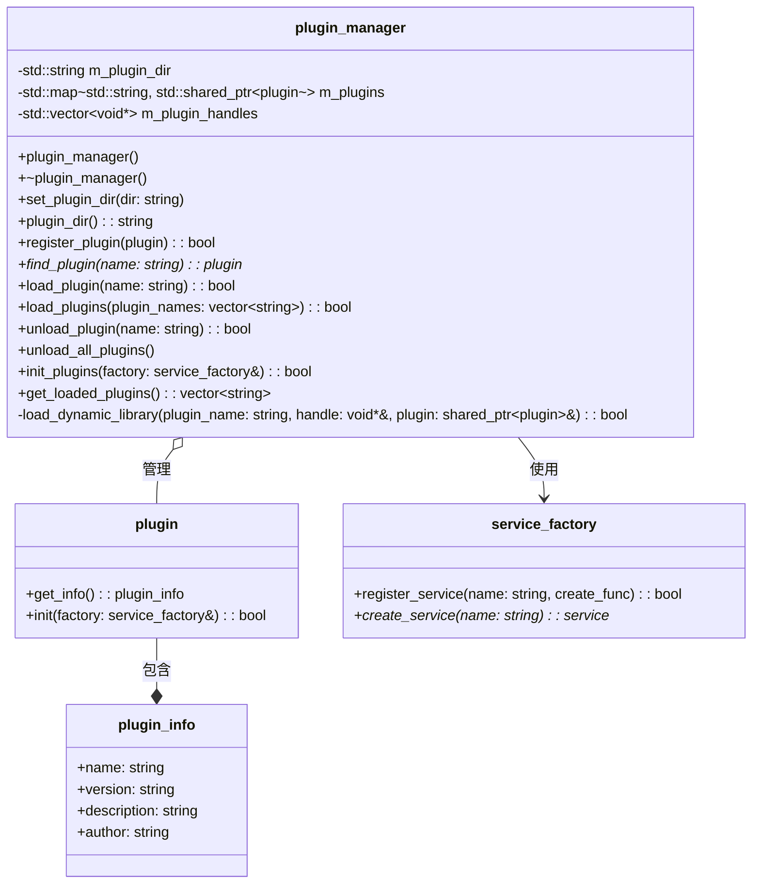
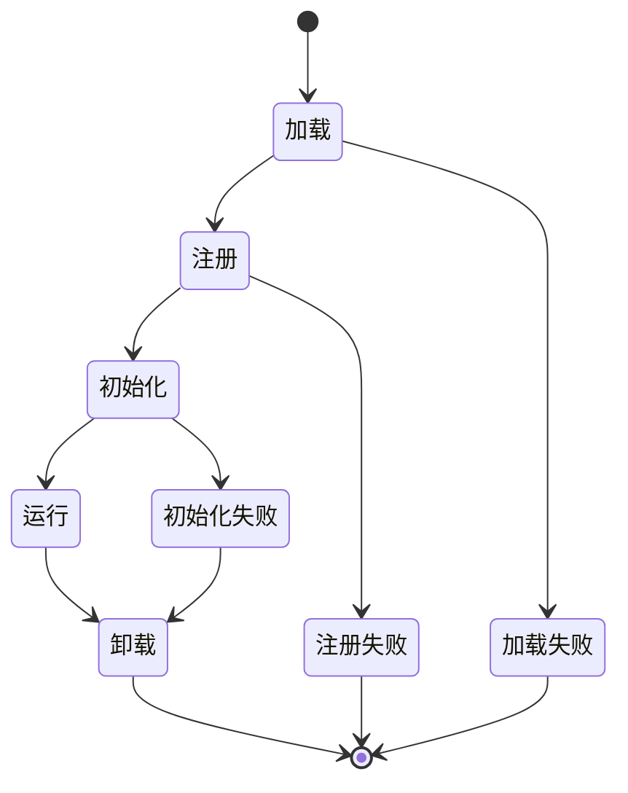

# 插件管理器设计文档

## 1. 概述

插件管理器(`plugin_manager`)是libmcpp框架中的核心组件，负责动态加载、管理和初始化插件。它允许应用程序在运行时扩展功能，实现了模块化和可扩展的系统架构。插件管理器使用动态链接库机制，支持插件的动态加载和卸载，并提供统一的插件生命周期管理。

## 2. 核心功能

插件管理器提供以下核心功能：

1. **插件目录管理**：设置和获取插件所在目录
2. **插件注册**：将插件实例注册到管理器
3. **插件查找**：根据名称查找已注册的插件
4. **插件加载**：从动态库中加载单个或多个插件
5. **插件卸载**：卸载单个插件或所有插件
6. **插件初始化**：使用服务工厂初始化所有已加载的插件
7. **插件列表查询**：获取所有已加载插件的名称列表

## 3. 类设计



## 4. 插件加载机制

插件管理器使用动态链接库(`.so`文件)机制加载插件，实现过程如下：

1. **定位插件文件**：根据插件名称和插件目录构建动态库路径
2. **加载动态库**：使用`dlopen`函数加载动态库
3. **查找创建函数**：使用`dlsym`函数查找库中的`create_plugin`函数
4. **查找销毁函数**：使用`dlsym`函数查找库中的`destroy_plugin`函数
5. **创建插件实例**：调用`create_plugin`函数创建插件实例
6. **封装插件对象**：使用智能指针和自定义删除器管理插件生命周期

## 5. 插件生命周期

插件在系统中的生命周期如下：



1. **加载阶段**：动态库被加载到内存，并创建插件实例
2. **注册阶段**：插件被注册到插件管理器中
3. **初始化阶段**：调用插件的init方法，传入服务工厂
4. **运行阶段**：插件正常工作，提供功能
5. **卸载阶段**：卸载插件，释放资源

## 6. 自动发现机制

插件管理器支持两种加载模式：

1. **指定加载**：明确指定要加载的插件名称列表
2. **自动发现**：扫描插件目录，自动加载所有`.so`文件作为插件

自动发现规则：
- 遍历指定的插件目录
- 查找所有扩展名为`.so`的文件
- 如果文件名以`lib`开头，则去除前缀
- 尝试将每个匹配的文件作为插件加载

## 7. 错误处理

插件管理器实现了全面的错误处理机制：

1. **日志记录**：使用框架的日志系统记录所有操作和错误
2. **错误返回值**：关键操作返回布尔值表示成功或失败
3. **容错设计**：单个插件的加载失败不影响其他插件
4. **资源清理**：确保出错时正确释放所有资源

## 8. 使用示例

### 8.1 基本使用

```cpp
// 创建插件管理器
mc::plugin_manager manager;

// 设置插件目录
manager.set_plugin_dir("/path/to/plugins");

// 加载所有插件
manager.load_plugins();

// 初始化插件
mc::service_factory factory;
manager.init_plugins(factory);

// 查找特定插件
mc::plugin* my_plugin = manager.find_plugin("my_plugin");

// 获取所有已加载插件
auto plugin_names = manager.get_loaded_plugins();
```

### 8.2 加载特定插件

```cpp
// 加载特定插件
manager.load_plugin("my_plugin");

// 加载多个特定插件
std::vector<std::string> plugins_to_load = {"plugin1", "plugin2", "plugin3"};
manager.load_plugins(plugins_to_load);
```

## 9. 插件开发指南

要开发一个兼容的插件，需要：

1. **实现插件基类**：继承`mc::plugin`接口
2. **提供元数据**：实现`get_info()`方法返回插件信息
3. **实现初始化**：实现`init()`方法
4. **导出C函数**：提供`create_plugin`和`destroy_plugin`函数

```cpp
// 插件实现示例
class my_plugin : public mc::plugin {
public:
    plugin_info get_info() const override {
        return {
            .name = "my_plugin",
            .version = "1.0.0",
            .description = "示例插件",
            .author = "开发者"
        };
    }
    
    bool init(service_factory& factory) override {
        // 注册服务、初始化资源等
        return true;
    }
};

// 导出C函数
extern "C" {
    MC_EXPORT mc::plugin* create_plugin() {
        return new my_plugin();
    }
    
    MC_EXPORT void destroy_plugin(mc::plugin* p) {
        delete p;
    }
}
```

## 10. 设计考虑

### 10.1 优势

1. **灵活性**：支持运行时动态加载和卸载插件
2. **扩展性**：应用功能可以通过插件方式扩展
3. **隔离性**：插件间松耦合，一个插件的问题不影响其他插件
4. **资源管理**：使用智能指针确保资源正确释放
5. **易用性**：简单直观的API，易于集成和使用

### 10.2 限制

1. **平台相关性**：动态库机制与平台相关
2. **符号冲突**：可能发生符号冲突问题
3. **版本兼容性**：插件与主程序版本需保持兼容

## 11. 未来扩展

1. **插件依赖管理**：管理插件间的依赖关系
2. **版本兼容性检查**：自动检查插件与框架的兼容性
3. **热插拔支持**：支持运行时安全地加载和卸载插件
4. **沙箱隔离**：增强插件间的隔离性
5. **插件配置机制**：统一的插件配置管理
