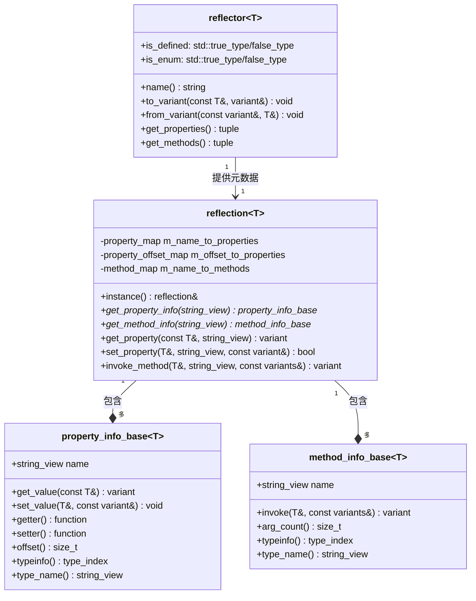
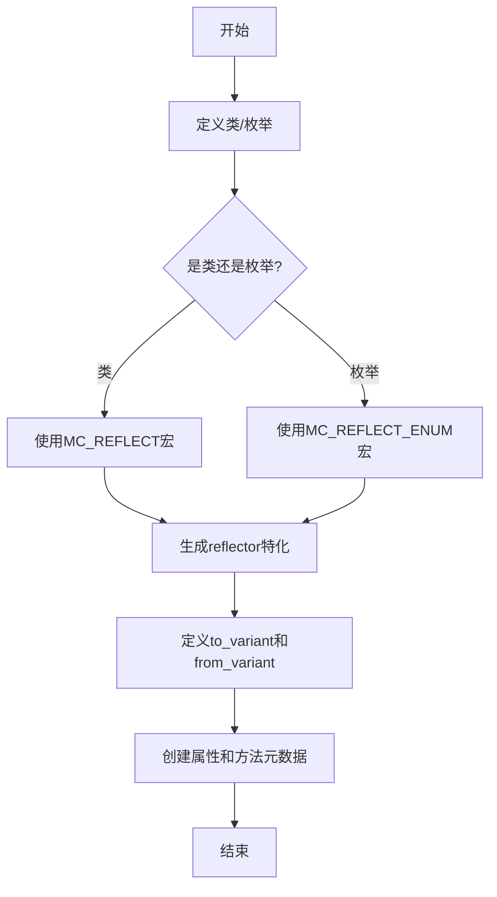
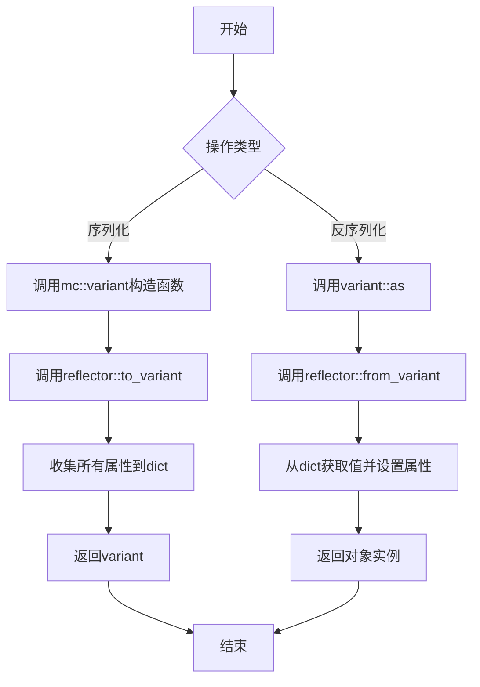
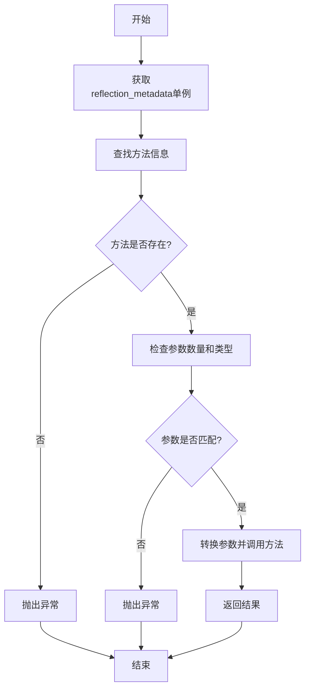
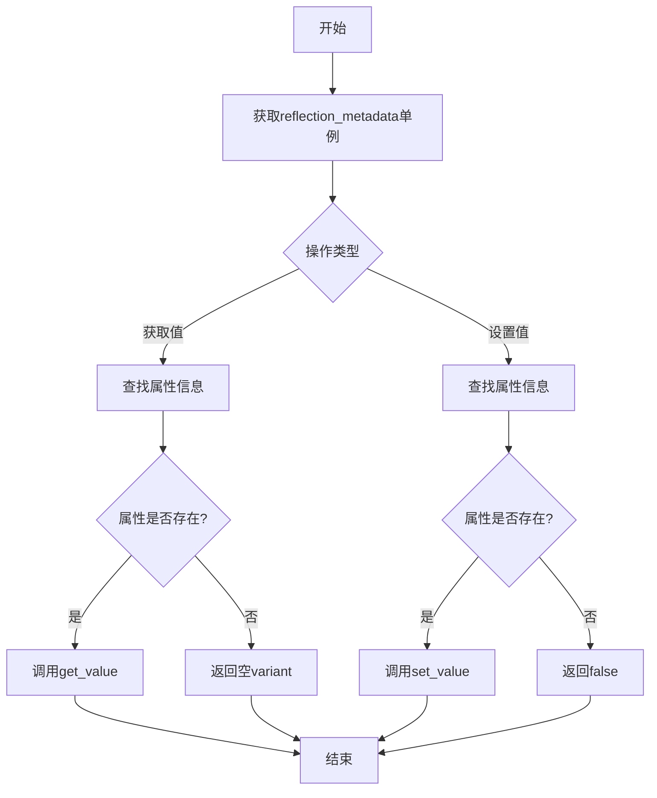
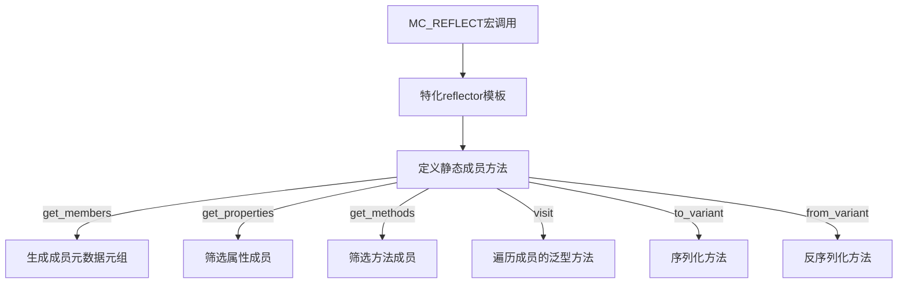
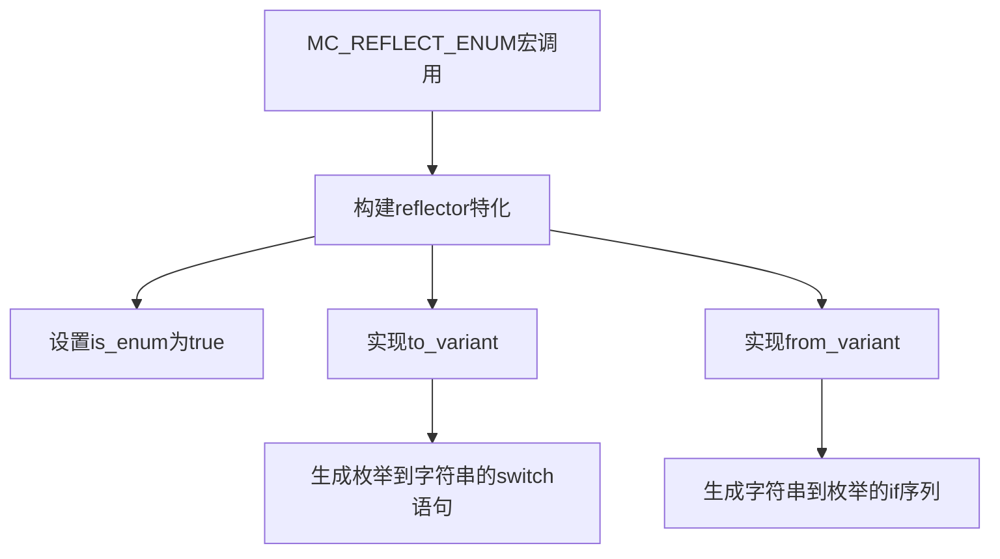

# MC++ 反射系统使用指南

## 1. 概述

mc 反射系统提供了一种在运行时获取和操作类型信息的机制。通过反射系统，你可以：

- 获取类型名称和元数据
- 访问和修改类的成员变量
- 调用类的成员方法
- 序列化和反序列化对象
- 支持枚举类型的字符串转换

反射系统基于模板元编程实现，无需修改编译器或运行时，完全在C++语言范围内工作。

## 2. 实现方案

mc 反射系统采用了以下核心技术实现：

### 2.1 反射元数据
系统通过定义特化的`reflector`模板类来存储类型元数据。特化是C++模板编程中的一个概念，指为特定类型提供模板的定制实现。通过对`reflector`模板进行特化，我们可以为不同的类型提供专门的反射信息和行为。

例如，对于一个自定义类型，我们可以这样特化reflector：

```cpp
namespace mc::reflect {
    template <typename T>
    struct reflector {
        using is_defined = std::false_type;
        using is_enum = std::false_type;
        // ...其他元数据
    };
}
```

通过宏（`MC_REFLECT`和`MC_REFLECT_ENUM`）对具体类型特化此模板。

### 2.2 成员信息模型

系统使用以下模型表示类成员：

- `property_info` - 存储属性（数据成员）的元数据和访问方法
- `method_info` - 存储方法的元数据和调用信息

### 2.3 缓存机制

为提高性能，系统通过`reflection`单例缓存每个类型的反射信息，避免重复构建：

```cpp
template <typename T>
reflection<std::remove_cv_t<std::remove_reference_t<T>>>& get_metadata();
```

### 2.4 架构总览

以下是MC++反射系统的架构图和主要流程图：

#### 2.4.1 反射系统类图



#### 2.4.2 反射注册流程



#### 2.4.3 序列化与反序列化流程



#### 2.4.4 方法调用流程



#### 2.4.5 访问成员流程



### 2.5 宏实现原理

#### 2.5.1 MC_REFLECT宏的实现原理

`MC_REFLECT`宏是用于为类型添加反射支持的核心工具。它的工作原理如下：



实现过程：

1. **模板特化**：为指定类型`T`特化`mc::reflect::reflector<T>`模板
2. **成员收集**：使用Boost预处理器递归展开成员列表，为每个成员创建元数据
3. **属性与方法分离**：通过标签系统区分属性和方法
4. **序列化实现**：通过`to_variant`方法自动实现对象到字典的转换
5. **反序列化实现**：通过`from_variant`方法自动实现字典到对象的转换
6. **元数据访问**：通过`visit`方法提供对成员的统一访问机制

关键技术点：
- 使用Boost预处理器处理变长参数和条件编译
- 使用C++模板元编程创建元数据类型
- 使用标签派发实现成员类型筛选
- 使用编译期断言保证反射安全性

#### 2.5.1.1 MC_REFLECT宏的C/C++对比分析

对于熟悉C语言但不熟悉C++的开发者，以下是MC_REFLECT宏实现的C/C++对比解析：

```cpp
#define MC_REFLECT(TYPE, MEMBERS)                                                                  \
    namespace mc::reflect {                                                                        \
    template <>                                                                                    \
    struct reflector<TYPE> {
        // ... 实现代码
    };                                                                                             \
    }
```

| 功能点 | C++实现 (MC_REFLECT) | C语言对应实现 |
|--------|---------------------|--------------|
| 类型标识 | `using is_defined = std::true_type;` | `#define TYPE_HAS_REFLECTION 1` |
| 类型名称 | `static constexpr std::string_view name() { return #TYPE; }` | `const char* get_type_name() { return "TypeName"; }` |
| 成员收集 | `static auto members = std::tuple_cat(...)` | `static struct MemberInfo members[] = {...}` |
| 成员筛选 | `template<typename Tag> static const auto& get_members_by_tag()` | `MemberInfo* get_properties(MemberInfo* all, int* count)` |
| 属性访问 | `std::apply([&](auto&... member) {...}, get_properties())` | `for(int i=0; i<member_count; i++) { callback(&members[i]); }` |
| 序列化 | `visit([&](std::string_view name, auto getter, auto) { dict[name] = getter(obj); })` | `void* value = get_member_value(obj, i); add_to_dict(dict, members[i].name, value, members[i].type)` |

##### 主要C++特性及其C语言替代方案：

1. **命名空间**
   - C++: `namespace mc::reflect { ... }`
   - C: 使用前缀命名约定，如 `mc_reflect_xxx`

2. **模板特化**
   - C++: `template<> struct reflector<TYPE> { ... }`
   - C: 为每种类型定义不同的函数，如 `void register_person_type()`

3. **静态类型信息**
   - C++: 编译期生成类型安全的元数据
   - C: 运行时构建类型表，通常使用预定义的类型枚举

4. **访问者模式**
   - C++: Lambda和参数包展开 `(visitor(...), ...)`
   - C: 函数指针回调 `void visit_members(void* obj, void (*callback)(void*, const char*, int))`

5. **自动序列化**
   - C++: 利用反射自动处理所有字段
   - C: 手动编写每个结构体的序列化/反序列化代码

##### 对C开发者的关键要点：

1. MC_REFLECT宏做了在C语言中需要大量手写代码才能完成的工作
2. 一行宏调用替代了数百行的手动类型注册和序列化代码
3. C++模板在编译期完成工作，避免了C中常见的运行时类型检查开销
4. 类型安全由编译器保证，而非运行时检查
5. 不需要为每个类型手动实现序列化/反序列化逻辑

MC_REFLECT的实现展示了C++如何通过模板元编程和现代语言特性，将C语言中需要手动编写的重复性代码自动化，同时提供更强的类型安全保证和更好的性能。

#### 2.5.2 MC_REFLECT_ENUM宏的实现原理

`MC_REFLECT_ENUM`宏专门用于为枚举类型添加反射支持。它主要解决枚举值与字符串之间的双向转换问题。



实现过程：

1. **模板特化**：为指定枚举类型特化`reflector`模板
2. **枚举标识**：设置`is_enum`为`true`，表明这是枚举类型
3. **值到字符串**：通过`to_variant`实现枚举值到字符串的转换，使用switch语句
4. **字符串到值**：通过`from_variant`实现字符串到枚举值的转换，使用if序列
5. **异常处理**：对于无效的枚举值或字符串，抛出`bad_enum_cast`异常

核心技术点：
- 使用宏拼接生成switch和if序列
- 使用BOOST_PP_STRINGIZE将枚举成员标识符转换为字符串
- 使用宏分解和重组来处理多种枚举语法
- 支持枚举值的双向转换

两个宏通过这些机制，在不修改编译器和不依赖RTTI的情况下，为C++类型提供了完整的反射功能。这种基于预处理器和模板元编程的方案，既保证了类型安全，又提供了良好的性能和兼容性。

### 2.6 实现效率优化

反射操作可能比直接访问开销大，可以通过以下方式优化：

```cpp
// 对频繁访问的属性缓存反射信息
const auto* property_info = mc::reflect::get_property_info<Person>("name");
if (property_info) {
    // 多次使用同一属性
    for (auto& obj : objects) {
        mc::variant value = property_info->get_value(obj);
        // 处理值...
    }
}
```

## 3. 基本用法

### 3.1 为类添加反射支持

使用 `MC_REFLECT` 宏来为类添加反射支持。示例：

```cpp
class Person {
public:
    std::string name;
    int age;
    bool is_male;

    Person() : name(""), age(0), is_male(false) {}
    Person(const std::string& n, int a, bool m)
        : name(n), age(a), is_male(m) {}
};

// 添加反射支持
MC_REFLECT(Person, (name)(age)(is_male))
```

也可以为成员指定自定义名称：

```cpp
// 使用自定义名称
MC_REFLECT(Person, ((full_name, name))(age)(is_male))
```

### 3.2 为枚举添加反射支持

使用 `MC_REFLECT_ENUM` 宏来为枚举添加反射支持：

```cpp
enum class Color { RED, GREEN, BLUE };

// 添加反射支持
MC_REFLECT_ENUM(Color, (RED)(GREEN)(BLUE))
```

## 4. 反射API

### 4.1 类型信息查询

```cpp
// 检查类型是否支持反射
bool supported = mc::reflect::is_reflectable<Person>();

// 检查类型是否为枚举
bool is_enum = mc::reflect::is_enum<Color>();

// 获取类型名称
const char* type_name = mc::reflect::get_type_name<Person>();
```

### 4.2 属性访问

```cpp
Person person("张三", 30, true);

// 访问所有成员
mc::reflect::visit_properties<Person>([&](const char* name,
                                     auto getter,
                                     auto setter) {
    // name: 成员名称
    // getter: 获取成员值的函数
    // setter: 设置成员值的函数
    mc::variant value = getter(person);
    std::cout << name << ": " << value << std::endl;
});

// 获取特定属性
mc::variant value = mc::reflect::get_property(person, "name");
assert(value == "张三");

// 设置特定属性
bool success = mc::reflect::set_property(person, "age", 35);
assert(success && person.age == 35);

// 获取属性名称（通过偏移量）
size_t offset = MC_MEMBER_OFFSETOF(Person, &Person::name);
std::string_view name = mc::reflect::get_property_name<Person>(offset);
assert(name == "name");

// 获取属性名称（通过成员指针）
std::string_view name2 = mc::reflect::get_property_name<Person>(&Person::name);
assert(name2 == "name");
```

### 4.3 方法调用

```cpp
class Calculator {
public:
    int add(int a, int b) { return a + b; }
    double multiply(double a, double b) { return a * b; }
    void reset() { /* ... */ }
};

// 添加反射支持（包括方法）
MC_REFLECT(Calculator, (add)(multiply)(reset))

// 使用反射调用方法
Calculator calc;
mc::variant result = mc::reflect::invoke(calc, "add", {5, 3});
assert(result.as<int>() == 8);

// 检查方法是否存在
bool has_method = mc::reflect::has_method<Calculator>("multiply");
assert(has_method);

// 获取方法参数数量
size_t arg_count = mc::reflect::method_arg_count<Calculator>("add");
assert(arg_count == 2);

// 获取方法返回类型
std::string_view return_type = mc::reflect::method_return_type<Calculator>("add");
assert(return_type == "int");
```

### 4.4 序列化和反序列化

```cpp
// 序列化为变体
Person person("张三", 30, true);
mc::variant var(person);

// 检查序列化结果
const mc::dict& dict = var.as<mc::dict>();
assert(dict["name"] == "张三");
assert(dict["age"] == 30);
assert(dict["is_male"] == true);

// 反序列化
Person new_person = var.as<Person>();
assert(new_person.name == "张三");
assert(new_person.age == 30);
assert(new_person.is_male == true);
```

#### 4.4.1 序列化和反序列化概念

- **序列化**：将对象转换为可传输或存储的格式（例如字节流、字符串、数据结构）
- **反序列化**：将序列化的数据恢复为原始对象

在C语言中，通常需要手动编写代码来打包/解包结构体。而在C++中，特别是使用反射系统，这个过程可以自动化。mc::variant 作为中间容器，可以平滑地处理不同类型之间的转换，大大简化了序列化过程。

##### 1. **序列化部分**:
   ```cpp
   Person person("张三", 30, true);
   ```
   - 创建一个Person对象，相当于C语言中的结构体初始化
   - 使用了C++的构造函数语法，在C语言中可能是这样：
     ```c
     struct Person person;
     strcpy(person.name, "张三");
     person.age = 30;
     person.is_male = true;
     ```

   ```cpp
   mc::variant var(person);
   ```
   - 这行代码将Person对象序列化为variant容器
   - variant是一个通用容器，可以存储多种类型的数据（类似union但更强大）
   - 在C语言中可能需要手动实现：
     ```c
     // 手动填充序列化结构
     serialize_person(&person, &serialized_data);
     ```

##### 2. **检查序列化结果**:
   ```cpp
   const mc::dict& dict = var.as<mc::dict>();
   ```
   - 这行代码是将variant中的内容提取为dict类型（键值对映射）
   - `const`：表示该引用指向的内容不可修改
   - `mc::dict&`：C++引用类型，类似指针但更安全，无需手动解引用
   - `var.as<mc::dict>()`：调用variant的模板方法as，指定要转换的目标类型为mc::dict
   - 在C语言中的类似操作：
     ```c
     struct Dictionary* dict_ptr = get_dict_from_variant(&var);
     if(dict_ptr == NULL) {
         // 处理错误
     }
     ```

   ```cpp
   assert(dict["name"] == "张三");
   assert(dict["age"] == 30);
   assert(dict["is_male"] == true);
   ```
   - 验证序列化结果是否正确
   - dict支持使用[]操作符按键访问（类似哈希表）
   - 在C语言中可能是：
     ```c
     assert(strcmp(get_string_from_dict(dict_ptr, "name"), "张三") == 0);
     assert(get_int_from_dict(dict_ptr, "age") == 30);
     assert(get_bool_from_dict(dict_ptr, "is_male") == true);
     ```

##### 3. **反序列化部分**:
   ```cpp
   Person new_person = var.as<Person>();
   ```
   - 将variant转换回Person对象
   - 在C语言中可能需要：
     ```c
     struct Person new_person;
     deserialize_person(&serialized_data, &new_person);
     ```
   - 反序列化过程会自动将dict中的每个字段映射到对象的相应成员，无需手动处理每个字段
   - 这种自动化减少了代码量，同时避免了因手动映射字段而引入的错误

##### mc::variant与mc::dict的关系

- **mc::variant**：通用数据容器，可以存储任意类型的数据（整数、字符串、对象等）
  - 类似于C语言中的联合体(union)，但更安全且功能更强大
  - 提供类型安全的访问方法，如`as<T>()`和`try_as<T>()`
  - 支持多态行为，一个variant可以转换为多种不同类型
  - 在反射系统中作为通用数据传输的桥梁

- **mc::dict**：键值对映射容器，类似于C语言中的哈希表
  - 存储键值对，键为字符串，值为variant类型
  - 使用`[]`操作符访问元素
  - 类似于JSON对象结构，适合表示结构化数据
  - 在反射系统中主要用于表示对象的成员变量集合

两者的协作关系：
1. 当对象被序列化时，其各个成员被收集到一个dict中
2. 这个dict被封装在一个variant中，便于传输和转换
3. 反序列化时，variant首先被转换为dict
4. 然后dict中的各个字段被映射回对象的成员变量

这种设计使得反射系统可以处理任意复杂度的对象结构，包括嵌套对象和容器类型。

序列化在以下场景特别有用：
- 网络通信中传输数据
- 持久化存储对象状态
- 配置文件的读写
- 跨语言/跨系统数据交换
- 分布式系统中的数据共享

### 4.5 枚举转换

```cpp
// 枚举转字符串
Color color = Color::GREEN;
mc::variant var(color);
assert(var == "GREEN");

// 字符串转枚举
Color new_color = var.as<Color>();
assert(new_color == Color::GREEN);

// 无效值会抛出异常
try {
    mc::variant invalid_var = "YELLOW";
    Color invalid_color = invalid_var.as<Color>();
} catch (const mc::reflect::bad_enum_cast& e) {
    std::cerr << e.what() << std::endl;
}
```

### 4.6 部分对象更新

```cpp
// 部分更新对象成员
Person person("张三", 30, true);
mc::reflect::from_variant(mc::dict{{"age", 35}}, person);
// 仅更新age字段，其他字段保持不变
assert(person.name == "张三");
assert(person.age == 35);
assert(person.is_male == true);
```

### 4.7 嵌套对象处理

```cpp
class Address {
public:
    std::string city;
    int zip_code;
};
MC_REFLECT(Address, (city)(zip_code));

class Company {
public:
    std::string name;
    Address address; 
};
MC_REFLECT(Company, (name)(address));

// 序列化嵌套对象
Company company{"Example", {"Beijing", 100080}};
mc::variant var = company;
// 反序列化时会自动处理嵌套结构
Company new_company = var.as<Company>();
assert(new_company.name == "Example");
assert(new_company.address.city == "Beijing");
assert(new_company.address.zip_code == 100080);
```

## 5. 高级使用

### 5.1 自定义类型的序列化支持

要支持自定义类型的序列化，需要特化`to_variant`和`from_variant`函数：

```cpp
// 自定义类型示例
struct Custom {
    int value;
    // 不使用MC_REFLECT，而是手动实现转换
};

// 添加自定义序列化支持
namespace mc {
namespace reflect {
    void to_variant(const Custom& obj, variant& var) {
        var = mc::dict{{"custom_value", obj.value}};
    }
    
    void from_variant(const variant& var, Custom& obj) {
        if (var.is_dict()) {
            obj.value = var.as<mc::dict>().get("custom_value", 0);
        }
    }
}
}
```

### 5.2 性能优化

反射操作可能比直接访问开销大，可以通过以下方式优化：

```cpp
// 对频繁访问的属性缓存反射信息
const auto* property_info = mc::reflect::get_property_info<Person>("name");
if (property_info) {
    // 多次使用同一属性
    for (auto& obj : objects) {
        mc::variant value = property_info->get_value(obj);
        // 处理值...
    }
}
```

## 6. 应用场景

### 6.1 配置系统

使用反射可以轻松创建配置系统，实现配置的加载、保存和验证：

```cpp
struct Config {
    std::string server_ip;
    int port;
    bool use_ssl;
};
MC_REFLECT(Config, (server_ip)(port)(use_ssl))

// 从配置文件加载
mc::variant config_var = load_from_json_file("config.json");
Config config = config_var.as<Config>();

// 保存配置
save_to_json_file("config.json", mc::variant(config));
```

### 6.2 序列化与网络通信

反射系统可简化网络通信中的数据序列化：

```cpp
// 服务端代码
void handle_request(const Request& req) {
    Response res{/* 处理请求 */};
    send_response(mc::variant(res)); // 自动序列化
}

// 客户端代码
void on_response(mc::variant var) {
    Response res = var.as<Response>(); // 自动反序列化
    process_response(res);
}
```

### 6.3 UI自动绑定

可以基于反射自动生成UI界面：

```cpp
template <typename T>
void generate_ui_for_object(T& obj) {
    mc::reflect::visit_properties<T>([&](const char* name, auto getter, auto setter) {
        mc::variant value = getter(obj);
        
        // 根据属性类型创建相应UI控件
        if (value.is_int()) {
            add_number_field(name, value.as<int>(), [&obj, setter](int new_value) {
                setter(obj, new_value);
            });
        } else if (value.is_string()) {
            add_text_field(name, value.as<std::string>(), [&obj, setter](std::string new_value) {
                setter(obj, new_value);
            });
        }
        // 处理其他类型...
    });
}
```

### 6.4 数据验证

反射系统可用于实现数据验证：

```cpp
template <typename T>
bool validate(const T& obj, mc::dict& errors) {
    bool valid = true;
    
    mc::reflect::visit_properties<T>([&](const char* name, auto getter, auto setter) {
        mc::variant value = getter(obj);
        
        // 根据属性类型和名称应用不同的验证规则
        if (std::string(name) == "email" && value.is_string()) {
            std::string email = value.as<std::string>();
            if (!is_valid_email(email)) {
                errors[name] = "无效的电子邮件地址";
                valid = false;
            }
        }
        // 其他验证规则...
    });
    
    return valid;
}
```

## 7. 注意事项

1. 反射系统目前支持基本类型、STL容器和自定义类型
2. 反射的成员必须是公有的
3. 使用反射API时注意异常处理
4. 枚举反射不支持自定义值，只支持连续的枚举值
5. 支持以下STL容器类型：
   - vector
   - map
   - unordered_map
   - set
   - unordered_set
   - list
   - deque
   - array
   - unique_ptr
   - shared_ptr
   - optional
   - pair
   - tuple

   示例：
   ```cpp
   class Data {
   public:
       std::vector<int> scores;
       std::map<std::string, Address> locations;
   };
   MC_REFLECT(Data, (scores)(locations));

   // 支持复杂容器的序列化
   Data d;
   d.scores = {80, 90, 75};
   d.locations = {{"home", {"Beijing", 100080}}, {"work", {"Shanghai", 200080}}};
   mc::variant var = d;
   Data new_d = var.as<Data>();
   ```

## 8. 完整示例

```cpp
#include <mc/reflect.h>
#include <iostream>

// 定义枚举
enum class Status { ACTIVE, INACTIVE, SUSPENDED };
MC_REFLECT_ENUM(Status, (ACTIVE)(INACTIVE)(SUSPENDED))

// 定义地址类
class Address {
public:
    std::string city;
    std::string street;
    int number;

    Address() : city(""), street(""), number(0) {}
    Address(const std::string& c, const std::string& s, int n)
        : city(c), street(s), number(n) {}
};
MC_REFLECT(Address, (city)(street)(number))

// 定义用户类
class User {
public:
    std::string username;
    int id;
    Status status;
    Address address;
    std::vector<std::string> skills;

    User() : username(""), id(0), status(Status::INACTIVE) {}
    User(const std::string& name, int uid, Status s, const Address& addr)
        : username(name), id(uid), status(s), address(addr) {}
    
    double calculate_score() const {
        return id * 1.5;
    }
};
MC_REFLECT(User, (username)(id)(status)(address)(skills)(calculate_score))

int main() {
    // 创建对象
    Address addr("北京", "中关村大街", 10);
    User user("admin", 1, Status::ACTIVE, addr);
    user.skills = {"C++", "Python", "SQL"};

    // 序列化
    mc::variant var(user);
    std::cout << "序列化结果: " << var << std::endl;

    // 修改序列化数据
    mc::mutable_dict dict = var.as<mc::dict>();
    dict["status"] = "SUSPENDED";
    dict["username"] = "superadmin";

    // 反序列化
    User new_user = mc::variant(dict).as<User>();
    assert(new_user.status == Status::SUSPENDED);
    assert(new_user.username == "superadmin");
    
    // 调用方法
    mc::variant score = mc::reflect::invoke(new_user, "calculate_score");
    std::cout << "用户得分: " << score << std::endl;

    return 0;
}
```

这个示例展示了反射系统的主要功能：枚举反射、嵌套对象、STL容器支持、方法调用等。通过这个例子，你可以了解如何在实际应用中利用反射系统提高代码的灵活性和可扩展性。