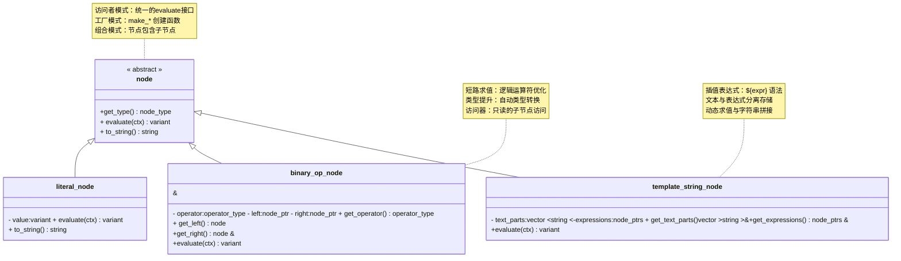
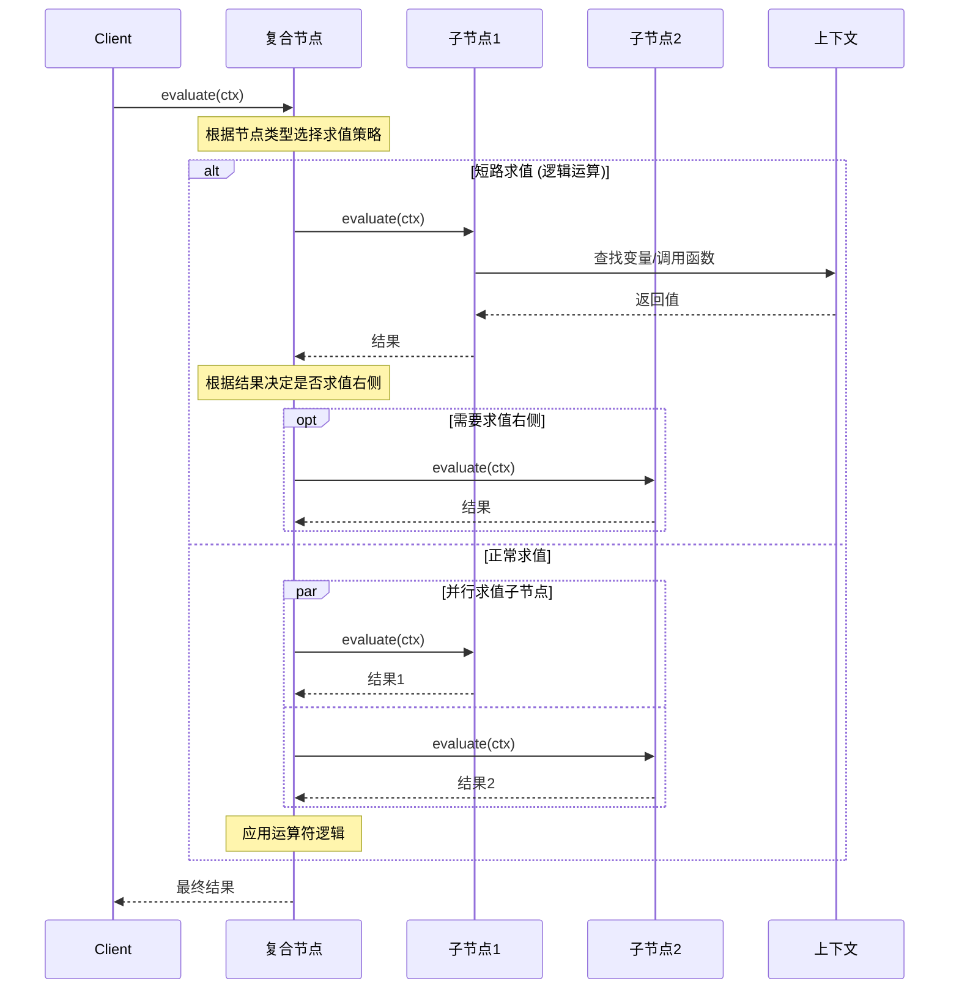
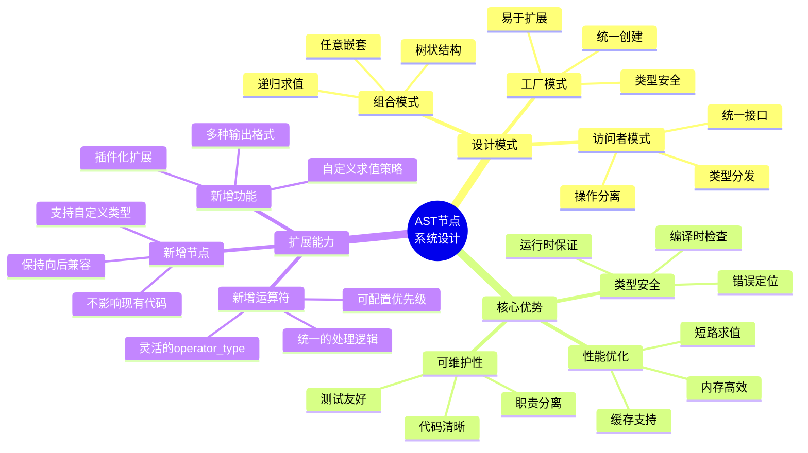
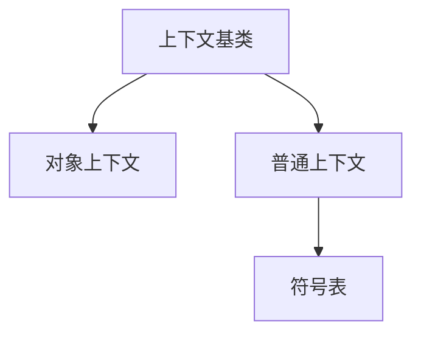

#表达式引擎设计文档

##1. 模块设计

    ## #1.1 核心组件关系

```mermaid
        graph TD
            Engine[表达式引擎 Engine] Lexer[词法分析器 Lexer] Parser[语法分析器 Parser] AST[抽象语法树 AST] Context[上下文 Context] Builtin[内置函数 Builtin]

    Engine-- > Lexer
                                  Engine-- > Parser
                                  Engine-- > Context

                                                                                                                  Lexer-- Token流-- > Parser
                                                                                                                  Parser-- 生成-- > AST
                                                                                                                  AST-- 求值-- > Context
                                                                                                                  Context-- 函数调用-- > Builtin
```

                                                                                                                                                 ## #1.2 AST节点类型系统

                                                                                                                                                 ####1.2.1 设计理念

                                                                                                                                                 AST节点系统采用了经典的** 组合模式** 和** 访问者模式** 的设计思想，体现了以下核心理念：

                                                                                                                                                 1. *
                                                                                                                                                 *统一接口原则* *
                                                                                                                                                 -所有节点继承自统一的 `node` 基类 -
                                                                                                                                             提供一致的 `evaluate()`、`get_type()`、`to_string()` 接口
                                                                                                                                             - 保证了系统的一致性和可预测性

                                                                                                                                                   2. *
                                                                                                                                                   *单一职责原则* * -每个节点类型只负责一种特定的语法结构
                                                                                                                                             - 字面值节点只处理常量值，运算节点只处理运算逻辑
                                                                                                                                             - 职责分离使得代码更易于理解和维护

                                                                                                                                                   3. *
                                                                                                                                                   *不可变性设计* * -节点一旦创建就不可修改，保证了线程安全
                                                                                                                                             - 避免了状态变化带来的复杂性
                                                                                                                                             - 支持表达式的缓存和重用

                                                                                                                                                   4. *
                                                                                                                                                   *类型安全保证* * -使用 `node_type` 枚举明确区分节点类型
                                                                                                                                             - 编译时类型检查，避免运行时错误
                                                                                                                                             - 支持类型相关的优化策略

                                                                                                                                                   5. *
                                                                                                                                                   *组合式架构* * -复杂节点由简单节点组合而成（如二元运算节点包含两个子节点）
                                                                                                                                             - 支持任意深度的嵌套表达式
                                                                                                                                             - 天然支持递归求值

                                                                                                                                                   6. *
                                                                                                                                                   *可扩展性设计* * -新增节点类型不影响现有代码
                                                                                                                                             - 工厂方法模式支持统一的节点创建
                                                                                                                                             - 支持自定义节点类型的扩展

                                                                                                                                             ####1.2.2 节点分类体系

```mermaid graph LR Node[node 基类 统一接口定义]

                                                                                                                                             subgraph Terminal["叶子节点 Terminal Nodes"] LiteralNode[literal_node 字面值节点] VariableNode[variable_node 变量引用节点] end

                                                                                                                                             subgraph Operator["运算节点 Operator Nodes"] BinaryOpNode[binary_op_node 二元运算节点] UnaryOpNode[unary_op_node 一元运算节点] ConditionalNode[conditional_node 条件运算节点] end

                                                                                                                                             subgraph Invocation["调用节点 Invocation Nodes"] FuncCallNode[function_call_node 函数调用节点] ObjMethodCallNode[object_method_call_node 方法调用节点] end

                                                                                                                                             subgraph Access["访问节点 Access Nodes"] PropAccessNode[property_access_node 属性访问节点] end

                                                                                                                                             subgraph Composite["复合节点 Composite Nodes"] TplStrNode[template_string_node 模板字符串节点] end

                                                                                                                                             Node-- >
    LiteralNode
    Node-- > VariableNode
    Node-- > BinaryOpNode
    Node-- > UnaryOpNode
    Node-- > ConditionalNode
    Node-- > FuncCallNode
    Node-- > ObjMethodCallNode
    Node-- > PropAccessNode
    Node-- > TplStrNode
```

    ####1.2.3 节点设计模式



#### 1.2.4 求值策略设计



#### 1.2.5 架构优势总结



### 1.3 上下文管理系统



### 1.4 引擎系统集成

表达式引擎是整个引擎系统的一个重要子系统，通过以下方式与其他组件集成:

1. 对象系统集成
   - 通过 `mc::engine::engine` 类管理表达式引擎实例
   - 使用 `get_expr_engine()` 获取表达式引擎
   - 支持对象属性的动态访问和计算

2. 错误处理集成
   - 使用统一的错误处理机制
   - 支持错误的传播和转换
   - 提供详细的错误信息和上下文

3. 上下文管理
   - 支持对象上下文和普通上下文
   - 实现变量作用域和符号解析
   - 处理函数调用和属性访问

### 1.5 表达式引擎与引擎系统关系

表达式引擎与 `@engine` 文件夹的关系体现在以下几个方面：

1. 架构关系
   - 表达式引擎(`mc::expr::engine`)是引擎系统的子系统
   - 通过 `mc::engine::engine` 类统一管理和访问
   - 与对象系统、错误系统等核心组件紧密集成

2. 功能协作
   - 表达式引擎：负责解析和执行动态表达式
   - 对象系统：提供属性访问和方法调用能力
   - 错误系统：处理异常情况和错误传播
   - 路径系统：管理对象定位和访问

3. 代码组织
   - 表达式引擎核心代码位于 `mc::expr` 命名空间
   - 引擎系统通用组件位于 `mc::engine` 命名空间
   - 通过清晰的接口边界实现功能解耦

4. 文件结构
   - `engine.h`: 定义引擎主类，管理整个系统
   - `base.h`: 包含基础类型和接口定义
   - `interface.h`: 实现接口系统
   - `object.h`: 实现对象系统
   - `property.h`: 处理属性系统
   - `error.h`/`error_engine.h`: 错误处理系统
   - `path.h`: 对象路径管理
   - `utils.h`: 工具函数集合

5. 交互方式
   - 表达式计算：通过上下文系统访问变量和函数
   - 属性访问：使用对象系统的属性机制
   - 错误处理：集成到统一的错误处理流程
   - 路径解析：利用路径系统定位对象

这种设计使得表达式引擎能够灵活地处理各种表达式计算需求，同时又能与整个系统紧密协作，保持了系统的可扩展性和可维护性。

### 1.6 AST节点继承关系

```mermaid
classDiagram
    class Node {
        << abstract >>
            +get_type() + evaluate() + to_string()
    }

            Node < |
        --LiteralNode
                Node < |
        --VariableNode
                Node < |
        --BinaryOpNode
                Node < |
        --UnaryOpNode
                Node < |
        --ConditionalNode
                Node < |
        --FunctionCallNode
                Node < |
        --PropertyAccessNode
                Node < |
        --TemplateStringNode
                Node < |
        --ObjectMethodCallNode

        class LiteralNode {
        - value:variant
    } class VariableNode {
        - name:string
    } class BinaryOpNode {
        - operator:operator_type - left:Node - right:Node
    } class UnaryOpNode {
        - operator:operator_type - operand:Node
    } class ObjectMethodCallNode {
        - object:Node - method_name:string - args:Node[]
    }
```

        ## #1.7 上下文继承关系

```mermaid
            classDiagram class ContextBase {
        << abstract >>
            +has_variable() + has_function() + get_variable() + invoke() + set_parent() + get_parent()
    }

            ContextBase < |
        --Context
                ContextBase < |
        --ObjectContext

        class Context {
        - parent:ContextBase - impl:shared_ptr<context_impl> + register_variable() + register_function() + register_object() + import_from_dict()
    }

    class ObjectContext {
        - object:AbstractObject - parent:ContextBase + get_object()
    }
```

            ## #1.8 数据流

```mermaid
                sequenceDiagram
                    participant Client
                        participant Engine
                            participant Lexer
                                participant Parser
                                    participant AST
                                        participant Context

                                            Client->> Engine : evaluate(expr, ctx)
                                                                   Engine->> Lexer : scan_tokens(expr)
                                                                                         Lexer-- >>
                                                                                     Engine : tokens
                                                                                              Engine->> Parser : parse(tokens)
                                                                                                                     Parser-- >>
                                                                                                                 Engine : ast
                                                                                                                          Engine->> AST : evaluate(ctx)
                                                                                                                                              AST->> Context : lookup / invoke
                                                                                                                                                               Context-- >>
                                                                                                                 AST : result
                                                                                                                       AST-- >>
                                                                                                                       Engine : result
                                                                                                                                Engine-- >>
                                                                                                                                Client : result
```

                                                                                                                                         ## #1.9 错误处理流

```mermaid
                                                                                                                                         graph TD
                                                                                                                                         Input[输入表达式]-- > Lexer

                                                                                                                                         Lexer-- > |
        词法错误 | LexerError[ParseErrorException] Lexer-- > | 成功 | Parser

                                                                          Parser-- > |
        语法错误 | ParserError[ParseErrorException] Parser-- > | 成功 | AST

                                                                            AST-- > |
        求值 | Evaluation

                   Evaluation-- > |
        类型错误 | TypeError[InvalidOpException] Evaluation-- > | 除零错误 | DivError[DivideByZeroException] Evaluation-- > | 变量未定义 | VarError[InvalidArgException] Evaluation-- > | 成功 | Result[计算结果]
```

                                                                                                                                                                                                     ##2. 概述

                                                                                                                                                                                                     表达式引擎是一个用于解析和执行动态表达式的组件。它支持基本的算术运算、逻辑运算、位运算、变量引用、函数调用、属性访问以及模板字符串等功能。

                                                                                                                                                                                                     ##3. 整体架构

                                                                                                                                                                                                     表达式引擎由以下主要组件构成：

                                                                                                                                                                                                     1. 词法分析器（Lexical Analyzer，简称 Lexer）
                                                                                                                                                                                                     - 负责将输入的表达式字符串转换为标记（Token）序列 - 支持数字、字符串、标识符、运算符等基本标记 - 支持模板字符串的解析

                                                                                                                                                                                                     2. 语法分析器（Parser）
                                                                                                                                                                                                     - 将标记序列转换为抽象语法树（AST） - 实现运算符优先级和结合性 - 处理括号表达式和函数调用

                                                                                                                                                                                                     3. 抽象语法树（Abstract Syntax Tree，简称 AST）
                                                                                                                                                                                                     - 由各种类型的节点组成，每种节点对应一种语法结构 - 支持表达式的求值和字符串表示

                                                                                                                                                                                                     4. 上下文（Context）
                                                                                                                                                                                                     - 提供变量和函数的运行时环境 - 支持变量查找和函数调用 - 支持对象属性访问

                                                                                                                                                                                                     ##4. 语法规则

                                                                                                                                                                                                     表达式支持以下语法结构：

                                                                                                                                                                                                     1. 字面值
                                                                                                                                                                                                     - 数字：整数和浮点数（支持十六进制，如 0x0F） - 字符串：使用双引号或单引号 - 模板字符串：支持 `$ {
        expression
    }
    ` 形式的插值

                    2. 运算符 -
                    算术运算： +、-、*、/、%
                                       -比较运算： ==、!=、<、<=、>、>=
                                                             -逻辑运算：&&、||、!-位运算： &、|、^、~、<<、>>
                                                                                                       -条件运算：
        ?:

        3. 变量和函数 - 变量引用：直接使用标识符 - 函数调用：func(arg1, arg2, ...) - 属性访问：obj.prop
            - 方法调用：obj.method(arg1, arg2, ...)

                  ##5. 实现细节

              ## #5.1 词法分析

              词法分析器将输入字符串转换为标记序列，主要处理：

              1. 标记类型
            - 关键字和标识符
            - 数字和字符串字面值
            - 运算符和分隔符
            - 模板字符串标记

            2. 特殊处理
            - 处理转义字符
            - 模板字符串的分段解析
            - 错误处理和报告

            ## #5.2 语法分析

            语法分析器采用递归下降的方式构建AST：

            1. 表达式解析
            - 按照运算符优先级从低到高解析
            - 处理左递归和右递归
            - 支持括号表达式

            2. 函数调用解析
            - 解析函数名和参数列表
            - 支持嵌套函数调用
            - 支持方法调用

            ## #5.3 AST节点

            主要的AST节点类型：

            1. 基本节点
            - `literal`：字面值节点
            - `variable`：变量引用节点
            - `binary_op`：二元运算符节点
            - `unary_op`：一元运算符节点

            2. 复合节点
            - `conditional`：条件表达式节点
            - `function_call`：函数调用节点
            - `property_access`：属性访问节点
            - `object_method_call`：对象方法调用节点
            - `template_string`：模板字符串节点

            ## #5.4 上下文管理

            上下文系统的主要特性：

            1. 变量管理
            - 支持变量的注册和查找
            - 支持变量作用域
            - 支持对象属性访问

            2. 函数管理
            - 支持函数的注册和调用
            - 支持内置函数
            - 支持对象方法调用

            3. 作用域链
            - 支持父子上下文
            - 支持变量和函数的继承
            - 支持全局和局部作用域

            ##6. 使用示例

```cpp
            // 创建表达式引擎
            mc::expr::engine engine;

    // 创建上下文并设置变量
    auto ctx = engine.make_context();
    ctx.register_variable("x", 10);
    ctx.register_variable("y", 20);

    // 编译和执行表达式
    auto result = engine.evaluate("x + y * 2", ctx); // 结果: 50

    // 使用模板字符串
    auto msg = engine.evaluate("\"结果是: ${x + y}\"", ctx); // 结果: "结果是: 30"

    // 注册自定义函数
    auto add_func = mc::expr::make_simple_function("add", [](int a, int b) {
        return a + b;
    });
    ctx.register_function(add_func);
    auto sum = engine.evaluate("add(x, y)", ctx); // 结果: 30

    // 从dict导入变量
    mc::dict variables = {
        {"name", "Alice"},
        {"age", 25}};
    ctx.import_from_dict(variables);
    auto greeting = engine.evaluate("\"Hello, ${name}! You are ${age} years old.\"", ctx);
    ```

        ##7. 错误处理

            表达式引擎提供了完善的错误处理机制：

        1. 词法错误 -
        非法字符 - 未闭合的字符串 - 非法的数字格式

        2. 语法错误 -
        不匹配的括号 - 非法的表达式结构 - 未闭合的模板表达式

        3. 运行时错误 -
        未定义的变量 - 类型不匹配 - 除零错误 - 函数调用错误

        ##8. 性能优化

        1. 编译优化 -
        表达式预编译 - AST节点复用 - 常量折叠

        2. 运行时优化 -
        变量查找缓存 - 函数调用缓存 - 表达式结果缓存

        ##9. 扩展性

            表达式引擎的设计支持以下扩展：

        1. 运算符扩展 -
        添加新的运算符 - 自定义运算符优先级 - 自定义运算符行为

        2. 函数扩展 -
        注册自定义函数 - 扩展内置函数 - 支持可变参数

        3. 类型扩展 -
        支持自定义类型 - 类型转换规则 - 运算符重载

        ##10. 内置函数

            表达式引擎提供了丰富的内置函数，使用反射机制进行模块化注册：

        ## #10.1 数学函数

        1. `abs(x)`：计算绝对值
        - 支持整数和浮点数
        - 示例：`abs(-10) = 10`, `abs(-3.14) = 3.14`

                                               2. `min(x1, x2, ...)`：计算最小值
                                               - 支持多个参数
                                               - 支持混合数值类型
                                               - 示例：`min(3, 1, 4, 1, 5) = 1`

                                                                             3. `max(x1, x2, ...)`：计算最大值
                                                                             - 支持多个参数
                                                                             - 支持混合数值类型
                                                                             - 示例：`max(3.14, 2.71, 1.41) = 3.14`

                                                                                                              4. `pow(base, exponent)`：计算幂
                                                                                                              - 支持负指数和零次方
                                                                                                              - 示例：`pow(2, 3) = 8.0`, `pow(2, -1) = 0.5`

                                                                                                                                                       5. `sqrt(x)`：计算平方根
                                                                                                                                                       - 示例：`sqrt(16) = 4.0`

                                                                                                                                         6. `round(x)`, `floor(x)`, `ceil(x)`：数值舍入
                                                                                                                                                                        - 示例：`round(3.7) = 4.0`, `floor(3.7) = 3.0`, `ceil(3.2) = 4.0`

                                                                                                                                                                                                                        7. `log(x)`, `exp(x)`：对数和指数函数

                                                                                                                                                                                                                                         ## #10.2 字符串函数

                                                                                                                                                                                                                                         1. `concat(str1, str2, ...)`：字符串连接
                                                                                                                                                                                                                                         - 支持任意数量的参数
                                                                                                                                                                                                                                         - 自动转换非字符串参数
                                                                                                                                                                                                                                         - 示例：`concat('hello', ' ', 'world') = "hello world"`

                                                                                                                                                                                                                                                                                  2. `length(str)`：获取字符串长度
                                                                                                                                                                                                                                                                                  - 示例：`length('hello') = 5`

                                                                                                                                                                                                                                                                                                             3. `substring(str, start, length)`：截取子字符串
                                                                                                                                                                                                                                                                                                             - 支持负索引（从末尾开始）
                                                                                                                                                                                                                                                                                                             - 自动处理越界情况
                                                                                                                                                                                                                                                                                                             - 示例：`substring('hello world', 0, 5) = "hello"`

                                                                                                                                                                                                                                                                                                                                                       4. `to_upper(str)`：转换为大写
                                                                                                                                                                                                                                                                                                                                                       - 示例：`to_upper('hello') = "HELLO"`

                                                                                                                                                                                                                                                                                                                                                                                    5. `to_lower(str)`：转换为小写
                                                                                                                                                                                                                                                                                                                                                                                    - 示例：`to_lower('HELLO') = "hello"`

                                                                                                                                                                                                                                                                                                                                                                                                                 ## #10.3 类型转换函数

                                                                                                                                                                                                                                                                                                                                                                                                                 1. `to_string(value)`：转换为字符串
                                                                                                                                                                                                                                                                                                                                                                                                                 - 支持数值、布尔值等类型
                                                                                                                                                                                                                                                                                                                                                                                                                 - 示例：`to_string(42) = "42"`

                                                                                                                                                                                                                                                                                                                                                                                                                                          2. `to_integer(value)`：转换为整数
                                                                                                                                                                                                                                                                                                                                                                                                                                          - 支持字符串、浮点数、布尔值
                                                                                                                                                                                                                                                                                                                                                                                                                                          - 示例：`to_integer('42') = 42`

                                                                                                                                                                                                                                                                                                                                                                                                                                                                      3. `to_double(value)`：转换为浮点数
                                                                                                                                                                                                                                                                                                                                                                                                                                                                      - 支持字符串、整数、布尔值
                                                                                                                                                                                                                                                                                                                                                                                                                                                                      - 示例：`to_double('3.14') = 3.14`

                                                                                                                                                                                                                                                                                                                                                                                                                                                                                                   4. `to_bool(value)`：转换为布尔值
                                                                                                                                                                                                                                                                                                                                                                                                                                                                                                   - 数值：非零为true
                                                                                                                                                                                                                                                                                                                                                                                                                                                                                                   - 字符串： 'true'和 '1'为true - 示例：`to_bool('true') = true`

                                                                                                                                                                                                                                     ## #10.4 内置函数注册机制

                                                                                                                                                                                                                                     使用反射机制注册内置函数模块：

```cpp
                                                                                                                                                                                                                                     // 定义函数模块
                                                                                                                                                                                                                                     struct math_funcs {
        static mc::variant abs(const mc::variant& value);
        static mc::variant min(const mc::variants& args);
        static mc::variant max(const mc::variants& args);
        static double      pow(double base, double exponent);
        // ...
    };

    // 注册反射信息
    MC_REFLECT(mc::expr::math_funcs, (abs)(min)(max)(pow));

    // 自动注册模块
    MC_REGISTER_BUILTIN_MODULE(math, mc::expr::math_funcs);
    ```

        ##11. 对象表达式

            表达式引擎支持对象属性访问和方法调用：

        ## #11.1 属性访问

        1. 基本访问
   ```cpp
            // 直接访问属性
            obj.property

                // 指定接口访问
                obj.interface.property
   ```

        2. 链式访问
   ```cpp
            // 多级属性访问
            obj.prop1.prop2.prop3

                // 混合接口和属性
                obj.interface1.prop1.interface2.prop2
   ```

        ## #11.2 方法调用

        1. 基本调用
   ```cpp
            // 直接调用方法
            obj.method(arg1, arg2)

        // 指定接口调用
        obj.interface.method(arg1, arg2)
   ```

        2. 链式调用
   ```cpp
        // 方法返回对象
        obj.method1()
            .method2()

        // 混合属性访问和方法调用
        obj.prop1.method1()
            .prop2.method2()
   ```

        ## #11.3 上下文集成

        1. 对象上下文创建
   ```cpp
        // 创建对象上下文
        auto obj_ctx = engine.make_context(object);

    // 带父级上下文的对象上下文
    auto obj_ctx = engine.make_context(object, parent_ctx);
    ```

        2. 变量和方法解析 -
        优先从对象接口查找 - 未找到时查找父级上下文 - 支持多级接口继承

        ##12. 高级特性

        ## #12.1 运算符重载

        1. 数值运算 -
        支持混合类型运算 - 自动类型提升 - 保持精度

        2. 字符串运算 -
        字符串连接（ +） - 字符串比较 - 自动类型转换

        3. 位运算 -
        支持整数类型 - 自动类型转换 - 保持精度

        ## #12.2 类型系统

        1. 基本类型 -
        整数（int32,
        int64） - 浮点数（double） - 字符串（string） - 布尔值（bool）

            2. 复合类型 -
            对象（object） - 字典（dict） - 数组（array）

            3. 类型转换 -
            隐式转换规则 - 显式转换函数 - 类型安全检查

            ## #12.3 错误处理

            1. 编译期错误
   ```cpp try {
        engine.compile("1 + "); // 语法错误
    } catch (const mc::parse_error_exception& e) {
        // 处理语法错误
    }
    ```

        2. 运行时错误
   ```cpp try {
        engine.evaluate("1 / 0", ctx); // 除零错误
    } catch (const mc::divide_by_zero_exception& e) {
        // 处理除零错误
    }
    ```

        3. 类型错误
   ```cpp try {
        engine.evaluate("'abc' < 123", ctx); // 类型不匹配
    } catch (const mc::invalid_op_exception& e) {
        // 处理类型错误
    }
    ```

        ##13. 性能考虑

        ## #13.1 编译优化

        1. 表达式缓存
   ```cpp
        // 缓存编译结果
        auto ast = engine.compile(expr);

    // 重复使用
    for (const auto& ctx : contexts) {
        auto result = ast->evaluate(ctx);
    }
    ```

        2. 常量折叠
   ```cpp
        // 编译期计算
        "1 + 2 * 3"->"7"
   ```

        ## #13.2 运行时优化

        1. 变量查找 -
        符号表缓存 - 作用域链优化 - 快速路径

        2. 函数调用 -
        函数指针缓存 - 参数类型检查优化 - 内联优化

        3. 内存管理 -
        对象池 - 内存复用 - 智能指针

        ##14. API参考

        ## #14.1 引擎类

```cpp class engine {
    public:
        engine();
        ~engine();

        // 编译表达式
        node_ptr compile(std::string_view expr);

        // 求值表达式
        mc::variant evaluate(std::string_view expr, const context_base& ctx);

        // 获取全局上下文
        context& get_global_context() const;

        // 创建上下文
        context        make_context(context_base* parent = nullptr) const;
        context        make_context(const mc::dict& variables, context_base* parent = nullptr) const;
        object_context make_context(mc::engine::abstract_object* object,
                                    context_base*                parent = nullptr) const;
    };
    ```

        ## #14.2 上下文类

```cpp class context : public context_base {
    public:
        context();
        explicit context(context_base* parent);
        explicit context(const mc::dict& dict, context_base* parent = nullptr);

        // 变量管理
        int                register_variable(std::string name, const mc::variant& value);
        const mc::variant& get_variable(std::string_view name, std::string_view iface = {}) const override;
        bool               has_variable(std::string_view name, std::string_view iface = {}) const override;
        void               import_from_dict(const mc::dict& dict);

        // 函数管理
        int         register_function(std::shared_ptr<function> func);
        bool        has_function(std::string_view name, std::string_view iface = {}) const override;
        mc::variant invoke(std::string_view name, const mc::variants& args,
                           std::string_view iface = {}) const override;

        // 对象管理
        int register_object(std::string name, mc::engine::abstract_object* obj);
    };
    ```

        ## #14.3 函数定义

```cpp
        // 创建简单函数
        template <typename Func>
        auto make_simple_function(std::string name, Func&& func);

    // 函数基类
    class function {
    public:
        virtual ~function()                                             = default;
        virtual mc::variant        call(const mc::variants& args) const = 0;
        virtual const std::string& get_name() const                     = 0;
        virtual int                get_arg_count() const                = 0;
    };
    ```

        ## #14.4 节点创建函数

```cpp
            node_ptr
             make_literal(mc::variant value);
    node_ptr make_variable(const std::string& name);
    node_ptr make_unary_op(operator_type op, node_ptr operand);
    node_ptr make_binary_op(operator_type op, node_ptr left, node_ptr right);
    node_ptr make_function_call(const std::string& name, node_ptrs args);
    node_ptr make_conditional(node_ptr condition, node_ptr true_branch, node_ptr false_branch);
    node_ptr make_property_access(node_ptr object, const std::string& property);
    node_ptr make_object_method_call(node_ptr object, const std::string& method_name, node_ptrs args);
    node_ptr make_template_string(std::vector<std::string> text_parts, node_ptrs expressions);
    ```
