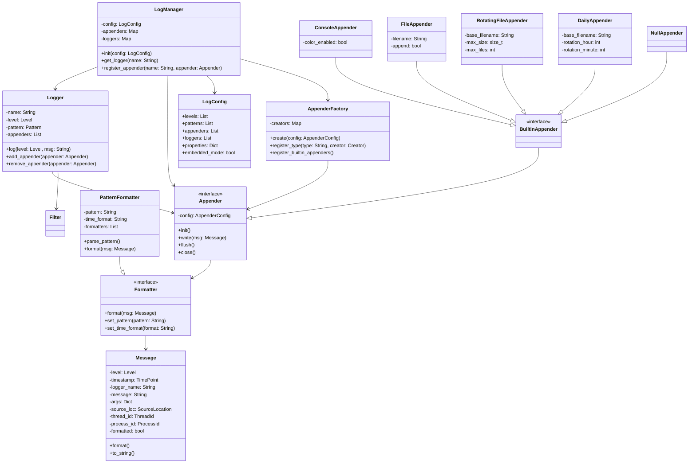

# 日志模块设计文档

## 1. 摘要

日志模块是一个灵活、高性能的日志系统，旨在满足应用程序的日志需求。该模块采用模块化设计，支持多种日志级别、多种输出目标和自定义格式化。系统针对嵌入式环境进行了优化，确保在资源受限场景下也能高效可靠地运行。

### 1.1 核心特性

- **灵活配置**：支持通过代码或配置文件进行全面配置
- **多级日志**：预定义多种日志级别，可自定义新级别
- **多目标输出**：内置多种输出目标（控制台、文件等）
- **格式自定义**：灵活的日志格式配置
- **过滤机制**：支持基于多种条件的日志过滤
- **高性能设计**：采用多种优化策略，确保高效运行
- **结构化日志**：支持结构化日志格式，便于分析和处理
- **资源优化**：针对嵌入式系统优化内存和存储需求
- **静态配置**：支持编译时配置，减少运行时开销
- **确定性行为**：确保日志操作的实时性和可预测性

### 1.2 架构概述

日志模块由以下核心组件构成：

- **LogManager**：日志系统的中央管理器，负责初始化配置、创建和管理日志器和输出目标
- **Logger**：日志记录器，应用程序的主要接口，负责记录和分发日志消息
- **Appender**：日志输出目标，负责将日志写入具体的媒介（控制台、文件等）
- **Formatter**：格式化器，负责格式化日志消息
- **Filter**：过滤器，负责过滤日志消息

## 2. 整体架构



## 3. 核心组件

### 3.1 LogManager

中央管理器，负责整个日志系统的初始化和管理。主要职责包括：

- 加载配置
- 注册内置 Appender
- 创建和管理 Logger 实例
- 在嵌入式环境中控制资源分配

### 3.2 Logger

应用程序的主要接口，用于记录日志。每个 Logger 实例代表一个日志类别，可以关联多个 Appender。主要职责：

- 接收应用程序的日志请求
- 根据日志级别过滤消息
- 将日志消息转发到关联的 Appender

### 3.3 Appender

负责将日志消息写入具体的目标媒介。系统提供多种内置 Appender。主要类型：

- **ConsoleAppender**：输出到控制台
- **FileAppender**：输出到文件
- **RotatingFileAppender**：按大小轮转文件
- **DailyAppender**：按时间轮转文件
- **NullAppender**：丢弃所有日志（用于测试）

### 3.4 Message

表示一条完整的日志消息，包含级别、时间戳、消息文本、源代码位置等信息。

### 3.5 Formatter

负责将日志消息格式化为最终的输出字符串。主要实现是 PatternFormatter，支持通过模式字符串定义输出格式。

### 3.6 Filter

根据设定的条件过滤日志消息，决定是否输出。支持基于级别、正则表达式等多种过滤条件。

## 4. 日志前端接口

为保持一致性和提高易用性，日志模块仅提供一种统一的日志记录方式：结构化日志。这种方式使日志信息更加清晰、易于处理和分析。

### 4.1 日志宏

日志模块提供以下宏用于不同级别的日志记录：

#### 4.1.1 基于Logger的日志宏

以下宏需要指定Logger实例作为第一个参数：

```cpp
mc_tlog(logger, format, args...)  // trace级别日志
mc_dlog(logger, format, args...)  // debug级别日志
mc_ilog(logger, format, args...)  // info级别日志
mc_nlog(logger, format, args...)  // notice级别日志
mc_wlog(logger, format, args...)  // warn级别日志
mc_elog(logger, format, args...)  // error级别日志
mc_flog(logger, format, args...)  // fatal级别日志
```

#### 4.1.2 全局日志宏

为了简化日志记录，系统还提供了以下全局日志宏，这些宏使用默认的全局日志记录器，无需指定Logger实例：

```cpp
tlog(format, args...)  // 全局trace级别日志
dlog(format, args...)  // 全局debug级别日志
ilog(format, args...)  // 全局info级别日志
nlog(format, args...)  // 全局notice级别日志
wlog(format, args...)  // 全局warn级别日志
elog(format, args...)  // 全局error级别日志
flog(format, args...)  // 全局fatal级别日志
```

全局日志宏在内部使用名为"default"或"global"的Logger，该Logger在系统初始化时自动创建。

### 4.2 结构化日志格式

为了支持结构化日志，日志模块采用类似于命名参数的方式记录日志：

```cpp
mc_ilog(logger, "${key1}:${key2}", ("key1", value1)("key2", value2));
// 或使用全局宏
ilog("${key1}:${key2}", ("key1", value1)("key2", value2));
```

其中：

- 第一个参数是日志记录器实例（如果使用全局宏则不需要）
- 第二个参数是带有占位符的格式字符串，占位符格式为 `${key}`
- 后续参数是一系列键值对，用于填充占位符

这种方式的优势包括：

1. **类型安全**：值的类型由编译器检查，避免类型错误
2. **自描述**：日志中的每个值都有明确的名称，容易理解
3. **结构化**：日志可以被解析为结构化数据，方便自动化处理
4. **一致性**：提供单一接口，避免接口选择困惑

### 4.3 使用示例

#### 4.3.1 使用指定Logger的日志宏

```cpp
// 获取日志对象
auto& logger = mc::log::log_manager::instance().get_logger("main");

// 记录简单日志
mc_ilog(logger, "系统初始化完成");

// 记录带参数的结构化日志
mc_ilog(logger, "用户 ${user} 从 ${ip} 登录成功", 
       ("user", "admin")("ip", "192.168.1.100"));

// 记录包含多种类型参数的日志
mc_dlog(logger, "处理请求 ${method} ${path} 用时 ${time}ms, 状态 ${status}",
       ("method", "GET")("path", "/api/users")("time", 45.3)("status", 200));

// 记录错误日志
mc_elog(logger, "连接数据库失败: ${error}", 
       ("error", "Connection timeout"));
```

#### 4.3.2 使用全局日志宏

```cpp
// 记录简单日志，使用默认日志记录器
ilog("系统初始化完成");

// 记录带参数的结构化日志
ilog("用户 ${user} 从 ${ip} 登录成功", 
    ("user", "admin")("ip", "192.168.1.100"));

// 记录调试日志
dlog("详细信息: ${detail}", ("detail", "正在加载配置文件"));

// 记录警告信息
wlog("磁盘空间不足: ${available}GB", ("available", 1.2));

// 记录错误信息
elog("操作失败: ${code}, ${message}", 
    ("code", 404)("message", "资源不存在"));
```

### 4.4 参数值类型

参数值支持多种类型：

- 基本类型：字符串、整数、浮点数、布尔值
- 复合类型：日志系统会将复合类型转换为适当的字符串表示
- 自定义类型：可以为自定义类型实现 `to_string` 方法

### 4.5 实现原理

结构化日志的实现基于以下机制：

1. 宏定义解析格式字符串和参数
2. 参数通过链式调用构建参数列表
3. 消息构造时将参数存储为键值对
4. 格式化时根据键名查找并替换占位符

这种设计是对传统printf风格和stream风格日志的改进，结合了两者的优点并避免了缺点。

## 5. 配置结构

日志系统采用结构化的配置，支持完整的日志级别、格式、输出目标等定义。

### 5.1 配置组成

配置主要包含以下部分：

- **日志级别定义**：定义系统支持的日志级别及其数值
- **日志格式定义**：定义日志的输出格式模式
- **Appender 配置**：定义各种输出目标的配置
