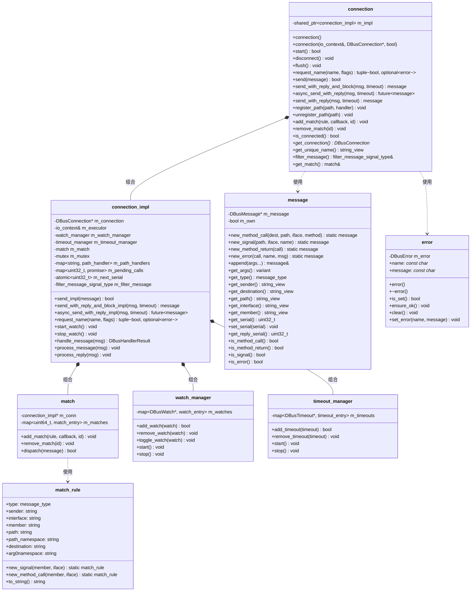
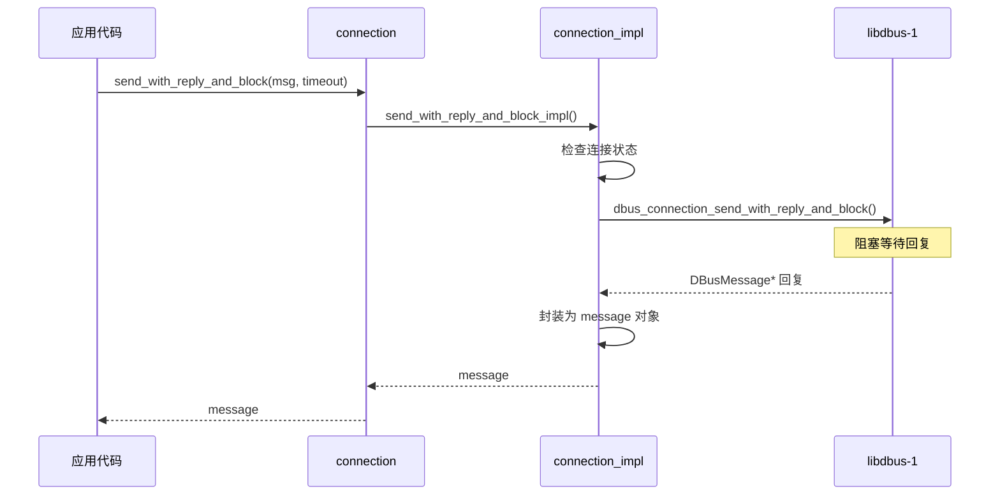
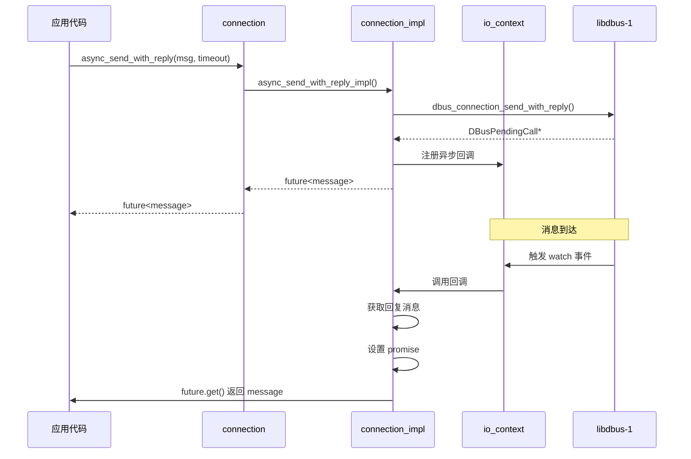
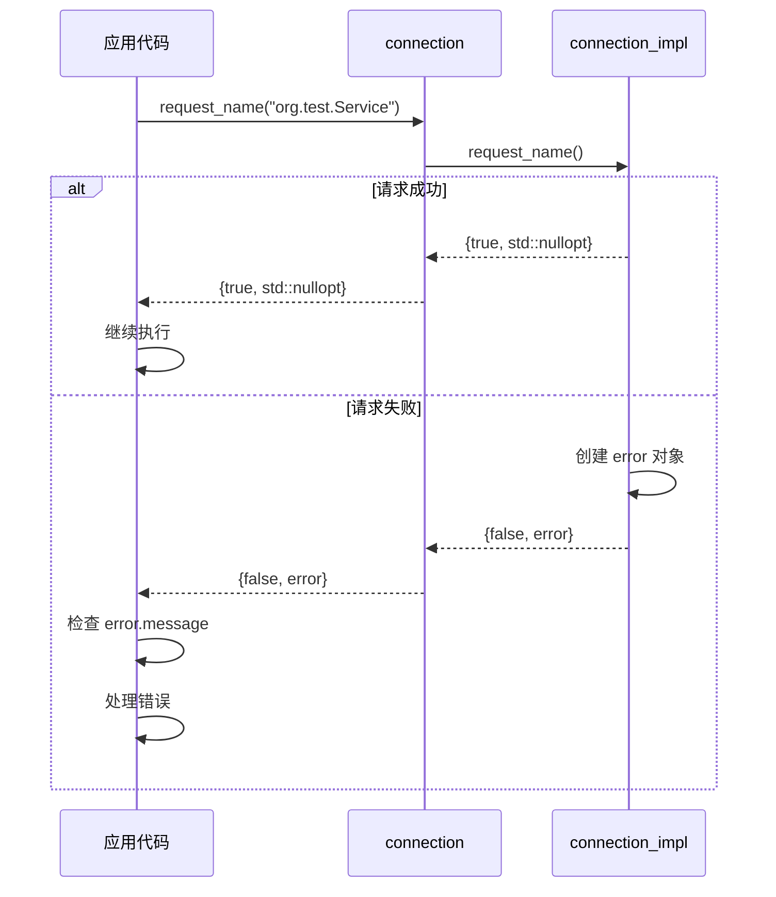

# D-Bus 模块设计文档

## 1. 摘要

D-Bus 模块是 libmcpp 框架中的进程间通信（IPC）组件，提供了对 D-Bus 协议的完整封装。D-Bus 是 Linux 系统中广泛使用的消息总线系统，用于应用程序之间的通信。本模块提供了 C++ 和 Lua 两层接口，支持同步和异步通信模式，实现了类型安全的消息传递和信号订阅机制。

### 1.1 核心特性

- **双层接口**：提供 C++ 和 Lua 两层接口，满足不同场景需求
- **异步 IO**：基于 `io_context` 的事件驱动架构，支持高并发
- **类型安全**：强类型接口，编译时检查，避免运行时错误
- **RAII 管理**：自动资源管理，防止资源泄漏
- **信号订阅**：支持 D-Bus 信号的订阅和派发
- **对象路径**：支持注册对象路径处理器
- **匹配规则**：灵活的消息过滤和匹配机制
- **错误处理**：完善的错误处理机制，支持异常和返回值两种模式
- **线程安全**：内部使用互斥锁保护共享状态

### 1.2 架构概述

D-Bus 模块采用分层设计：

- **C++ 核心层**：基于 libdbus-1 实现的核心功能，包括连接管理、消息处理、异步 IO 等
- **Lua 绑定层**：将 C++ 核心功能封装为 Lua 接口，提供便捷的脚本化使用方式
- **辅助组件**：消息构造、错误处理、匹配规则等辅助功能

## 2. 整体架构

### 2.1 模块结构

```mermaid
graph TB
    subgraph "Lua 绑定层"
        ldbus[ldbus 模块<br/>luaopen_ldbus]
        
        subgraph "Lua 子模块"
            lua_blocking[ldbus.blocking<br/>阻塞式连接]
            lua_nonblock[ldbus.nonblock<br/>非阻塞式连接]
            lua_message[ldbus.message<br/>消息操作]
            lua_error[ldbus.error<br/>错误处理]
        end
        
        subgraph "Lua Wrapper Classes"
            l_blocking[dbus_wrapper<br/>阻塞式 Lua userdata]
            l_nonblock[dbus_wrapper<br/>非阻塞式 Lua userdata]
            l_connection[connection_wrapper<br/>连接对象]
            l_message[message_wrapper<br/>消息对象]
            l_error[error 对象<br/>错误对象]
        end
    end
    
    subgraph "C++ 核心层"
        subgraph "核心组件"
            connection[connection<br/>连接管理<br/>───────────<br/>+ start&#40;&#41;<br/>+ disconnect&#40;&#41;<br/>+ send&#40;&#41;<br/>+ send_with_reply_and_block&#40;&#41;<br/>+ async_send_with_reply&#40;&#41;<br/>+ request_name&#40;&#41;<br/>+ register_path&#40;&#41;<br/>+ add_match&#40;&#41;]
            
            connection_impl[connection_impl<br/>连接实现<br/>───────────<br/>- m_connection: DBusConnection*<br/>- m_executor: io_context&<br/>- m_watch_manager<br/>- m_timeout_manager<br/>- m_match<br/>+ 底层 D-Bus 操作]
            
            message[message<br/>消息对象<br/>───────────<br/>+ new_method_call&#40;&#41;<br/>+ new_signal&#40;&#41;<br/>+ new_method_return&#40;&#41;<br/>+ append&#40;&#41;<br/>+ get_args&#40;&#41;]
            
            error[error<br/>错误对象<br/>───────────<br/>+ is_set&#40;&#41;<br/>+ name: const char*<br/>+ message: const char*<br/>+ ensure_ok&#40;&#41;]
            
            match[match<br/>匹配规则<br/>───────────<br/>+ add_match&#40;&#41;<br/>+ remove_match&#40;&#41;<br/>+ dispatch&#40;&#41;]
            
            signal_obj[signal<br/>信号对象<br/>───────────<br/>+ emit&#40;&#41;<br/>+ subscribe&#40;&#41;]
        end
        
        subgraph "底层支持"
            io_context[io_context<br/>异步 IO 上下文<br/>───────────<br/>+ post&#40;&#41;<br/>+ run&#40;&#41;<br/>+ stop&#40;&#41;]
            
            dbus_lib[libdbus-1<br/>D-Bus 底层库<br/>───────────<br/>DBusConnection*<br/>DBusMessage*<br/>DBusError*]
        end
    end
    
    %% Lua 到 C++ 的绑定关系
    ldbus --> lua_blocking
    ldbus --> lua_nonblock
    ldbus --> lua_message
    ldbus --> lua_error
    
    lua_blocking --> l_blocking
    lua_nonblock --> l_nonblock
    lua_blocking --> l_connection
    lua_nonblock --> l_connection
    lua_message --> l_message
    lua_error --> l_error
    
    l_blocking -.wraps.-> connection
    l_nonblock -.wraps.-> connection
    l_connection -.wraps.-> connection
    l_message -.wraps.-> message
    l_error -.wraps.-> error
    
    %% C++ 组合关系
    connection --> connection_impl
    connection_impl --> io_context
    connection_impl --> match
    connection_impl --> dbus_lib
    
    connection --> message
    connection --> error
    match --> signal_obj
    
    style ldbus fill:#e1f5ff
    style connection fill:#fff9c4
    style connection_impl fill:#ffecb3
```



### 2.2 类关系图



## 3. 核心组件

### 3.1 connection - 连接对象

`connection` 是 D-Bus 模块的核心类，代表一个到 D-Bus 守护进程的连接。

#### 3.1.1 主要接口

**静态工厂方法**

```cpp
// 打开系统总线连接
static connection open_system_bus(io_context& executor);

// 打开会话总线连接
static connection open_session_bus(io_context& executor);

// 通过地址打开连接
static connection open(io_context& executor, std::string_view address);
```

**生命周期管理**

```cpp
// 启动连接（注册 watch 和 timeout）
bool start();

// 断开连接
void disconnect();

// 检查连接状态
bool is_connected() const;

// 刷新待发送的消息
void flush();

// 手动调度消息处理
void dispatch();
```

**消息发送**

```cpp
// 异步发送消息（不等待回复）
bool send(message msg);

// 同步发送消息并阻塞等待回复
message send_with_reply_and_block(
    message msg, 
    milliseconds timeout = DBUS_TIMEOUT_DEFAULT
);

// 异步发送消息并返回 future
future<message> async_send_with_reply(
    message msg, 
    milliseconds timeout = DBUS_TIMEOUT_DEFAULT
);

// 同步发送消息（使用事件循环等待）
message send_with_reply(
    message msg, 
    milliseconds timeout = DBUS_TIMEOUT_DEFAULT
);
```

**名称请求（重要修改）**

```cpp
// 请求总线名称
// 返回：tuple<成功状态, 可选的错误信息>
std::tuple<bool, std::optional<error>> request_name(
    std::string_view name, 
    uint32_t flags = 0
);

// 使用示例
auto [success, err_opt] = conn.request_name("org.example.Service");
if (!success) {
    if (err_opt.has_value()) {
        std::cerr << "错误: " << err_opt->message << std::endl;
    }
}
```

**对象路径注册**

```cpp
// 注册对象路径处理器
void register_path(std::string_view path, path_handler_type handler);

// 注销对象路径处理器
void unregister_path(std::string_view path);
```

**信号订阅**

```cpp
// 添加匹配规则并订阅信号
void add_match(const match_rule& rule, match_cb_t callback, uint64_t id);

// 移除匹配规则
void remove_match(uint64_t id);

// 获取匹配对象（高级用法）
match& get_match();
```

**其他功能**

```cpp
// 获取连接的唯一名称（如 :1.42）
std::string_view get_unique_name() const;

// 获取底层 DBusConnection 指针（高级用法）
DBusConnection* get_connection() const;

// 获取消息过滤信号（高级用法）
filter_message_signal_type& filter_message();

// 获取下一个序列号
uint32_t get_next_serial();

// 获取内部实现对象（高级用法）
connection_impl& get_impl();
```

#### 3.1.2 使用示例

**C++ 示例：同步调用**

```cpp
#include <mc/dbus/connection.h>
#include <mc/dbus/message.h>
#include <mc/runtime/thread_pool.h>

using namespace mc::dbus;

int main() {
    // 创建 IO 上下文
    mc::runtime::thread_pool executor(4);
    executor.start();
    
    // 打开会话总线连接
    auto conn = connection::open_session_bus(executor);
    conn.start();
    
    // 请求服务名称
    auto [success, err_opt] = conn.request_name("org.example.MyService");
    if (!success) {
        std::cerr << "请求名称失败" << std::endl;
        return 1;
    }
    
    // 创建方法调用消息
    auto msg = message::new_method_call(
        "org.freedesktop.DBus",
        "/org/freedesktop/DBus",
        "org.freedesktop.DBus",
        "ListNames"
    );
    
    // 同步发送并等待回复
    auto reply = conn.send_with_reply_and_block(msg, mc::seconds(5));
    
    // 处理回复
    if (reply.is_method_return()) {
        auto names = reply.get_args();
        // 处理结果...
    }
    
    conn.disconnect();
    executor.stop();
    return 0;
}
```

**C++ 示例：异步调用**

```cpp
// 异步发送消息
auto future = conn.async_send_with_reply(msg, mc::seconds(5));

// 添加回调
future.then([](const message& reply) {
    if (reply.is_method_return()) {
        std::cout << "收到回复" << std::endl;
    }
});
```

**C++ 示例：信号订阅**

```cpp
// 创建匹配规则
auto rule = match_rule::new_signal("NameOwnerChanged", "org.freedesktop.DBus");

// 订阅信号
conn.add_match(rule, [](message& msg) {
    std::cout << "收到信号: " << msg.get_member() << std::endl;
}, 1);

// 取消订阅
conn.remove_match(1);
```

### 3.2 message - 消息对象

`message` 类封装了 D-Bus 消息，支持创建、序列化和反序列化。

#### 3.2.1 消息类型

```cpp
enum class message_type {
    invalid = DBUS_MESSAGE_TYPE_INVALID,
    method_call = DBUS_MESSAGE_TYPE_METHOD_CALL,
    method_return = DBUS_MESSAGE_TYPE_METHOD_RETURN,
    error = DBUS_MESSAGE_TYPE_ERROR,
    signal = DBUS_MESSAGE_TYPE_SIGNAL
};
```

#### 3.2.2 创建消息

```cpp
// 创建方法调用消息
static message new_method_call(
    std::string_view destination,
    std::string_view path,
    std::string_view interface,
    std::string_view method
);

// 创建信号消息
static message new_signal(
    std::string_view path,
    std::string_view interface,
    std::string_view name
);

// 创建方法返回消息
static message new_method_return(const message& call);

// 创建错误消息
static message new_error(
    const message& call,
    std::string_view error_name,
    std::string_view error_message
);
```

#### 3.2.3 消息操作

```cpp
// 添加参数
message& append(const variant& value);
template<typename... Args>
message& append(Args&&... args);

// 获取参数
variant get_args() const;

// 消息属性
message_type get_type() const;
std::string_view get_sender() const;
std::string_view get_destination() const;
std::string_view get_path() const;
std::string_view get_interface() const;
std::string_view get_member() const;
uint32_t get_serial() const;
uint32_t get_reply_serial() const;

// 类型检查
bool is_method_call() const;
bool is_method_return() const;
bool is_signal() const;
bool is_error() const;
bool is_valid() const;
```

### 3.3 error - 错误对象

`error` 类封装了 D-Bus 错误信息。

```cpp
class error {
public:
    const char* name;     // 错误名称
    const char* message;  // 错误消息
    
    // 检查是否有错误
    bool is_set() const;
    
    // 如果有错误则抛出异常
    void ensure_ok() const;
    
    // 清除错误
    void clear();
    
    // 设置错误
    void set_error(std::string_view name, std::string_view message);
};
```

### 3.4 match_rule - 匹配规则

`match_rule` 用于过滤和匹配 D-Bus 消息。

```cpp
struct match_rule {
    message_type type = message_type::invalid;
    std::string sender;
    std::string interface;
    std::string member;
    std::string path;
    std::string path_namespace;
    std::string destination;
    std::string arg0namespace;
    
    // 创建信号匹配规则
    static match_rule new_signal(
        std::string_view member, 
        std::string_view interface = {}
    );
    
    // 创建方法调用匹配规则
    static match_rule new_method_call(
        std::string_view member, 
        std::string_view interface = {}
    );
    
    // 转换为 D-Bus 匹配字符串
    std::string to_string() const;
};
```

## 4. Lua 绑定层

### 4.1 模块结构

Lua 绑定层将 C++ 核心功能封装为易用的 Lua 接口。

```lua
local dbus = require("ldbus")

-- 子模块
-- dbus.blocking  -- 阻塞式连接
-- dbus.nonblock  -- 非阻塞式连接
-- dbus.message   -- 消息构造
-- dbus.error     -- 错误处理
```

### 4.2 阻塞式连接（blocking）

```lua
-- 打开用户会话总线
local conn = dbus.blocking.open_user()

-- 请求服务名称（返回两个值：成功状态和错误信息）
local success, err = conn:request_name("org.example.Service")
if not success then
    print("错误:", err)
end

-- 手动运行一次事件循环（阻塞式）
local timeout_ms = 1000
local has_message = conn:run_once(timeout_ms)

-- 运行事件循环直到满足条件
conn:run_until(function(msg)
    -- 返回 true 停止循环，false 继续
    return msg:get_type() == "method_return"
end, timeout_ms, step_ms)

-- 刷新待发送消息
conn:flush()

-- 关闭连接
conn:close()

-- 关闭 D-Bus 守护进程
dbus.blocking.shutdown()
```

### 4.3 非阻塞式连接（nonblock）

```lua
-- 打开用户会话总线（默认自动启动）
local conn = dbus.nonblock.open_user()

-- 或者手动控制启动
local conn = dbus.nonblock.open_user(false)  -- 不自动启动
conn:start()  -- 手动启动

-- 请求服务名称
local success, err = conn:request_name("org.example.Service")

-- 刷新待发送消息
conn:flush()

-- 手动派发消息（通常由事件循环自动调用）
conn:dispatch()

-- 关闭连接
conn:close()

-- 关闭 D-Bus 守护进程
dbus.nonblock.shutdown()
```

### 4.4 消息操作（message）

```lua
-- 创建方法调用消息
local msg = dbus.message.new_method_call(
    "org.freedesktop.DBus",      -- 目标服务
    "/org/freedesktop/DBus",      -- 对象路径
    "org.freedesktop.DBus",       -- 接口
    "ListNames"                    -- 方法
)

-- 添加参数
msg:append("string_arg")
msg:append(123)

-- 获取消息属性
local sender = msg:get_sender()
local dest = msg:get_destination()

-- 发送消息并等待回复
local reply = conn:send_with_reply_and_block(msg, 5000)  -- 超时 5 秒
```

### 4.5 错误处理（error）

```lua
-- 错误对象会在失败时返回
local success, err = conn:request_name("org.example.Service")
if not success then
    -- err 是一个错误对象
    if err:is_set() then
        print("错误名称:", err.name)
        print("错误消息:", err.message)
    end
    
    -- 或者直接抛出异常
    err:ensure_ok()
end
```

### 4.6 完整 Lua 示例

```lua
local dbus = require("ldbus")

-- 创建阻塞式连接
local conn = dbus.blocking.open_user()

-- 请求服务名称
local success, err = conn:request_name("org.example.MyService")
if not success then
    print("请求名称失败:", err.message)
    return
end

-- 创建方法调用
local msg = dbus.message.new_method_call(
    "org.freedesktop.DBus",
    "/org/freedesktop/DBus",
    "org.freedesktop.DBus",
    "ListNames"
)

-- 发送并等待回复
local reply = conn:send_with_reply_and_block(msg, 5000)

if reply then
    print("收到回复")
    -- 处理回复...
end

-- 清理
conn:close()
```

## 5. 关键交互流程

### 5.1 同步消息发送（阻塞式）



### 5.2 异步消息发送（非阻塞式）



### 5.3 错误处理流程（新机制）



## 6. 设计模式和最佳实践

### 6.1 设计模式

1. **PIMPL 模式**: `connection` 使用 `connection_impl` 隐藏实现细节
2. **RAII 模式**: 所有对象自动管理资源生命周期
3. **观察者模式**: `match` 和信号订阅机制
4. **工厂模式**: 静态工厂方法创建连接和消息
5. **包装器模式**: Lua 绑定封装 C++ 对象为 userdata
6. **单例模式**: Lua 绑定使用静态 `io_context` (Meyer's Singleton)

### 6.2 最佳实践

#### 6.2.1 错误处理

**推荐做法（新机制）：**

```cpp
// C++ - 使用结构化绑定
auto [success, err_opt] = conn.request_name("org.example.Service");
if (!success && err_opt.has_value()) {
    std::cerr << "错误: " << err_opt->message << std::endl;
}

// Lua - 检查返回值
local success, err = conn:request_name("org.example.Service")
if not success and err then
    print("错误:", err.message)
end
```

**优势：**
- 一次调用获取所有信息
- 无副作用，线程安全
- 符合现代 C++ 风格

#### 6.2.2 资源管理

```cpp
// 推荐：使用 RAII
{
    auto conn = connection::open_session_bus(executor);
    conn.start();
    // 使用连接...
}  // 自动断开和清理

// 不推荐：手动管理
auto conn = connection::open_session_bus(executor);
conn.start();
// ... 可能忘记调用 disconnect()
```

#### 6.2.3 异步编程

```cpp
// 推荐：使用 future 链式调用
conn.async_send_with_reply(msg, timeout)
    .then([](const message& reply) {
        // 处理回复
        return process_reply(reply);
    })
    .then([](const result& res) {
        // 处理结果
    });

// 不推荐：阻塞等待
auto reply = conn.send_with_reply_and_block(msg, timeout);  // 阻塞线程
```

#### 6.2.4 线程安全

```cpp
// connection 对象是线程安全的
std::thread t1([&conn]() {
    conn.send(msg1);
});

std::thread t2([&conn]() {
    conn.send(msg2);
});
```

## 7. 性能优化

### 7.1 连接复用

```cpp
// 推荐：复用连接
static auto conn = connection::open_session_bus(executor);

// 不推荐：频繁创建连接
for (int i = 0; i < 100; ++i) {
    auto conn = connection::open_session_bus(executor);  // 开销大
}
```

### 7.2 批量消息处理

```cpp
// 推荐：批量发送
std::vector<message> messages = create_messages();
for (auto& msg : messages) {
    conn.send(msg);  // 不阻塞
}
conn.flush();  // 一次性刷新

// 不推荐：逐个发送并等待
for (auto& msg : messages) {
    conn.send_with_reply_and_block(msg);  // 每次都阻塞
}
```

### 7.3 匹配规则优化

```cpp
// 推荐：精确匹配
auto rule = match_rule::new_signal("NameOwnerChanged", "org.freedesktop.DBus");
rule.sender = ":1.42";  // 限定发送者

// 不推荐：过于宽泛的匹配
auto rule = match_rule::new_signal("", "");  // 匹配所有信号
```

## 8. 测试覆盖

### 8.1 C++ 单元测试

- **connection_test**: 39 个测试用例
  - 连接生命周期管理
  - 消息发送和接收
  - 名称请求和管理
  - 对象路径注册
  - 信号订阅和派发
  - 错误处理
  - 并发操作

- **dispatch_test**: 19 个测试用例
  - Watch 和 Timeout 管理
  - 异步消息派发
  - PendingCall 处理
  - 事件循环集成

- **signal_send_receive_test**: 3 个测试用例
  - 双向信号通信
  - 多信号处理
  - 订阅和取消订阅

### 8.2 Lua 单元测试

- **lua_dbus_tests**: 52 个测试用例
  - 阻塞式连接
  - 非阻塞式连接
  - 消息构造和发送
  - 错误处理
  - 环境变量测试

### 8.3 测试结果

```
✅ C++ 测试: 76/76 通过
✅ Lua 测试: 52/52 通过
✅ 总计: 128/128 通过
```

## 9. 常见问题

### 9.1 连接失败

**问题**: `connection::open_session_bus()` 失败

**解决方法**:
1. 检查 `DBUS_SESSION_BUS_ADDRESS` 环境变量
2. 确保 D-Bus 守护进程正在运行
3. 检查权限设置

### 9.2 消息超时

**问题**: `send_with_reply_and_block()` 超时

**解决方法**:
1. 增加超时时间
2. 检查目标服务是否响应
3. 使用异步方法避免阻塞

### 9.3 内存泄漏

**问题**: 使用后内存持续增长

**解决方法**:
1. 确保调用 `disconnect()`
2. 检查信号订阅是否正确移除
3. 使用智能指针管理对象生命周期

## 10. 与旧版本的差异

### 10.1 已移除的类

- ❌ `dbus_base` - 基类已删除，功能直接由 `connection` 提供
- ❌ `blocking_dbus` - 阻塞式功能移至 Lua 绑定层
- ❌ `nonblock_dbus` - 非阻塞式功能移至 Lua 绑定层

### 10.2 接口变更

**request_name 返回类型变更**

```cpp
// 旧版本
bool success = conn.request_name("org.test.Service");
if (!success) {
    auto err = conn.get_last_error();  // 需要额外调用
}

// 新版本
auto [success, err_opt] = conn.request_name("org.test.Service");
if (!success && err_opt.has_value()) {
    // 错误信息直接可用
}
```

**优势**:
- 更简洁的 API
- 线程安全（无共享状态）
- 符合现代 C++ 习惯

## 11. 参考资料

- [D-Bus 规范](https://dbus.freedesktop.org/doc/dbus-specification.html)
- [libdbus 文档](https://dbus.freedesktop.org/doc/api/html/)
- [C++ RAII 最佳实践](https://en.cppreference.com/w/cpp/language/raii)
- [异步编程模式](https://en.cppreference.com/w/cpp/thread/future)
