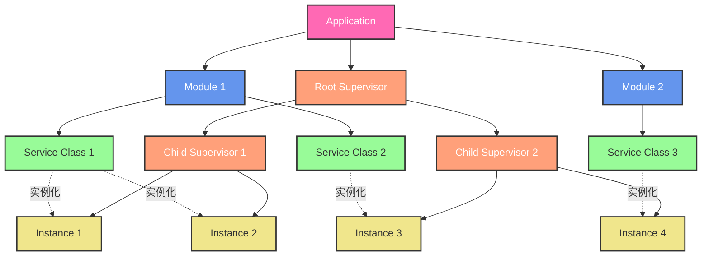
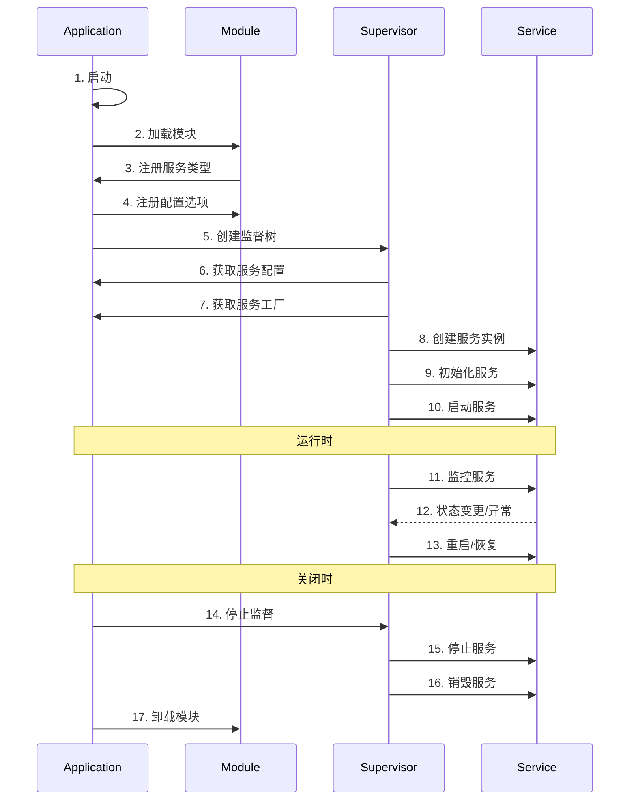
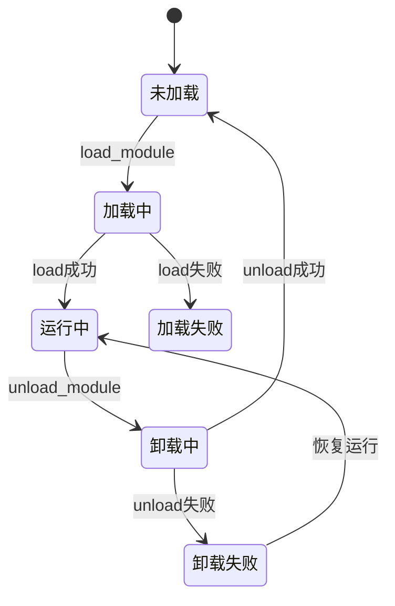
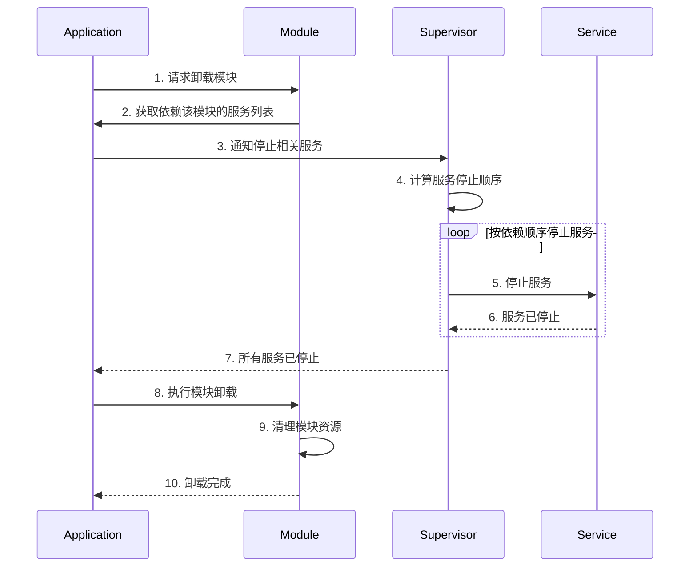

# 应用程序设计

## 1. 概述

应用程序框架采用模块化设计，主要包含以下核心概念：

- Application：应用程序容器，提供基础设施
- Module：可动态加载的功能模块
- Service：可实例化的服务单元
- Supervisor：服务生命周期管理器

### 1.1 组件层次关系



### 1.2 组件职责说明

1. **Application（应用程序）**
   - 管理模块的加载/卸载
   - 提供服务注册表
   - 管理全局资源和配置
   - 创建根监督器

2. **Module（模块）**
   - 实现并注册服务类型
   - 管理服务类型的元数据
   - 不直接参与服务实例管理

3. **Supervisor（监督器）**
   - 支持树形层次结构
   - 可以管理子监督器和服务实例
   - 不同层级可以有不同的监督策略
   - 支持 one_for_one、one_for_all、rest_for_one 等策略
   - 按层级传播故障和恢复操作

4. **Service Class（服务类型）**
   - 定义服务接口和实现
   - 声明配置项和依赖关系
   - 提供实例化方法

5. **Service Instance（服务实例）**
   - 服务类型的运行时实例
   - 包含具体配置和状态
   - 由特定层级的 Supervisor 管理生命周期

### 1.2 生命周期交互关系



## 2. 核心概念

### 2.1 Application

Application 是应用程序的容器，主要职责包括：

- 提供基础设施（io_context、线程池等）
- 管理模块的加载/卸载
- 解析命令行参数和配置文件
- 管理服务类型注册（工厂模式）
- 创建和管理 Supervisor

### 2.2 Module

Module 是可动态加载的功能模块，主要职责包括：

- 提供 Service 类的实现
- 注册 Service 类型到 Application
- 管理模块级别的资源
- 提供模块生命周期回调
- 维护模块内服务之间的依赖关系
- 支持运行时动态卸载
- 提供模块版本和兼容性信息
- 支持模块间的依赖声明

### 2.2.1 Module 生命周期



### 2.2.2 Module 卸载流程



### 2.2.3 Module 接口定义

```cpp
class module {
public:
    // 模块信息
    struct info {
        std::string name;            // 模块名称
        std::string version;         // 模块版本
        std::vector<std::string> dependencies;  // 模块依赖
        std::string min_app_version; // 最小应用版本要求
    };
    
    // 生命周期方法
    virtual bool load() = 0;                    // 加载模块
    virtual bool unload() = 0;                  // 卸载模块
    virtual void pre_unload() {}               // 卸载前处理
    virtual void post_load() {}                // 加载后处理
    
    // 配置管理
    virtual void register_options(options_description& cli_opts,
                                options_description& cfg_opts) {}
                                
    // 资源管理
    virtual void cleanup_resources() {}         // 清理资源
    
    // 状态查询
    virtual bool is_unloadable() const { return true; }  // 是否可以卸载
    virtual std::vector<std::string> get_active_services() const = 0;  // 获取活动服务
    
    // 版本和依赖
    virtual const info& get_info() const = 0;   // 获取模块信息
};
```

### 2.2.4 Module 依赖管理

1. **模块间依赖**
- 模块可以声明对其他模块的依赖
- 加载时检查依赖模块是否已加载
- 卸载时检查是否有其他模块依赖当前模块

2. **服务依赖追踪**
- 记录模块提供的服务类型
- 追踪服务实例的创建和销毁
- 维护服务间的依赖关系图

3. **安全卸载**
- 检查模块是否可以安全卸载
- 按依赖顺序停止相关服务
- 确保资源完全释放

4. **版本管理**
- 检查模块版本兼容性
- 支持模块版本升级
- 处理版本冲突

### 2.2.5 Module 实现示例

```cpp
class logger_module : public module {
public:
    const info& get_info() const override {
        static info i = {
            .name = "logger",
            .version = "1.0.0",
            .dependencies = {"metrics"},
            .min_app_version = "0.1.0"
        };
        return i;
    }
    
    bool load() override {
        // 注册服务类型
        app().register_service<file_logger>();
        app().register_service<console_logger>();
        
        // 初始化模块资源
        return init_resources();
    }
    
    bool unload() override {
        // 清理模块资源
        return cleanup_resources();
    }
    
    void pre_unload() override {
        // 保存状态，准备卸载
        save_state();
    }
    
    std::vector<std::string> get_active_services() const override {
        // 返回当前活动的服务实例
        return m_active_services;
    }
    
    bool is_unloadable() const override {
        // 检查是否可以安全卸载
        return check_unloadable();
    }
    
private:
    bool init_resources() {
        // 初始化模块资源
        return true;
    }
    
    bool cleanup_resources() {
        // 清理模块资源
        return true;
    }
    
    void save_state() {
        // 保存模块状态
    }
    
    bool check_unloadable() {
        // 检查是否有其他模块依赖此模块
        // 检查是否有无法停止的服务
        return true;
    }
    
    std::vector<std::string> m_active_services;
};
```

### 2.3 Service

Service 是一个可实例化的服务类，主要特点包括：

- 单线程执行模型
- 可以有多个实例
- 有明确的生命周期
- 可以声明依赖关系
- 可以定义自己的配置选项

### 2.4 Supervisor

Supervisor 负责管理 Service 实例的生命周期，主要功能包括：

- 创建和销毁 Service 实例
- 初始化、启动和停止 Service
- 监控 Service 状态
- 处理 Service 异常
- 执行重启策略
- 维护服务依赖关系
- 管理服务启动顺序

## 3. 工作流程

### 3.1 应用程序启动流程

1. 解析命令行参数
2. 加载配置文件
3. 根据配置加载 Module
4. Module 注册服务类型
5. Application 从已注册服务类型收集配置选项
6. 验证配置完整性
7. 创建 Supervisor 树
8. Supervisor 创建和初始化服务实例
9. Supervisor 启动服务

### 3.2 模块加载流程

1. 加载动态库
2. 调用 mc_module_load
3. 注册 Service 类型
4. 注册配置选项
5. 初始化模块资源

### 3.3 Service 生命周期

1. Supervisor 从 Application 获取服务工厂
2. Supervisor 创建服务实例
3. Supervisor 传入配置参数初始化服务
4. Supervisor 分配服务到执行线程
5. Supervisor 启动服务
6. 运行时由 Supervisor 监控和管理
7. 停止时由 Supervisor 清理和销毁

## 4. 关键特性

### 4.1 单线程执行模型

- Service 实例绑定到特定线程
- 避免多线程并发问题
- 简化编程模型

### 4.2 配置管理

- Service 类通过静态接口定义配置选项
- Application 直接从已注册的服务类型收集配置
- 支持命令行和配置文件选项
- 配置验证在服务初始化阶段完成

### 4.3 依赖管理

- Service 可以声明依赖
- 支持运行时依赖检查
- 确保启动顺序正确

### 4.4 生命周期管理

- Application 负责加载和初始化
- Supervisor 负责运行时管理
- Service 专注于业务逻辑

## 5. 示例代码

### 5.1 Service 定义

```cpp
class file_logger : public service {
public:
    static const char* service_type() { return "logger.file_logger"; }
    
    // 注册配置选项
    static void register_options(options_description& cli_opts,
                               options_description& cfg_opts) {
        cfg_opts.add_options()
            ("log.file", value<string>(), "日志文件路径")
            ("log.level", value<string>(), "日志级别");
    }
    
    // 声明依赖
    static const std::vector<std::string>& dependencies() {
        static std::vector<std::string> deps = {"metrics"};
        return deps;
    }
    
    // 生命周期方法
    bool init(const dict& config) override {
        m_path = config.get("log.file").as<std::string>();
        return true;
    }
    
    void start() override {
        // 启动日志服务
    }
    
    void stop() override {
        // 停止日志服务
    }
};
```

### 5.2 Module 定义

```cpp
class logger_module : public module {
public:
    bool load() override {
        // 注册 Service 类型
        app().register_service<file_logger>();
        return true;
    }
    
    void register_options(options_description& cli_opts,
                         options_description& cfg_opts) override {
        // 注册模块级别的配置选项
        cli_opts.add_options()
            ("log-level", value<string>(), "日志级别");
            
        // 注册 Service 的配置选项
        file_logger::register_options(cli_opts, cfg_opts);
    }
};
```

## 6. 配置示例

```yaml
# 模块配置
modules:
  - name: logger
    path: liblogger.so
    
# 服务配置
services:
  - name: app_logger
    type: logger.file_logger
    config:
      log.file: /var/log/app.log
      log.level: info
    restart: always
    max_restarts: 3
    
# Supervisor 配置
supervisors:
  - name: logger_supervisor
    strategy: one_for_one
    services:
      - app_logger
```

## 7. 待实现功能

### 7.1 基础框架 [x]
1. **Application 核心框架**
   - [x] 实现 `application` 单例类
   - [x] 实现基本的事件循环
   - [x] 实现命令行参数解析
   - [x] 实现配置文件加载
   - [x] 单元测试覆盖

### 7.2 Module 系统 [部分完成]
1. **Module 基础功能**
   - [x] 实现 `module` 基类
   - [ ] 实现动态库加载机制
   - [x] 实现模块注册机制
   - [x] 实现模块依赖管理
   - [x] 单元测试覆盖

### 7.3 Service 框架 [x]
1. **Service 基础功能**
   - [x] 实现 `service` 基类
   - [x] 实现服务生命周期管理
   - [x] 实现服务配置机制
   - [x] 实现服务依赖管理
   - [x] 单元测试覆盖

### 7.4 Supervisor 系统 [部分完成]
1. **Supervisor 基础功能**
   - [x] 实现 `supervisor` 基类
   - [x] 实现基本监督策略
   - [x] 实现服务实例管理
   - [ ] 实现更多高级监督策略
   - [x] 实现默认监督器 `default_supervisor`
   - [ ] 实现错误处理和恢复
   - [x] 单元测试覆盖

### 7.5 错误引擎 [ ]
1. **错误引擎功能**
   - [ ] 实现错误定义系统
   - [ ] 实现错误传播机制
   - [ ] 实现错误处理器
   - [ ] 实现错误日志
   - [ ] 单元测试覆盖

### 7.6 示例和文档 [ ]
1. **示例实现**
   - [ ] 实现日志服务示例
   - [ ] 实现配置服务示例
   - [ ] 实现监控服务示例
2. **文档完善**
   - [ ] 编写开发指南
   - [ ] 编写使用手册
   - [ ] 编写 API 文档

## 8. 未来扩展

### 8.1 热插拔支持

- 运行时动态加载和卸载插件
- 插件状态迁移和数据保存/恢复

### 8.2 分布式配置

- 支持从远程配置中心加载配置
- 配置变更实时推送

### 8.3 监控和管理接口

- 提供REST API或命令行工具监控应用状态
- 支持远程管理插件和配置

### 8.4 安全机制

- 插件签名验证
- 配置加密存储
- 访问控制和权限管理

## 9. 系统对比与完善建议

### 9.1 与 Erlang/OTP 的对比

1. **监督树模型**
   - Erlang：完整的监督树模型，支持多种监督策略（one_for_one, one_for_all, rest_for_one, simple_one_for_one）
   - 我们的系统：基本的监督树，可以增加：
     - 动态监督器（类似 simple_one_for_one）用于运行时创建大量相同类型的服务
     - 临时监督器（Temporary Supervisor）用于临时任务
     - 监督器组（Supervisor Group）用于批量管理服务

2. **错误处理机制**
   - Erlang："Let it crash" 哲学，依赖监督树自动恢复
   - 完善建议：
     - 添加错误隔离机制，防止错误传播
     - 实现错误升级策略（Error Escalation）
     - 支持自定义错误处理回调
     - 添加错误报告和分析系统

3. **消息传递**
   - Erlang：Actor 模型，进程间通过消息异步通信
   - 完善建议：
     - 实现轻量级的消息传递系统
     - 支持服务间的异步通信
     - 添加消息路由和过滤机制
     - 实现发布/订阅模式

### 9.2 与 Akka 的对比

1. **服务定位**
   - Akka：ActorPath 和 ActorSelection 机制
   - 完善建议：
     - 实现服务注册表和服务发现机制
     - 支持服务别名和服务组
     - 添加服务位置透明性

2. **状态管理**
   - Akka：FSM DSL, Persistence
   - 完善建议：
     - 添加状态机支持
     - 实现服务状态持久化
     - 支持状态快照和恢复

### 9.3 建议的新增特性

1. **服务通信增强**
```cpp
class service {
public:
    // 异步消息接口
    virtual void handle_message(const message& msg) {}
    
    // 发布/订阅接口
    void subscribe(const std::string& topic);
    void publish(const std::string& topic, const message& msg);
    
    // 请求/响应接口
    future<message> request(const std::string& service, const message& msg);
    virtual message handle_request(const message& msg);
};
```

2. **动态监督器**
```cpp
class dynamic_supervisor : public supervisor {
public:
    // 运行时创建服务实例
    template<typename Service, typename... Args>
    service_ptr start_child(Args&&... args);
    
    // 批量操作接口
    void start_children(const std::vector<service_spec>& specs);
    void stop_children(const std::vector<std::string>& ids);
};
```

3. **状态机支持**
```cpp
template<typename State, typename Event>
class state_machine : public service {
public:
    // 状态转换定义
    void add_transition(State from, Event event, State to);
    
    // 状态回调
    virtual void on_enter_state(State state) {}
    virtual void on_exit_state(State state) {}
    
    // 事件处理
    virtual void handle_event(const Event& event);
};
```

### 9.4 配置示例扩展

```yaml
# 监督器策略配置
supervisors:
  - name: root_supervisor
    strategy: one_for_all
    max_restarts: 3
    max_time: 60
    children:
      - name: db_supervisor
        strategy: one_for_one
        services:
          - name: mysql_service
            type: database.mysql
            restart: permanent
            shutdown_timeout: 5000
      - name: dynamic_supervisor
        type: supervisor.dynamic
        child_spec:
          type: worker.process
          restart: temporary
          shutdown: 2000

# 服务通信配置
services:
  - name: message_broker
    type: messaging.broker
    topics:
      - name: system.events
        buffer_size: 1000
        subscribers:
          - logger_service
          - metrics_service
      - name: user.events
        buffer_size: 500
        
  - name: cache_service
    type: cache.redis
    state_persistence:
      enabled: true
      storage: file
      path: /var/lib/cache/state
      snapshot_interval: 3600
```

### 9.5 错误处理增强

1. **错误隔离**
- 服务实例运行在独立的错误域中
- 错误不会影响其他服务的正常运行
- 支持自定义错误处理策略

2. **错误升级**
- 定义错误严重程度
- 根据错误级别选择处理策略
- 支持向上层监督器升级错误

3. **错误恢复**
- 支持服务状态快照
- 提供回滚机制
- 允许自定义恢复策略

### 9.6 监控和调试

1. **内置监控**
- 服务健康检查
- 资源使用统计
- 性能指标收集

2. **调试工具**
- 服务状态查看
- 消息流追踪
- 监督树可视化

3. **日志和追踪**
- 结构化日志
- 分布式追踪
- 性能分析工具

### 9.7 下一步建议

1. **核心功能完善**
- [ ] 实现完整的监督策略
- [ ] 添加服务间通信机制
- [ ] 完善错误处理机制

2. **工具支持**
- [ ] 开发监控和管理工具
- [ ] 提供调试和诊断接口
- [ ] 实现配置验证工具

3. **性能优化**
- [ ] 优化消息传递性能
- [ ] 实现服务热升级
- [ ] 提供性能分析工具

## 10. 错误引擎设计

### 10.1 错误引擎概述

错误引擎是一个集中式的错误处理系统，由 Application 在启动时加载。主要功能包括：
- 统一的错误定义和管理
- 错误传播和升级机制
- 错误处理和恢复策略
- 错误日志和分析

### 10.2 错误定义

```cpp
// 错误类型定义
struct error_info {
    uint32_t code;                  // 错误码
    std::string category;           // 错误类别
    std::string message;            // 错误消息
    variant_object context;         // 错误上下文
    std::vector<error_info> chain;  // 错误链（记录错误传播路径）
};

// 错误定义宏
#define MC_DEFINE_ERROR(category, code, message) \
    static constexpr error_info error_##code = { \
        code, category, message \
    }

// 错误定义示例
namespace mc::errors {
    // 系统错误
    MC_DEFINE_ERROR("system", out_of_memory, "内存不足");
    MC_DEFINE_ERROR("system", timeout, "操作超时");
    
    // 网络错误
    MC_DEFINE_ERROR("network", connection_failed, "连接失败");
    MC_DEFINE_ERROR("network", invalid_address, "无效地址");
    
    // 服务错误
    MC_DEFINE_ERROR("service", not_found, "服务未找到");
    MC_DEFINE_ERROR("service", already_exists, "服务已存在");
}
```

### 10.3 错误引擎接口

```cpp
class error_engine {
public:
    // 注册错误处理器
    template<typename Error>
    void register_handler(std::function<void(const Error&)> handler);
    
    // 注册错误转换器
    template<typename FromError, typename ToError>
    void register_converter(std::function<ToError(const FromError&)> converter);
    
    // 处理错误
    template<typename Error>
    void handle_error(const Error& error);
    
    // 转换错误
    template<typename ToError, typename FromError>
    ToError convert_error(const FromError& error);
    
    // 创建错误链
    template<typename Error>
    error_chain_builder chain(const Error& error);
};

// 错误链构建器
class error_chain_builder {
public:
    // 添加错误到链中
    template<typename Error>
    error_chain_builder& append(const Error& error);
    
    // 设置错误上下文
    error_chain_builder& with_context(const variant_object& context);
    
    // 完成错误链构建
    error_info build();
};
```

### 10.4 服务间错误传播

```cpp
class service {
public:
    // 服务调用接口
    template<typename Result>
    expected<Result, error_info> call_service(const std::string& service, 
                                            const std::string& method,
                                            const variant& params) {
        try {
            return do_call(service, method, params);
        } catch (const service_error& e) {
            // 创建错误链
            return app().error_engine().chain(e)
                .with_context(variant_object()
                    ("service", m_name)
                    ("method", method)
                    ("params", params))
                .build();
        }
    }
    
    // 错误处理接口
    virtual void handle_error(const error_info& error) {
        // 默认实现：向上传播未处理的错误
        if (!try_handle_error(error)) {
            throw service_error(error);
        }
    }
    
protected:
    // 子类实现：尝试处理特定错误
    virtual bool try_handle_error(const error_info& error) {
        return false;
    }
};
```

### 10.5 使用示例

```cpp
// 1. 定义服务特定错误
namespace order_service::errors {
    MC_DEFINE_ERROR("order", invalid_order, "无效订单");
    MC_DEFINE_ERROR("order", order_not_found, "订单未找到");
}

// 2. 实现订单服务
class order_service : public service {
public:
    void init() override {
        // 注册错误处理器
        app().error_engine().register_handler<db_error>(
            [this](const db_error& e) {
                // 处理数据库错误
                if (e.code == db_errors::connection_lost) {
                    reconnect_database();
                }
            });
    }
    
protected:
    bool try_handle_error(const error_info& error) override {
        // 处理特定错误
        if (error.category == "order") {
            if (error.code == errors::invalid_order) {
                log_invalid_order(error);
                return true;
            }
        }
        // 其他错误向上传播
        return false;
    }
    
    variant process_order(const variant& order) {
        try {
            // 调用数据库服务
            auto result = call_service<variant>(
                "database", "save_order", order);
                
            if (!result) {
                // 处理错误
                handle_error(result.error());
                return {};
            }
            
            return *result;
        } catch (const service_error& e) {
            // 未处理的错误会自动传播
            throw;
        }
    }
};
```

### 10.6 错误处理流程

1. **错误产生**：
   - 服务调用失败
   - 系统资源不足
   - 业务逻辑错误

2. **错误捕获**：
   - 服务捕获错误
   - 创建错误链
   - 添加上下文信息

3. **错误处理**：
   - 查找注册的错误处理器
   - 执行错误处理逻辑
   - 决定是否传播错误

4. **错误传播**：
   - 向上层服务传播
   - 维护错误链信息
   - 记录错误日志

5. **错误恢复**：
   - 执行恢复策略
   - 清理相关资源
   - 通知相关服务

### 10.7 配置示例

```yaml
error_engine:
  # 错误定义文件
  definitions:
    - path: errors/system.yaml
    - path: errors/network.yaml
    - path: errors/service.yaml
    
  # 错误处理策略
  handlers:
    - category: system
      max_retries: 3
      retry_interval: 1000
      escalation: supervisor
      
    - category: network
      max_retries: 5
      retry_interval: 2000
      timeout: 10000
      
  # 错误日志配置
  logging:
    level: error
    format: json
    file: /var/log/errors.log
    
  # 错误分析配置
  analysis:
    enabled: true
    interval: 3600
    patterns:
      - type: frequency
        threshold: 10
        window: 300
      - type: correlation
        window: 3600
```

这个设计的主要优点：

1. **统一管理**：
   - 集中式错误定义
   - 统一的错误处理机制
   - 标准化的错误传播流程

2. **灵活性**：
   - 支持自定义错误类型
   - 可扩展的错误处理器
   - 灵活的错误转换机制

3. **可追踪性**：
   - 完整的错误链信息
   - 详细的上下文记录
   - 错误分析和诊断

4. **易用性**：
   - 简单的错误定义方式
   - 直观的错误处理接口
   - 自动的错误传播机制

您觉得这个错误引擎的设计是否满足需求？是否还需要添加其他功能？

### 10.8 实现计划

我们将按照以下步骤逐步实现错误引擎：

#### 阶段一：基础错误定义（预计耗时：1-2天）
1. **实现错误信息结构**
   - 实现 `error_info` 结构体
   - 实现错误定义宏 `MC_DEFINE_ERROR`
   - 添加基本系统错误定义
   
2. **单元测试**
   - 测试错误信息创建
   - 测试错误信息序列化
   - 测试错误定义宏使用

#### 阶段二：错误链实现（预计耗时：2-3天）
1. **实现错误链功能**
   - 实现 `error_chain_builder` 类
   - 实现错误上下文管理
   - 实现错误链构建和遍历

2. **单元测试**
   - 测试错误链创建和追加
   - 测试上下文信息管理
   - 测试错误链序列化和反序列化

#### 阶段三：错误引擎核心（预计耗时：3-4天）
1. **实现错误引擎基础功能**
   - 实现 `error_engine` 类
   - 实现错误处理器注册机制
   - 实现基本错误处理流程

2. **单元测试**
   - 测试错误处理器注册
   - 测试基本错误处理流程
   - 测试错误处理性能

#### 阶段四：服务集成（预计耗时：2-3天）
1. **集成到服务框架**
   - 在 `service` 类中添加错误处理接口
   - 实现服务间错误传播机制
   - 实现错误处理回调

2. **集成测试**
   - 测试服务间错误传播
   - 测试错误处理回调
   - 测试服务恢复机制

#### 阶段五：配置和日志（预计耗时：2-3天）
1. **实现配置和日志功能**
   - 实现错误引擎配置加载
   - 实现错误日志记录
   - 实现基本错误分析

2. **系统测试**
   - 测试配置加载和验证
   - 测试日志记录功能
   - 测试错误分析功能

每个阶段完成后，我们将：
1. 评估实现的功能是否满足需求
2. 检查测试覆盖率是否充分
3. 考虑是否需要优化或调整设计
4. 决定是否继续下一阶段或调整计划

建议从阶段一开始实现，您觉得这个计划如何？

## 11. 实现计划

### 11.1 总体规划

按照功能依赖关系和复杂度，我们将分为以下几个阶段实现：

#### 阶段一：基础框架（预计耗时：1周）[已完成]
1. **Application 核心框架**
   - [x] 实现 `application` 单例类
   - [x] 实现基本的事件循环
   - [x] 实现命令行参数解析
   - [x] 实现配置文件加载

2. **单元测试**
   - [x] 测试 application 生命周期
   - [x] 测试配置加载
   - [x] 测试事件循环

#### 阶段二：Module 系统（预计耗时：1周）[部分完成]
1. **Module 基础功能**
   - [x] 实现 `module` 基类
   - [ ] 实现动态库加载机制
   - [x] 实现模块注册机制
   - [x] 实现模块依赖管理

2. **单元测试**
   - [x] 创建测试模块
   - [x] 测试模块加载/卸载
   - [x] 测试模块依赖检查
   - [ ] 测试模块资源管理

#### 阶段三：Service 框架（预计耗时：2周）[已完成]
1. **Service 基础功能**
   - [x] 实现 `service` 基类
   - [x] 实现服务生命周期管理
   - [x] 实现服务配置机制
   - [x] 实现服务依赖管理

2. **单元测试**
   - [x] 创建测试服务
   - [x] 测试服务生命周期
   - [x] 测试服务配置
   - [x] 测试服务依赖

#### 阶段四：Supervisor 系统（预计耗时：2周）[部分完成]
1. **Supervisor 基础功能**
   - [x] 实现 `supervisor` 基类
   - [x] 实现基本监督策略
   - [x] 实现服务实例管理
   - [ ] 实现更多高级监督策略
   - [x] 实现默认监督器 `default_supervisor`
   - [ ] 实现错误处理和恢复

2. **单元测试**
   - [x] 测试监督树创建
   - [x] 测试服务启动顺序
   - [ ] 测试错误恢复策略
   - [ ] 测试服务重启机制

#### 阶段五：错误引擎（预计耗时：1周）[未开始]
1. **错误引擎功能**
   - [ ] 实现错误定义系统
   - [ ] 实现错误传播机制
   - [ ] 实现错误处理器
   - [ ] 实现错误日志

2. **单元测试**
   - [ ] 测试错误定义
   - [ ] 测试错误传播
   - [ ] 测试错误处理
   - [ ] 测试错误恢复

#### 阶段六：示例和文档（预计耗时：1周）[未开始]
1. **示例实现**
   - [ ] 实现日志服务示例
   - [ ] 实现配置服务示例
   - [ ] 实现监控服务示例

2. **文档完善**
   - [ ] 编写开发指南
   - [ ] 编写使用手册
   - [ ] 编写 API 文档

### 11.2 测试策略

每个功能模块的测试都包括：

1. **单元测试**
   - 功能完整性测试
   - 边界条件测试
   - 错误处理测试

2. **集成测试**
   - 模块间交互测试
   - 生命周期测试
   - 性能测试

3. **系统测试**
   - 完整流程测试
   - 压力测试
   - 稳定性测试

### 11.3 质量目标

1. **代码覆盖率**
   - 单元测试覆盖率 > 80%
   - 分支覆盖率 > 70%

2. **性能指标**
   - 服务启动时间 < 100ms
   - 错误处理延迟 < 10ms
   - 内存泄漏为 0

3. **可靠性指标**
   - 服务可用性 > 99.9%
   - 故障恢复时间 < 1s

### 11.4 里程碑

1. **第一个里程碑**（2周）
   - 完成基础框架
   - 完成模块系统
   - 通过基本功能测试

2. **第二个里程碑**（4周）
   - 完成服务框架
   - 完成监督系统
   - 通过集成测试

3. **第三个里程碑**（6周）
   - 完成错误引擎
   - 完成示例开发
   - 完成文档编写
   - 通过系统测试

### 11.5 风险管理

1. **技术风险**
   - 动态库加载兼容性问题
   - 性能瓶颈
   - 内存泄漏

2. **进度风险**
   - 功能复杂度超出预期
   - 测试发现重大问题
   - 需求变更

3. **应对策略**
   - 定期代码审查
   - 持续集成测试
   - 灵活调整计划

### 11.6 评估和调整

每个阶段完成后，我们将：

1. **功能评估**
   - 检查功能完整性
   - 验证接口易用性
   - 评估性能指标

2. **质量评估**
   - 检查代码质量
   - 分析测试覆盖率
   - 评估可维护性

3. **计划调整**
   - 及时识别问题
   - 调整实现方案
   - 更新项目计划

建议从阶段一开始实现，您觉得这个计划如何？