# 数据库模块设计文档

## 1. 概述

数据库模块是一个基于共享内存的对象数据库系统，它允许多个进程共享和管理对象数据。整个数据库以树形结构组织，所有数据存储在共享内存中。为了保证系统的可靠性和稳定性，设计采用中心化的管理进程架构，由管理进程负责共享内存的分配和对象的生命周期管理。数据库模块作为应用程序框架中的插件，遵循插件+服务架构，提供高度模块化和可扩展的设计。

### 1.1 设计目标

- 提供可靠的跨进程对象共享机制
- 支持基于路径的树形结构组织对象
- 确保进程崩溃时不会破坏共享内存内容
- 自动管理对象的引用计数和生命周期
- 支持高效的对象访问和遍历
- 作为应用程序插件无缝集成到现有框架
- 提供模块化和可扩展的服务架构

### 1.2 主要功能

- 共享内存管理
- 对象注册与卸载
- 对象引用计数管理
- 进程崩溃恢复
- 树形结构的对象组织和访问

## 2. 架构设计

### 2.1 整体架构

数据库模块是一个基于共享内存的分布式对象系统，采用应用程序插件架构设计，由以下几个主要组件构成：

1. **数据库插件**：整合所有核心服务，并遵循应用程序插件生命周期
2. **核心服务组件**：模块化的功能单元，包括通信服务、对象树服务、内存管理服务和引用追踪服务
3. **对象提供者**：可以创建和管理对象的进程，拥有对其创建对象的完全控制权
4. **对象使用者**：访问其他进程创建的对象，通常具有只读权限
5. **共享内存区域**：存储所有对象数据和元数据信息
6. **对象树**：按路径组织的对象层次结构

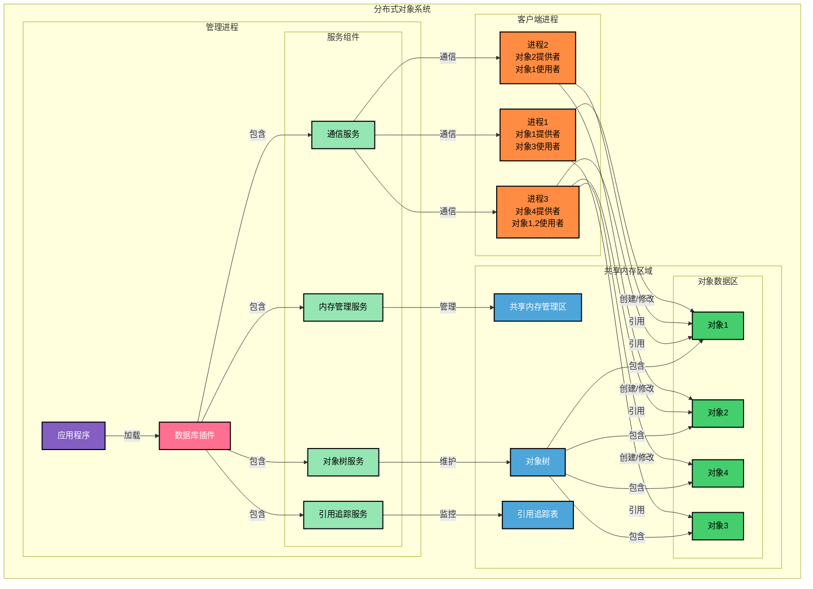

### 2.2 对象生命周期和数据流

下图展示了分布式对象系统中对象的生命周期和数据流：

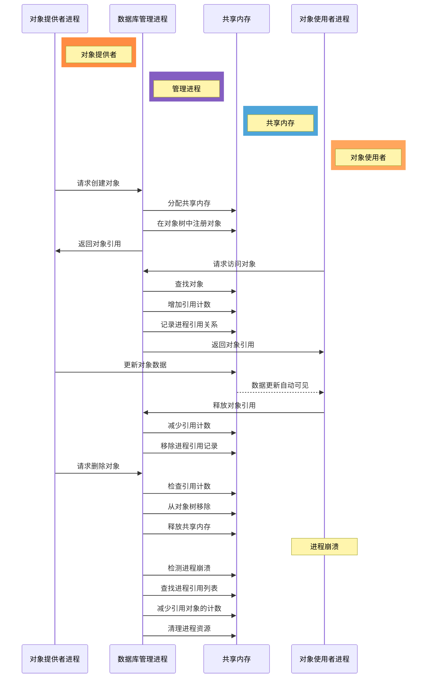

### 2.3 管理进程设计

管理进程是数据库的核心组件，负责以下职责：

1. **共享内存管理**
   - 创建和初始化共享内存区域
   - 为客户端分配共享内存
   - 在共享内存中维护全局数据结构

2. **对象树维护**
   - 管理树形结构
   - 处理对象注册和卸载请求
   - 维护对象之间的路径关系

3. **进程监控**
   - 检测客户端进程状态
   - 当进程崩溃时清理其资源和引用

4. **引用计数管理**
   - 跟踪对象引用计数
   - 当引用计数为零时释放对象

### 2.4 客户端库设计

客户端库提供应用程序与数据库交互的接口：

1. **连接管理**
   - 连接到数据库管理进程
   - 访问共享内存区域

2. **对象操作**
   - 获取对象引用
   - 释放对象引用
   - 创建和更新对象

3. **树遍历**
   - 按路径查找对象
   - 枚举子节点
   - 遍历树结构

### 2.5 引用追踪系统

引用追踪系统在共享内存中为每个进程维护一个双向链表，记录该进程持有的所有对象引用：

1. **引用记录**
   - 记录进程ID和对象指针
   - 维护引用列表的双向链接

2. **自动清理**
   - 进程终止时自动清理引用
   - 减少相应对象的引用计数

## 3. 数据结构设计

### 3.1 对象树节点

```cpp
struct tree_node {
    // 节点名称
    char name[64];
    
    // 父节点指针
    tree_node* parent;
    
    // 子节点链表头
    tree_node* first_child;
    
    // 兄弟节点指针
    tree_node* next_sibling;
    
    // 节点类型（目录或叶子）
    uint8_t type;
    
    // 对象数据（仅对叶子节点有效）
    void* data;
    
    // 引用计数
    uint32_t ref_count;
    
    // 对象大小（仅对叶子节点有效）
    size_t data_size;
};
```

### 3.2 进程引用记录

```cpp
struct process_ref {
    // 进程ID
    pid_t pid;
    
    // 引用的对象
    tree_node* node;
    
    // 链表前向指针
    process_ref* prev;
    
    // 链表后向指针
    process_ref* next;
};
```

### 3.3 进程引用表

```cpp
struct process_ref_table {
    // 进程ID
    pid_t pid;
    
    // 引用链表头
    process_ref* first_ref;
    
    // 引用链表尾
    process_ref* last_ref;
    
    // 下一个进程表
    process_ref_table* next;
};
```

### 3.4 共享内存头

```cpp
struct shared_memory_header {
    // 魔数，用于验证共享内存格式
    uint32_t magic;
    
    // 版本号
    uint32_t version;
    
    // 共享内存总大小
    size_t total_size;
    
    // 已使用大小
    size_t used_size;
    
    // 树根节点
    tree_node* root;
    
    // 进程引用表链表头
    process_ref_table* first_process;
    
    // 互斥锁，用于同步访问
    interprocess_mutex lock;
};
```

## 4. 接口设计

### 4.1 管理进程接口

```cpp
namespace mc::db {

class database_manager {
public:
    // 初始化数据库管理器
    database_manager();
    ~database_manager();

    // 启动管理进程
    bool start();
    
    // 停止管理进程
    void stop();
    
    // 分配共享内存
    void* allocate_memory(size_t size);
    
    // 释放共享内存
    void free_memory(void* ptr);
    
    // 注册对象到树
    bool register_object(std::string_view path, void* object, size_t size);
    
    // 更新对象
    bool update_object(std::string_view path, void* object, size_t size);
    
    // 卸载对象
    bool unregister_object(std::string_view path);
    
    // 检查和清理崩溃进程
    void cleanup_crashed_processes();
    
    // 获取状态信息
    bool get_status(database_status& status);

private:
    // 内部实现细节
};

} // namespace mc::db
```

### 4.2 客户端接口

```cpp
namespace mc::db {

class database_client {
public:
    // 初始化客户端
    database_client();
    ~database_client();

    // 连接到数据库
    bool connect();
    
    // 断开连接
    void disconnect();
    
    // 获取对象引用
    template<typename T>
    T* get_object(std::string_view path);
    
    // 释放对象引用
    void release_object(void* object);
    
    // 创建新对象
    template<typename T>
    bool create_object(std::string_view path, const T& object);
    
    // 更新对象
    template<typename T>
    bool update_object(std::string_view path, const T& object);
    
    // 删除对象
    bool delete_object(std::string_view path);
    
    // 检查对象是否存在
    bool object_exists(std::string_view path);
    
    // 获取子节点列表
    bool list_children(std::string_view path, std::vector<std::string>& children);
    
    // 遍历树
    bool traverse_tree(std::string_view path, const std::function<bool(std::string_view, void*)>& callback);

private:
    // 内部实现细节
};

} // namespace mc::db
```

## 5. 工作流程

### 5.1 初始化流程

1. 管理进程启动，创建共享内存区域
2. 初始化共享内存头和根节点
3. 设置进程监控机制
4. 等待客户端连接

### 5.2 对象注册流程

1. 客户端请求注册对象
2. 管理进程分配共享内存，复制对象数据
3. 管理进程在树中创建对应路径的节点
4. 将对象链接到树节点

### 5.3 对象访问流程

1. 客户端根据路径查找对象
2. 客户端获取对象引用，增加引用计数
3. 在进程引用表中添加引用记录
4. 客户端使用对象
5. 客户端释放对象引用，减少引用计数
6. 从进程引用表中移除引用记录

### 5.4 进程崩溃处理流程

1. 管理进程检测到客户端进程崩溃
2. 查找该进程的引用表
3. 遍历引用表中的所有对象引用
4. 减少每个被引用对象的引用计数
5. 释放引用计数为零的对象
6. 删除该进程的引用表

## 6. 安全性考虑

### 6.1 进程间同步

- 使用共享内存互斥锁保护关键数据结构
- 实现细粒度锁定以提高并发性能
- 避免死锁情况

### 6.2 数据完整性

- 验证共享内存头部魔数和版本号
- 定期检查数据结构完整性
- 实现故障恢复机制

### 6.3 权限控制

- 控制对共享内存的访问权限
- 可选择性地限制特定进程对特定对象的访问

## 7. 性能优化

### 7.1 内存管理

- 实现高效的内存分配器
- 使用内存池减少碎片
- 优化对象布局减少缓存未命中

### 7.2 访问优化

- 实现路径缓存加速查找
- 使用哈希表加速子节点查找
- 批量操作优化

### 7.3 并发优化

- 读写锁分离提高并发读取性能
- 避免全局锁争用
- 原子操作替代锁定

## 8. 异常处理

### 8.1 错误码定义

```cpp
enum class database_error_code {
    success = 0,
    not_initialized,
    already_exists,
    not_found,
    invalid_path,
    access_denied,
    out_of_memory,
    invalid_argument,
    internal_error
};
```

### 8.2 异常处理机制

- 使用MC_THROW宏抛出异常
- 合理使用错误代码
- 提供详细的错误信息

## 9. 未来扩展

### 9.1 持久化支持

- 增加对象序列化/反序列化机制
- 实现数据库快照功能
- 支持数据库恢复

### 9.2 查询支持

- 基于属性的查询语言
- 索引机制
- 事件通知机制

### 9.3 分布式支持

- 跨节点对象共享
- 分布式事务
- 节点间同步

## 10. 测试计划

### 10.1 单元测试

- 对象树操作测试
- 引用计数管理测试
- 内存分配和释放测试

### 10.2 集成测试

- 多进程并发访问测试
- 进程崩溃恢复测试
- 大规模对象管理测试

### 10.3 性能测试

- 吞吐量测试
- 延迟测试
- 内存消耗测试

## 11. 分布式对象类设计

### 11.1 类图设计

以下类图展示了分布式对象系统的核心组件及其关系：

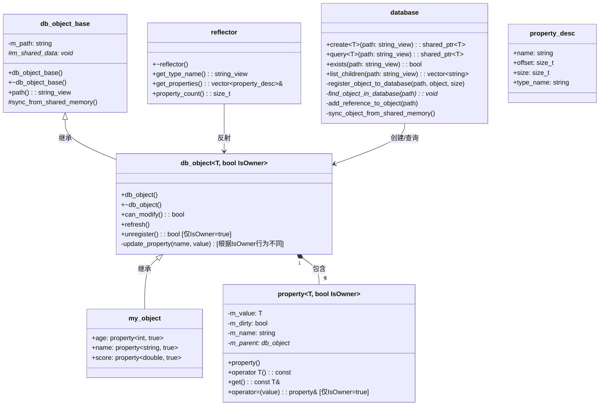

### 11.2 核心组件说明

#### 11.2.1 统一对象设计

分布式对象系统采用统一的对象模板设计，通过模板参数区分对象的所有权：

- **db_object_base**：抽象基类，提供共享功能
  - 对象路径管理
  - 共享内存引用管理
  - 通用对象生命周期管理

- **db_object<T, bool IsOwner>**：统一的对象模板
  - 当 `IsOwner=true` 时，表示对象拥有者（提供者），具有完全读写权限
  - 当 `IsOwner=false` 时，表示对象使用者，仅具有只读权限
  - 通过编译时类型检查强制权限控制
  - 简化了代码生成，避免了创建多个几乎相同的类

这种设计方式具有以下优势：
1. 代码生成仅需生成一种类型
2. 编译时强制权限检查
3. 接口统一，使用简单
4. 与反射系统的集成更加简洁

#### 11.2.2 属性模板

系统提供统一的属性模板，根据所有权参数自动适应不同的访问权限：

- **property<T, bool IsOwner>**：统一的属性模板
  - 所有实例都支持读取操作
  - 仅当 `IsOwner=true` 时，支持写入操作
  - 通过C++模板的特化和SFINAE技术实现编译时权限检查

通过这种设计，系统可以在编译时强制执行访问控制规则，防止非拥有者对象错误地修改属性值。

### 11.3 与现有反射系统集成

分布式对象系统利用mc::reflect现有的反射机制，用于对象属性的序列化、反序列化和动态访问。以下是集成方案：

#### 11.3.1 反射使用示例

```cpp
// 用户自定义分布式对象
class my_object : public mc::db::db_object<my_object> {
public:
    // 默认IsOwner=true的属性
    mc::db::property<int> age;
    mc::db::property<std::string> name;
    mc::db::property<double> score;
};

// 使用现有的MC_REFLECT机制添加反射支持
MC_REFLECT(my_object, (age)(name)(score))

// 使用示例
void example() {
    mc::db::client db;
    
    // 创建对象（拥有者模式）
    auto obj_owner = db.create<my_object>("/path/to/object");
    obj_owner->age = 30;      // 允许修改
    obj_owner->name = "测试"; // 允许修改
    
    // 查询对象（非拥有者模式）
    auto obj_user = db.query<db_object<my_object, false>>("/path/to/object");
    int age_value = obj_user->age;     // 允许读取
    // obj_user->name = "新名称";      // 编译错误！非拥有者不能修改属性
    
    // 刷新对象（从共享内存获取最新值）
    obj_user->refresh();
}
```

#### 11.3.2 代码生成支持

对于基于schema文件的代码生成，这种设计大大简化了代码生成过程。只需要生成一个类定义：

```cpp
// 从schema自动生成的代码
class ${object_name} : public mc::db::db_object<${object_name}> {
public:
    // 生成属性声明
    ${foreach property in schema.properties}
    mc::db::property<${property.type}> ${property.name};
    ${end}
};

// 自动生成反射代码
MC_REFLECT(${object_name}, (${schema.properties.map(p => p.name).join(")(")})
```

用户可以根据需要选择使用拥有者还是非拥有者模式：
```cpp
// 创建对象（拥有者）
auto obj = client.create<my_object>("/path");

// 访问对象（非拥有者，只读）
auto proxy = client.query<db_object<my_object, false>>("/path");
```

#### 11.3.3 属性模板实现

```cpp
namespace mc::db {

// 统一的属性模板，根据IsOwner参数区分访问权限
template<typename T, bool IsOwner = true>
class property {
public:
    // 构造函数
    property() = default;
    
    // 赋值操作符 - 只在IsOwner=true时启用
    template<bool O = IsOwner>
    typename std::enable_if<O, property&>::type
    operator=(const T& value) {
        m_value = value;
        m_dirty = true;
        
        // 通过反射通知属性变更
        if (m_parent && !m_name.empty()) {
            mc::variant var = value;
            property_reflector<T>::on_property_changed(m_parent, m_name.c_str(), var);
        }
        return *this;
    }
    
    // 类型转换操作符（读取访问，对所有人开放）
    operator T() const {
        return m_value;
    }
    
    // 获取值（读取访问，对所有人开放）
    const T& get() const {
        return m_value;
    }

private:
    T m_value{};
    bool m_dirty{false};
    std::string m_name;
    db_object_base* m_parent{nullptr};
    
    // 允许基类访问私有成员
    template<typename U, bool O>
    friend class db_object;
};

} // namespace mc::db
```

#### 11.3.4 对象模板实现

```cpp
namespace mc::db {

// 对象基类
class db_object_base {
protected:
    std::string m_path;
    void* m_shared_data;
    
    virtual void sync_from_shared_memory() = 0;
    
public:
    db_object_base();
    virtual ~db_object_base();
    
    std::string_view path() const { return m_path; }
    
    // 反射支持
    virtual const reflector& get_reflector() const = 0;
};

// 统一的对象模板，通过IsOwner参数区分权限
template<typename T, bool IsOwner = true>
class db_object : public db_object_base {
public:
    // 构造函数
    db_object() {}
    
    // 析构函数
    ~db_object() {}
    
    // 反射支持
    const reflector& get_reflector() const override {
        return reflector_for<T>::get();
    }
    
    // 判断是否有修改权限
    bool can_modify() const { return IsOwner; }
    
    // 刷新对象（从共享内存获取最新数据）
    void refresh() {
        sync_from_shared_memory();
    }
    
    // 注销对象 - 仅当IsOwner=true时可用
    template<bool O = IsOwner>
    typename std::enable_if<O, bool>::type
    unregister() {
        // 对象拥有者可以注销对象
        return database_instance().unregister_object(path());
    }
    
protected:
    // 处理属性更新 - 拥有者实现
    template<bool O = IsOwner>
    typename std::enable_if<O, void>::type
    update_property(const char* property_name, const variant& value) {
        // 更新共享内存中的属性值
        database_instance().update_object_property(path(), property_name, value);
    }
    
    // 处理属性更新 - 非拥有者实现（禁止修改）
    template<bool O = IsOwner>
    typename std::enable_if<!O, void>::type
    update_property(const char* property_name, const variant& value) {
        // 非拥有者无权修改，记录错误
        elog("非拥有者尝试修改对象属性: ${path}.${property}",
             ("path", path())("property", property_name));
    }
    
    // 从共享内存同步对象数据
    void sync_from_shared_memory() override {
        // 实现从共享内存读取数据的逻辑
    }
};

} // namespace mc::db
```

这种统一的对象设计通过C++模板特化和SFINAE技术，在编译时强制执行访问控制，同时简化了代码结构和生成过程。它为基于schema的对象生成提供了更高效的支持，减少了重复代码，并保持了清晰的接口和类型安全。

## 12. 插件与服务架构设计

数据库模块作为应用程序的插件，遵循插件+服务架构设计模式，实现与应用程序框架的无缝集成。插件作为容器包含多个服务组件，每个服务组件提供特定的功能，并可以独立开发、测试和部署。

### 12.1 应用程序框架集成

数据库插件遵循应用程序插件框架的规范，实现标准的插件接口：

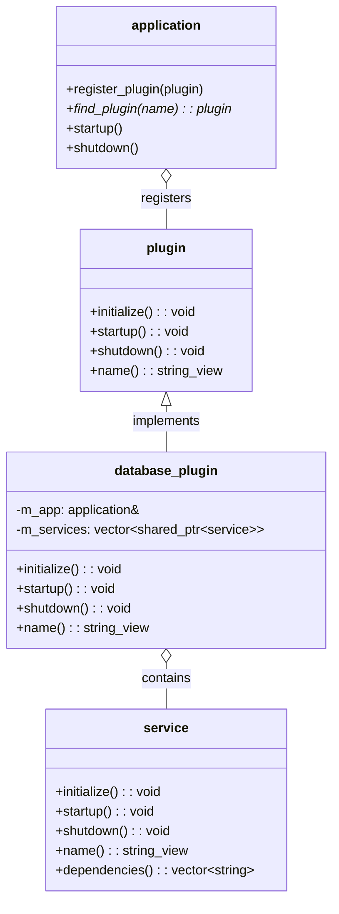

数据库插件在应用程序启动时注册，并在应用程序框架的控制下完成初始化、启动和关闭等生命周期事件。这种设计使数据库功能可以根据应用程序需求动态加载或卸载，提高了系统的灵活性和可维护性。

### 12.2 服务架构设计

数据库插件内部采用服务架构，将功能分解为多个独立的服务组件：

```mermaid
graph TD
    subgraph "数据库插件"
        DB[database_plugin]
        
        subgraph "核心服务"
            CS[通信服务<br>communication_service]
            OS[对象树服务<br>object_tree_service]
            MS[内存管理服务<br>memory_manager_service]
            RS[引用追踪服务<br>reference_tracker_service]
        end
        
        DB --> CS
        DB --> OS
        DB --> MS
        DB --> RS
        
        OS --> MS : 依赖
        OS --> RS : 依赖
        CS --> MS : 依赖
    end
```

服务组件间通过明确的依赖关系组织，确保在初始化和启动过程中按正确的顺序处理。每个服务组件都遵循统一的生命周期接口，使得插件可以集中管理各组件的状态。

### 12.3 核心服务组件

#### 12.3.1 通信服务 (communication_service)

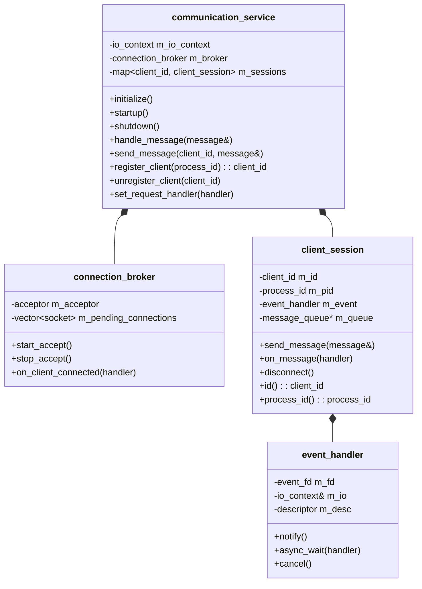

通信服务负责处理客户端与服务器之间的消息交换，管理客户端连接生命周期，并提供基于事件的异步通信机制。该服务是客户端进程与管理进程交互的桥梁，通过提供高性能的异步接口，确保消息高效传递。

#### 12.3.2 对象树服务 (object_tree_service)

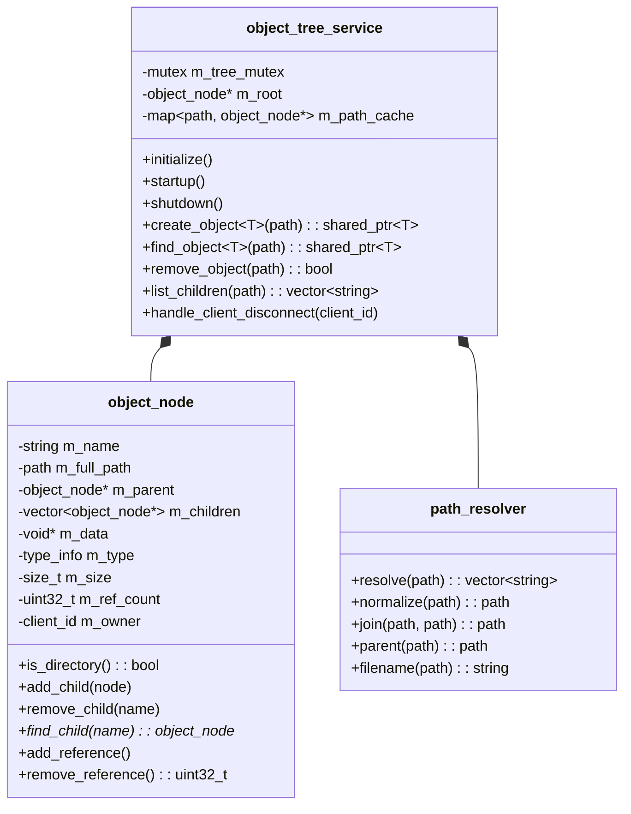

对象树服务是数据库系统的核心，负责管理对象的层次结构，提供对象的创建、查询、删除和遍历功能。通过路径命名系统，客户端可以按照直观的方式访问和管理对象，类似于文件系统的组织方式。

#### 12.3.3 内存管理服务 (memory_manager_service)

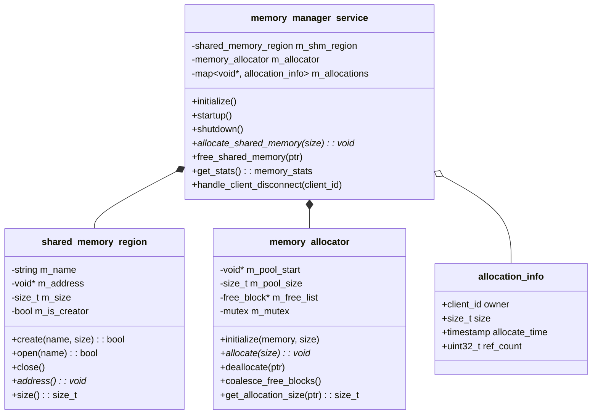

内存管理服务负责共享内存的创建、分配和回收，为对象数据提供存储空间。该服务实现了高效的内存分配器，支持内存池管理，减少内存碎片，并提供详细的内存使用统计信息。

#### 12.3.4 引用追踪服务 (reference_tracker_service)

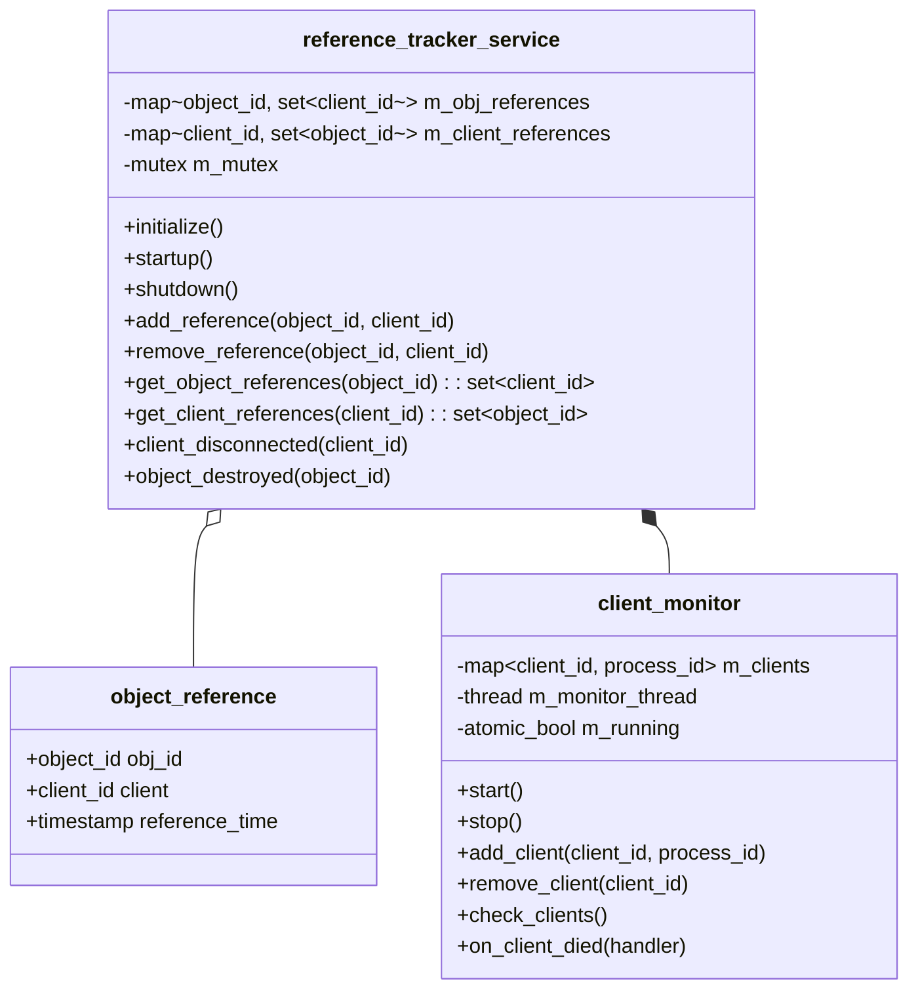

引用追踪服务负责管理对象的引用关系，跟踪每个客户端引用的对象，并在客户端异常退出时自动清理资源。该服务是确保系统稳定性和防止资源泄漏的关键组件。

### 12.4 服务生命周期管理

数据库插件管理服务组件的生命周期，确保它们按照正确的顺序初始化、启动和关闭：

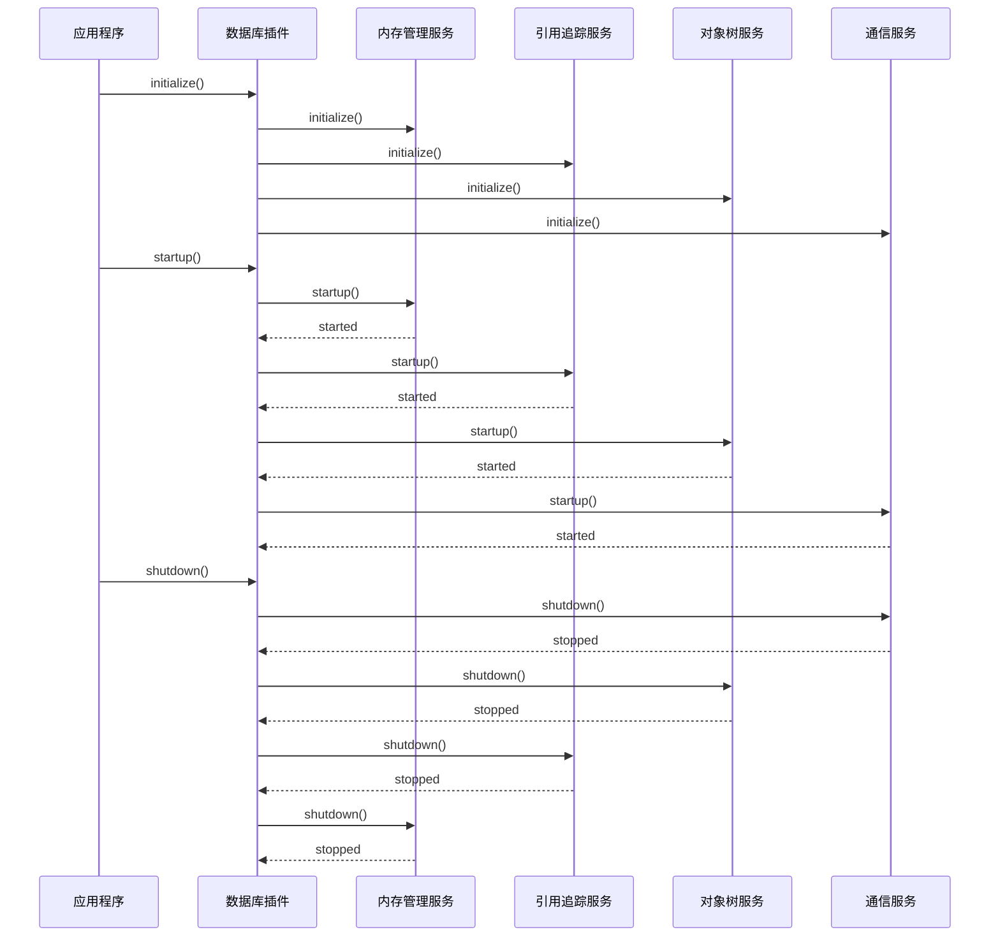

这种生命周期管理确保了服务组件之间的依赖关系得到正确处理，防止因初始化顺序不当导致的问题。

### 12.5 客户端框架集成

客户端库提供了与应用程序框架无缝集成的接口，使应用程序可以轻松地使用数据库功能：

```cpp
namespace mc::db {

// 客户端应用程序入口点
class client {
public:
    // 构造和析构
    client();
    ~client();
    
    // 异步连接管理
    void async_connect(std::function<void(bool)> completion_handler);
    void async_disconnect(std::function<void()> completion_handler);
    bool is_connected() const;
    
    // 对象操作
    template<typename T>
    std::shared_ptr<db_object<T>> create(const path& object_path);
    
    template<typename T>
    std::shared_ptr<db_object_proxy<T>> query(const path& object_path);
    
    void async_remove(const path& object_path, std::function<void(bool)> completion_handler);
    
    // 树遍历
    void async_list_children(const path& parent_path, 
                            std::function<void(const std::vector<std::string>&, bool)> completion_handler);
    
    void async_exists(const path& object_path, 
                     std::function<void(bool, bool)> completion_handler);
    
private:
    class impl;
    std::unique_ptr<impl> m_impl;
};

} // namespace mc::db
```

客户端API提供了面向应用程序开发者的高级接口，隐藏了底层通信和数据交换的复杂性，使得与数据库交互变得简单直观。

### 12.6 公共头文件组织

数据库模块的公共头文件组织如下：

```
include/mc/database/           # 公共头文件目录
  |- client.h                  # 客户端主接口
  |- path.h                    # 路径操作工具
  |- types.h                   # 基础类型定义
  |- exceptions.h              # 异常定义
  |
  |- object/                   # 对象相关头文件
  |  |- object.h               # 对象提供者基类
  |  |- object_proxy.h         # 对象代理基类
  |  |- property.h             # 属性模板
  |
  |- util/                     # 工具类头文件
     |- async_result.h         # 异步操作结果
     |- error_code.h           # 错误码定义
     |- logging.h              # 日志工具
```

这种组织结构清晰地分离了不同功能的头文件，方便开发者根据需要包含特定的组件。

### 12.7 服务实现文件组织

服务的实现文件组织如下：

```
src/database/                  # 源码目录
  |- plugin.h                  # 插件定义
  |- plugin.cpp                # 插件实现
  |
  |- services/                 # 服务实现
  |  |- communication/         # 通信服务
  |  |  |- service.h
  |  |  |- service.cpp
  |  |  |- session.h
  |  |  |- session.cpp
  |  |  |- event_handler.h
  |  |  |- event_handler.cpp
  |  |  |- message_queue.h
  |  |  |- message_queue.cpp
  |  |
  |  |- object_tree/           # 对象树服务
  |  |  |- service.h
  |  |  |- service.cpp
  |  |  |- node.h
  |  |  |- node.cpp
  |  |  |- path.h
  |  |  |- path.cpp
  |  |
  |  |- memory_manager/        # 内存管理服务
  |  |  |- service.h
  |  |  |- service.cpp
  |  |  |- allocator.h
  |  |  |- allocator.cpp
  |  |  |- shared_memory.h
  |  |  |- shared_memory.cpp
  |  |
  |  |- reference_tracker/     # 引用追踪服务
  |     |- service.h
  |     |- service.cpp
  |     |- monitor.h
  |     |- monitor.cpp
  |
  |- client/                   # 客户端实现
  |  |- client_impl.h
  |  |- client_impl.cpp
  |  |- object_impl.h
  |  |- object_impl.cpp
  |  |- proxy_impl.h
  |  |- proxy_impl.cpp
  |
  |- common/                   # 公共组件
     |- errors.h
     |- errors.cpp
     |- constants.h
     |- message_types.h
```

这种组织结构使得每个服务都有自己的独立目录，包含相关的头文件和实现文件，便于模块化开发和测试。

### 12.8 核心优势

插件与服务架构设计的核心优势包括：

1. **模块化设计** - 每个服务都是独立的功能单元，可以单独开发、测试和维护
2. **松耦合架构** - 服务之间通过明确的接口交互，减少依赖关系
3. **可扩展性** - 可以轻松添加新的服务或替换现有服务，而不影响整体系统
4. **框架集成** - 作为插件无缝集成到应用程序框架中
5. **生命周期管理** - 统一管理服务的初始化、启动和关闭
6. **异步操作** - 基于事件的异步设计提高了系统的响应性和并发能力
7. **资源隔离** - 每个服务管理自己的资源，减少全局状态和副作用

这种架构设计使得数据库模块在保持高性能的同时，具有更好的可维护性、可测试性和可扩展性。

## 13. 进程间通信设计

为了实现客户端与数据库管理进程之间的高效通信，我们采用Linux eventfd + 共享内存消息队列的方案，并使用Boost.Asio实现事件驱动架构。

### 13.1 通信类图

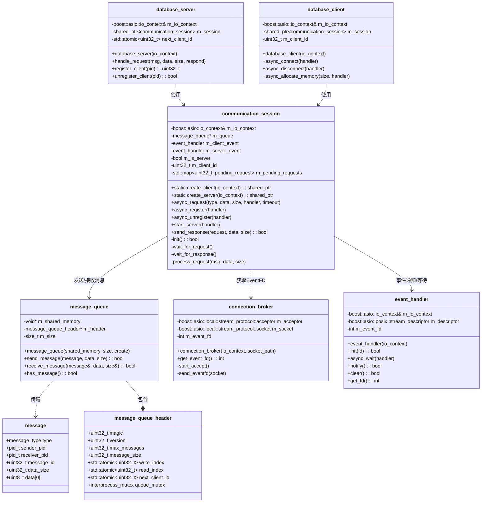

### 13.2 通信初始化流程

下面的时序图展示了客户端连接到管理进程的初始化流程：

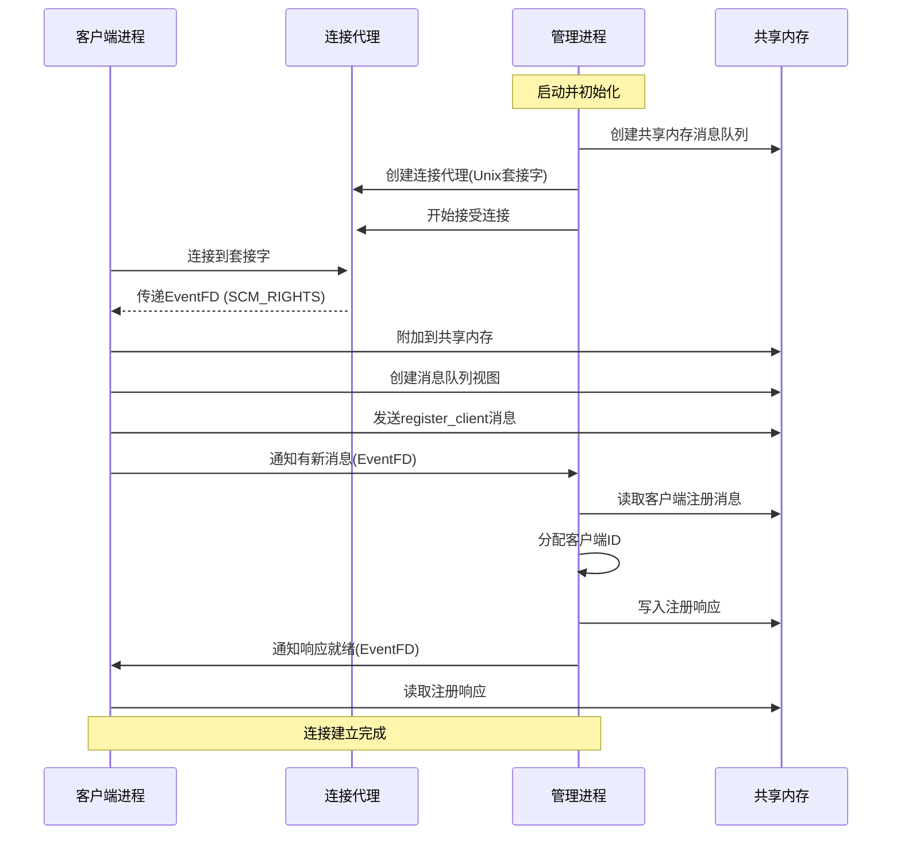

### 13.3 请求-响应处理流程

下面的时序图展示了客户端发送请求并接收响应的完整流程：

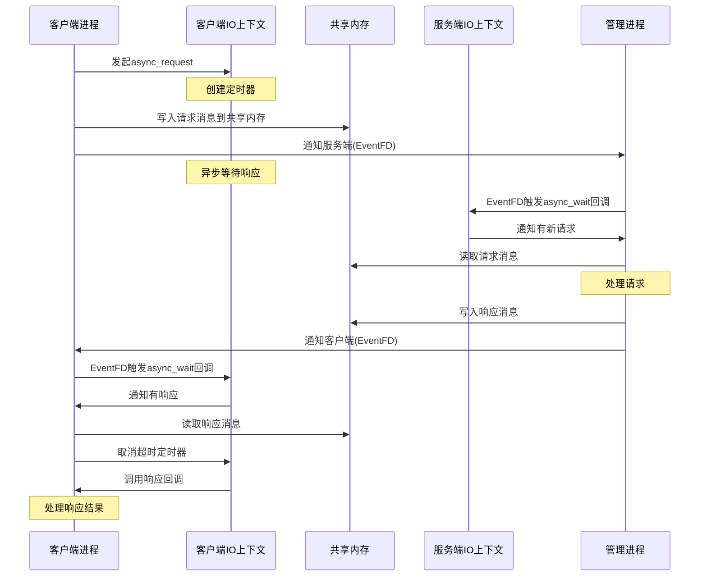

### 13.4 异步请求处理

使用Boost.Asio实现的异步请求处理流程：

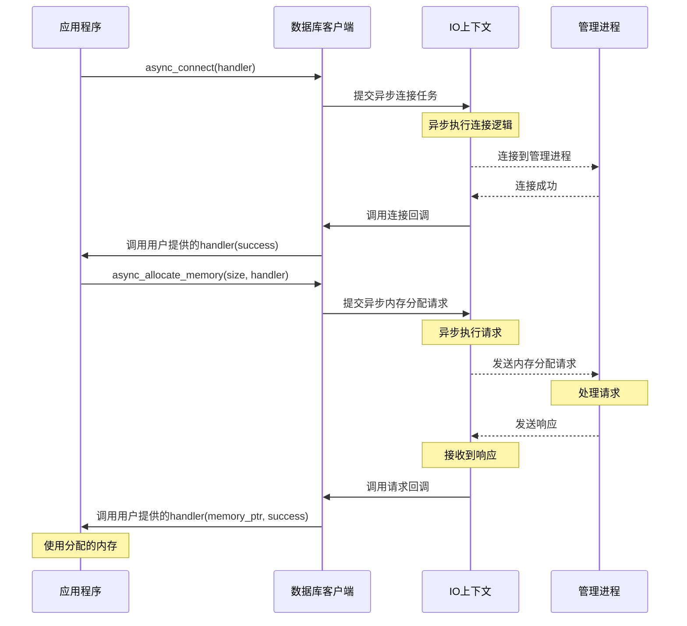

### 13.5 通信机制优势

1. **基于事件驱动**：使用Linux的eventfd机制进行高效通知
2. **异步无阻塞**：所有通信操作都是异步的，不会阻塞调用线程
3. **高效数据传输**：使用共享内存实现零拷贝数据传输
4. **安全的描述符传递**：使用Unix域套接字的SCM_RIGHTS机制安全传递eventfd
5. **高并发处理**：利用Boost.Asio的io_context处理高并发请求
6. **完整错误处理**：所有异步操作都有超时处理和错误回调
7. **线程安全设计**：适当使用互斥锁保护共享数据结构
