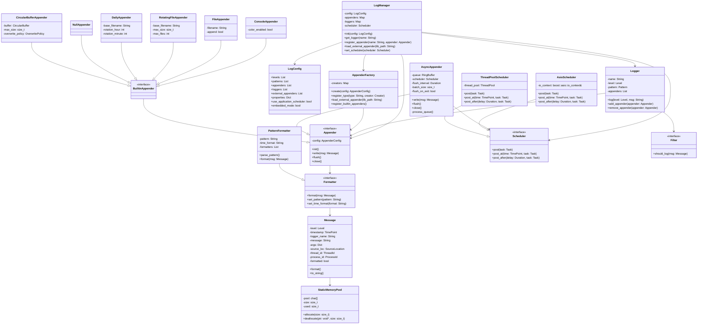
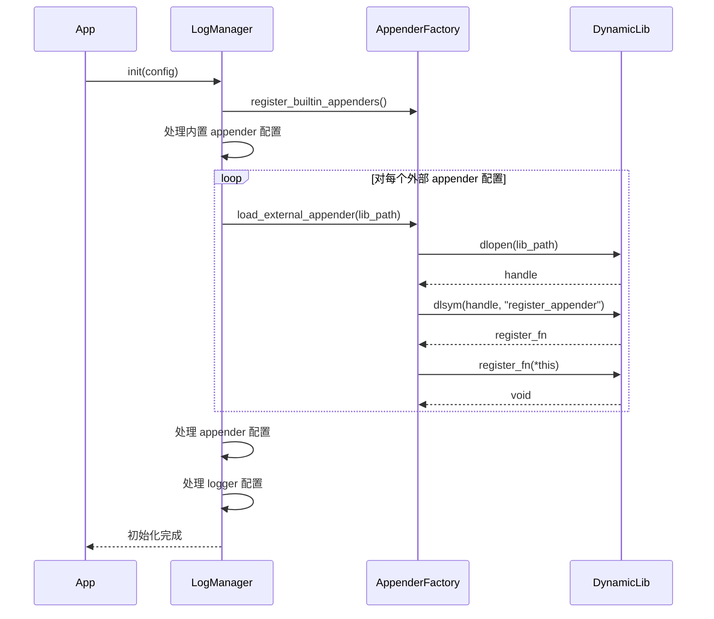

# 日志模块设计文档

## 1. 摘要

日志模块是一个灵活、高性能、可扩展的日志系统，旨在满足复杂应用程序的日志需求。该模块采用模块化设计，支持多种日志级别、多种输出目标、自定义格式化以及异步日志处理。系统特别优化了嵌入式环境下的资源使用，确保在资源受限场景下也能高效可靠地运行。

### 1.1 核心特性

- **灵活配置**：支持通过代码或配置文件进行全面配置
- **多级日志**：预定义多种日志级别，可自定义新级别
- **多目标输出**：内置多种输出目标（控制台、文件等），支持外部扩展
- **异步处理**：支持异步日志写入，提高性能
- **格式自定义**：灵活的日志格式配置
- **外部扩展**：支持动态加载外部日志处理器
- **调度器集成**：可与应用程序调度器（如 boost::asio）集成
- **过滤机制**：支持基于多种条件的日志过滤
- **高性能设计**：采用多种优化策略，确保高效运行
- **结构化日志**：支持结构化日志格式，便于分析和处理
- **资源优化**：针对嵌入式系统优化内存和存储需求
- **静态配置**：支持编译时配置，减少运行时开销
- **确定性行为**：确保日志操作的实时性和可预测性
- **可靠性保障**：提供掉电保护和错误恢复机制

### 1.2 架构概述

日志模块由以下核心组件构成：

- **LogManager**：日志系统的中央管理器，负责初始化配置、创建和管理日志器和输出目标
- **Logger**：日志记录器，应用程序的主要接口，负责记录和分发日志消息
- **Appender**：日志输出目标，负责将日志写入具体的媒介（控制台、文件、网络等）
- **Formatter**：格式化器，负责格式化日志消息
- **Filter**：过滤器，负责过滤日志消息
- **Scheduler**：调度器，负责异步日志处理的任务调度

该模块支持两类日志输出目标：
1. **内置 Appender**：系统预定义的输出目标，如控制台、文件等
2. **外部 Appender**：通过动态库加载的外部输出目标，扩展系统功能

## 2. 整体架构



## 3. 核心组件

### 3.1 LogManager

中央管理器，负责整个日志系统的初始化和管理。主要职责包括：
- 加载配置
- 注册内置和外部 Appender
- 创建和管理 Logger 实例
- 管理调度器
- 在嵌入式环境中控制资源分配

### 3.2 Logger

应用程序的主要接口，用于记录日志。每个 Logger 实例代表一个日志类别，可以关联多个 Appender。主要职责：
- 接收应用程序的日志请求
- 根据日志级别过滤消息
- 将日志消息转发到关联的 Appender

### 3.3 Appender

负责将日志消息写入具体的目标媒介。系统提供多种内置 Appender，并支持通过外部库扩展。主要类型：
- **ConsoleAppender**：输出到控制台
- **FileAppender**：输出到文件
- **RotatingFileAppender**：按大小轮转文件
- **DailyAppender**：按时间轮转文件
- **NullAppender**：丢弃所有日志（用于测试）
- **CircularBufferAppender**：使用固定大小环形缓冲区存储日志，适用于嵌入式系统
- **自定义外部 Appender**：通过动态库加载的自定义 Appender

### 3.4 Message

表示一条完整的日志消息，包含级别、时间戳、消息文本、源代码位置等信息。在嵌入式模式下，使用静态内存分配以减少内存碎片。

### 3.5 Formatter

负责将日志消息格式化为最终的输出字符串。主要实现是 PatternFormatter，支持通过模式字符串定义输出格式。

### 3.6 Filter

根据设定的条件过滤日志消息，决定是否输出。支持基于级别、正则表达式等多种过滤条件。

### 3.7 Scheduler

负责异步日志处理的任务调度。提供两种实现：
- **AsioScheduler**：基于 boost::asio 的调度器，可与应用程序共享 IO 上下文
- **ThreadPoolScheduler**：基于线程池的调度器

### 3.8 AsyncAppender

异步 Appender 包装器，可将任何 Appender 转换为异步模式。使用环形缓冲队列和调度器实现异步处理。

### 3.9 StaticMemoryPool

专为嵌入式环境设计的静态内存池，用于避免动态内存分配导致的内存碎片和不确定性。

## 4. 日志前端接口

为保持一致性和提高易用性，日志模块仅提供一种统一的日志记录方式：结构化日志。这种方式使日志信息更加清晰、易于处理和分析。

### 4.1 日志宏

日志模块提供以下宏用于不同级别的日志记录：

#### 4.1.1 基于Logger的日志宏

以下宏需要指定Logger实例作为第一个参数：

```cpp
mc_tlog(logger, format, args...)  // trace级别日志
mc_dlog(logger, format, args...)  // debug级别日志
mc_ilog(logger, format, args...)  // info级别日志
mc_wlog(logger, format, args...)  // warn级别日志
mc_elog(logger, format, args...)  // error级别日志
mc_flog(logger, format, args...)  // fatal级别日志
```

#### 4.1.2 全局日志宏

为了简化日志记录，系统还提供了以下全局日志宏，这些宏使用默认的全局日志记录器，无需指定Logger实例：

```cpp
tlog(format, args...)  // 全局trace级别日志
dlog(format, args...)  // 全局debug级别日志
ilog(format, args...)  // 全局info级别日志
wlog(format, args...)  // 全局warn级别日志
elog(format, args...)  // 全局error级别日志
flog(format, args...)  // 全局fatal级别日志
```

全局日志宏在内部使用名为"default"或"global"的Logger，该Logger在系统初始化时自动创建。

### 4.2 结构化日志格式

为了支持结构化日志，日志模块采用类似于命名参数的方式记录日志：

```cpp
mc_ilog(logger, "${key1}:${key2}", ("key1", value1)("key2", value2));
// 或使用全局宏
ilog("${key1}:${key2}", ("key1", value1)("key2", value2));
```

其中：
- 第一个参数是日志记录器实例（如果使用全局宏则不需要）
- 第二个参数是带有占位符的格式字符串，占位符格式为 `${key}`
- 后续参数是一系列键值对，用于填充占位符

这种方式的优势包括：
1. **类型安全**：值的类型由编译器检查，避免类型错误
2. **自描述**：日志中的每个值都有明确的名称，容易理解
3. **结构化**：日志可以被解析为结构化数据，方便自动化处理
4. **一致性**：提供单一接口，避免接口选择困惑

### 4.3 使用示例

#### 4.3.1 使用指定Logger的日志宏

```cpp
// 获取日志对象
auto& logger = mc::log::log_manager::instance().get_logger("main");

// 记录简单日志
mc_ilog(logger, "系统初始化完成");

// 记录带参数的结构化日志
mc_ilog(logger, "用户 ${user} 从 ${ip} 登录成功", 
       ("user", "admin")("ip", "192.168.1.100"));

// 记录包含多种类型参数的日志
mc_dlog(logger, "处理请求 ${method} ${path} 用时 ${time}ms, 状态 ${status}",
       ("method", "GET")("path", "/api/users")("time", 45.3)("status", 200));

// 记录错误日志
mc_elog(logger, "连接数据库失败: ${error}", 
       ("error", "Connection timeout"));
```

#### 4.3.2 使用全局日志宏

```cpp
// 记录简单日志，使用默认日志记录器
ilog("系统初始化完成");

// 记录带参数的结构化日志
ilog("用户 ${user} 从 ${ip} 登录成功", 
    ("user", "admin")("ip", "192.168.1.100"));

// 记录调试日志
dlog("详细信息: ${detail}", ("detail", "正在加载配置文件"));

// 记录警告信息
wlog("磁盘空间不足: ${available}GB", ("available", 1.2));

// 记录错误信息
elog("操作失败: ${code}, ${message}", 
    ("code", 404)("message", "资源不存在"));
```

### 4.4 参数值类型

参数值支持多种类型：
- 基本类型：字符串、整数、浮点数、布尔值
- 复合类型：日志系统会将复合类型转换为适当的字符串表示
- 自定义类型：可以为自定义类型实现 `to_string` 方法

### 4.5 实现原理

结构化日志的实现基于以下机制：
1. 宏定义解析格式字符串和参数
2. 参数通过链式调用构建参数列表
3. 消息构造时将参数存储为键值对
4. 格式化时根据键名查找并替换占位符

这种设计是对传统printf风格和stream风格日志的改进，结合了两者的优点并避免了缺点。

### 4.6 全局Logger配置

全局日志记录器（默认Logger）可以通过配置文件或代码进行配置：

```json
{
    "loggers": [
        {
            "name": "default",
            "level": {"level": "info", "value": 2},
            "appenders": ["console", "file"]
        }
    ]
}
```

或通过代码设置：

```cpp
// 获取默认日志记录器并配置
auto& default_logger = mc::log::log_manager::instance().get_logger("default");
default_logger.set_level("info");
default_logger.add_appender("console");
default_logger.add_appender("file");
```

使用全局日志宏时，系统会自动使用名为"default"的Logger。如果没有显式配置，系统会创建一个默认配置的Logger，通常输出到控制台。

### 4.7 嵌入式环境下的编译时优化

在嵌入式环境中，可以通过编译时宏控制日志行为：

```cpp
// 禁用低级别日志，减少代码大小和运行时开销
#define MC_LOG_DISABLE_TRACE
#define MC_LOG_DISABLE_DEBUG

// 使用静态内存分配
#define MC_LOG_USE_STATIC_MEMORY

// 设置最大消息长度
#define MC_LOG_MAX_MESSAGE_LENGTH 128

// 设置静态内存池大小
#define MC_LOG_STATIC_POOL_SIZE 4096
```

这些宏可以在编译时裁剪不必要的功能，减少代码大小和资源占用。

## 5. 配置结构

日志系统采用结构化的配置，支持完整的日志级别、格式、输出目标等定义。

### 5.1 配置组成

配置主要包含以下部分：
- **日志级别定义**：定义系统支持的日志级别及其数值
- **日志格式定义**：定义日志的输出格式模式
- **Appender 配置**：定义各种输出目标的配置
- **外部 Appender 配置**：定义需要动态加载的外部 Appender
- **Logger 配置**：定义日志记录器及其关联的 Appender
- **全局属性**：定义系统级的配置属性
- **嵌入式模式设置**：定义嵌入式环境下的特殊配置

### 5.2 配置示例（简化版）

```json
{
    "levels": [
        {"level": "debug", "value": 1},
        {"level": "info", "value": 2},
        {"level": "error", "value": 4}
    ],
    "appenders": [
        {
            "name": "console",
            "type": "console",
            "properties": {"color": true}
        }
    ],
    "external_appenders": [
        {
            "name": "kafka",
            "path": "libkafka_appender.so",
            "properties": {
                "topic": "logs"
            }
        }
    ],
    "loggers": [
        {
            "name": "main",
            "level": {"level": "info", "value": 2},
            "appenders": ["console", "kafka"]
        }
    ],
    "properties": {
        "use_application_scheduler": true,
        "embedded_mode": true,
        "static_memory_pool_size": 4096,
        "max_message_size": 128,
        "deterministic_mode": true
    }
}
```

### 5.3 嵌入式环境配置

在嵌入式环境下，可以使用轻量级配置方式，减少配置解析的开销：

```cpp
// 静态配置，避免运行时解析开销
static const mc::log::static_config embedded_config = {
    .embedded_mode = true,
    .static_memory_pool_size = 4096,
    .max_message_size = 128,
    .deterministic_mode = true,
    .default_level = mc::log::level::info,
    .default_appender = "circular_buffer",
    .circular_buffer_size = 1024
};

// 初始化日志系统
mc::log::log_manager::instance().init(embedded_config);
```

## 6. 扩展机制

### 6.1 内置 Appender 类型

系统预定义了多种内置 Appender，满足常见的日志输出需求：

1. **console** - 输出到控制台，支持彩色输出
2. **file** - 输出到文件，支持追加模式
3. **rotating_file** - 按大小轮转文件，支持设置最大大小和文件数量
4. **daily** - 按时间轮转文件，支持设置轮转时间点
5. **null** - 丢弃所有日志（用于测试）
6. **circular_buffer** - 环形缓冲区 Appender，特别适用于嵌入式系统
7. **uart** - 串口输出 Appender，适用于嵌入式系统

所有内置 Appender 都支持异步模式。

### 6.2 外部 Appender 扩展

系统支持通过动态库方式扩展 Appender 类型。开发者可以创建符合接口规范的自定义 Appender，编译为动态库后通过配置加载。

外部 Appender 插件接口示例：
```cpp
extern "C" void register_appender(AppenderFactory& factory) {
    factory.register_type("custom_type", 
        [](const AppenderConfig& config) {
            return std::make_shared<CustomAppender>(config);
        });
}
```

### 6.3 插件加载流程



### 6.4 其他扩展点

除了 Appender 外，系统还提供了多个扩展点：

1. **新增日志格式**：可自定义日志格式模式
2. **新增日志级别**：可在配置中定义新的日志级别
3. **自定义过滤器**：实现 Filter 接口创建自定义过滤规则
4. **自定义调度器**：实现 Scheduler 接口创建自定义调度策略
5. **自定义内存分配器**：实现 MemoryAllocator 接口提供特定的内存分配策略

## 7. 实现细节

### 7.1 日志管理器初始化流程

1. 注册内置 appender 类型
2. 根据配置设置调度器（应用程序调度器或内部线程池）
3. 加载配置中指定的外部 appender 并注册
4. 创建配置中定义的 appender 实例，设置异步 appender 的调度器
5. 创建配置中定义的 logger 实例并关联相应的 appender
6. 在嵌入式模式下，初始化静态内存池和其他嵌入式特定设置

### 7.2 异步日志实现

异步日志通过 AsyncAppender 包装器实现，主要特点：
- 使用环形缓冲队列缓存日志消息
- 利用调度器异步处理队列中的消息
- 支持批量处理提高性能
- 可配置的刷新策略
- 优雅关闭确保日志不丢失
- 在嵌入式模式下支持确定性响应时间

### 7.3 外部调度器集成

系统可与应用程序的调度器（如 boost::asio 的 io_context）集成，避免创建额外的线程，实现方式：
- 实现 Scheduler 接口适配外部调度器
- 通过配置启用应用程序调度器
- 设置接口允许注入外部调度器实例

### 7.4 静态内存管理

在嵌入式模式下，系统使用静态内存池避免动态内存分配：
- 预分配固定大小的内存池
- 使用自定义内存分配器管理内存
- 支持对象池化，减少内存碎片
- 提供内存使用统计和监控

## 8. 性能考虑

### 8.1 异步日志

- 环形缓冲队列缓存日志消息
- 批量写入提高性能
- 可配置的刷新策略
- 支持外部调度器减少线程开销
- 可配置的队列大小和溢出策略

### 8.2 内存管理

- 智能指针管理资源
- 避免不必要的字符串拷贝
- 使用移动语义优化性能
- 预分配消息缓冲区
- 日志消息对象池化
- 静态内存分配减少碎片
- 消息大小限制避免内存溢出

### 8.3 线程安全

- 互斥锁保护共享资源
- 支持多线程并发写入
- 使用无锁数据结构
- 中断安全的日志记录
- 可选择的锁优化策略

### 8.4 内存池和格式化优化

- 内存池管理日志消息对象
- 编译期字符串解析
- 延迟格式化，只在需要时格式化
- 预编译消息模板
- 静态字符串池减少内存使用

### 8.5 嵌入式特定优化

- 条件编译减少代码大小
- 静态配置避免解析开销
- 环形缓冲区日志存储
- 批量I/O操作减少写入次数
- 可配置的确定性行为

## 9. 高级特性

### 9.1 日志追踪与上下文

- 分布式追踪ID
- 请求链路追踪
- MDC (Mapped Diagnostic Context) 支持

### 9.2 日志聚合与监控

- 结构化日志输出
- JSON 格式输出
- 日志统计指标
- 告警阈值设置

### 9.3 安全特性

- 敏感信息脱敏
- 日志加密
- 访问控制
- 审计日志
- 掉电保护
- 日志完整性校验

## 10. 嵌入式环境适配与优化

### 10.1 内存优化

嵌入式环境通常受到严格的内存限制，日志系统提供以下内存优化：

- **静态内存分配**：使用预分配的静态内存池，避免动态分配导致的内存碎片
- **固定大小限制**：
  - 限制日志消息最大长度
  - 限制格式字符串长度
  - 限制参数数量
- **零拷贝设计**：尽可能减少内存拷贝操作
- **内存复用**：日志消息处理完成后立即释放内存
- **编译优化**：
  - 条件编译移除不需要的功能
  - 通过宏控制禁用低级别日志
  - 内联小型函数减少调用开销

### 10.2 存储空间优化

嵌入式设备的存储空间通常有限，系统提供以下存储优化：

- **循环日志**：实现循环覆盖式日志，自动覆盖最旧的日志
- **二进制格式**：支持紧凑的二进制日志格式，减少存储空间需求
- **选择性持久化**：可配置仅持久化特定级别的日志
- **增量日志**：记录变化部分，减少冗余信息
- **压缩支持**：实时压缩日志数据

### 10.3 确定性行为

嵌入式系统通常需要实时或近实时响应，系统提供以下确定性保障：

- **固定时间操作**：保证日志操作的最大执行时间可预测
- **无锁设计**：使用无锁队列传递日志消息
- **中断安全**：支持在中断上下文中安全记录日志
- **优先级调度**：重要日志消息优先处理
- **确定性内存分配**：预分配所有需要的内存

### 10.4 可靠性保障

嵌入式系统通常需要更高的可靠性，系统提供以下可靠性机制：

- **掉电保护**：实现日志写入的原子性，确保即使在掉电情况下也不会丢失或损坏日志
- **日志完整性校验**：添加校验和，确保日志数据完整性
- **错误恢复机制**：能够从存储错误中恢复
- **看门狗友好**：确保日志操作不会导致看门狗超时
- **系统重启保留**：系统重启后保留关键日志信息

### 10.5 资源受限适配

针对资源极其受限的嵌入式设备，系统提供以下适配：

- **最小功能集**：提供精简版实现，仅包含核心功能
- **静态初始化**：支持完全静态初始化，避免复杂的运行时配置
- **硬件加速**：利用可用的硬件加速功能，如DMA
- **低功耗设计**：
  - 批量处理减少处理器唤醒次数
  - 在系统进入低功耗模式前自动刷新日志
- **最小依赖**：减少对标准库和操作系统的依赖

### 10.6 嵌入式特定功能

为嵌入式环境提供的特殊功能：

- **硬件日志接口**：支持UART、JTAG、SWD等硬件接口输出日志
- **诊断集成**：与硬件诊断寄存器集成
- **远程调试**：支持远程日志查看和级别调整
- **固件更新记录**：特殊处理固件更新相关日志
- **故障转储**：在系统故障时自动生成诊断信息
- **系统监控**：记录系统状态和资源使用情况

## 11. 测试设计

### 11.1 单元测试

- 格式化器测试
- Appender 测试
- 配置加载测试
- 动态加载测试
- 异步日志与调度器测试
- 嵌入式特定功能测试

### 11.2 性能与压力测试

- 同步/异步性能测试
- 内存使用测试
- 并发性能测试
- 高负载场景测试
- 异常场景恢复测试
- 嵌入式环境性能测试

### 11.3 嵌入式环境特定测试

- 内存限制测试
- 确定性行为测试
- 电源不稳定场景测试
- 长时间运行测试
- 资源竞争测试
- 低功耗模式测试 