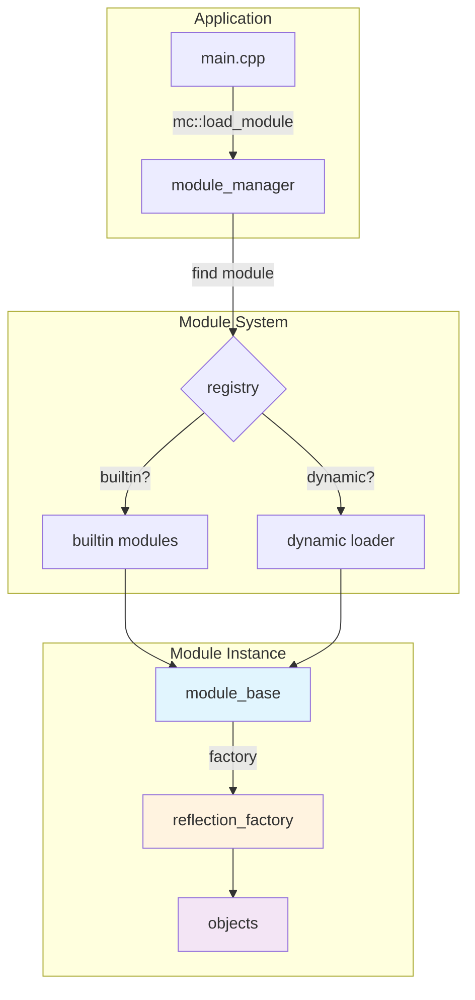
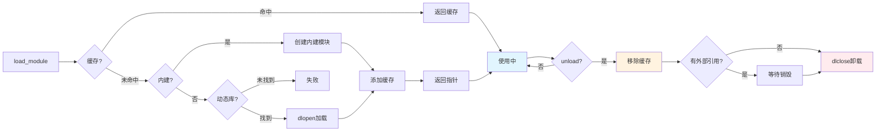

# MC 模块系统设计文档

## 1. MC 模块系统概述

### 1.1 系统定义

MC 模块系统是一个"插件管理器"，让开发者可以**把功能模块化**，需要时再加载。

### 1.2 核心目标

构建一个统一的模块化基础设施，实现以下核心目标：

- 🎯 **统一的模块管理**：为C++项目提供标准化的模块定义、加载和管理机制
- 🎯 **完全的类型隔离**：每个模块拥有独立的反射工厂，避免全局类型冲突
- 🎯 **灵活的部署模式**：同时支持静态链接的内建模块和动态加载的插件模块
- 🎯 **简单的开发接口**：通过宏和辅助函数简化模块开发，开发者专注业务逻辑

MC 模块系统通过**反射机制**作为核心技术，统一解决代码组织、功能解耦、动态加载和插件扩展等关键问题。

### 1.3 核心思想

每个模块都有自己的**独立反射工厂**：
- 模块A的类型不会与模块B的同名类型冲突
- 每个模块可以独立开发、测试、部署
- 程序可以动态决定加载哪些模块

## 2. 模块系统架构

### 2.1 架构概览



### 2.2 核心组件说明

**🎛️ 模块管理器 (module_manager)**
- 系统的"总调度员"，负责找到和加载模块
- 使用单例模式，全程序只有一个实例
- 提供 `mc::load_module("模块名")` 统一接口

**📦 模块基类 (module_base)**  
- 所有模块的统一接口
- 提供 `name()` (模块名)、`version()` (版本号)、`get_factory()` (获取反射工厂)

**🏭 反射工厂 (reflection_factory)**
- 每个模块都有自己独立的工厂实例
- 负责创建对象、调用方法
- 实现模块间的完全隔离

**🔍 动态加载器 (module_loader)**
- 在文件系统中搜索 `.so` 动态库
- 支持多种文件名模式：`mc/devices.so`、`mc/devices/init.so` 等

## 3. 两种模块类型

### 3.1 内建模块 - 编译时静态链接

**适用场景**：核心功能模块、不经常变化的模块

**优点** ✅：
- 无需额外文件，部署简单
- 加载速度快（无磁盘IO）
- 编译期类型检查

**缺点** ❌：
- 更新需要重新编译整个程序
- 程序体积较大

**实现方式**：
```cpp
// 1. 定义模块
MC_MODULE(mc_devices)

// 2. 定义业务类
namespace mc::devices {
class sensor {
public:
    void set_name(const std::string& name) { m_name = name; }
    const std::string& get_name() const { return m_name; }
private:
    std::string m_name;
};
}

// 3. 注册反射信息
MC_MODULE_REFLECT(mc_devices,
    (mc::devices::sensor, "Sensor"),
    ((set_name, "setName"))
    ((get_name, "getName")))

// 4. 实现内建模块（在 .cpp 文件中）
MC_BUILTIN_MODULE_IMPL(mc_devices);
```

### 3.2 动态模块 - 运行时动态加载

**适用场景**：插件功能、可选功能模块、第三方扩展

**优点** ✅：
- 支持热插拔，不停机更新
- 按需加载，节省内存
- 支持第三方开发插件

**缺点** ❌：
- 需要管理额外的 `.so` 文件
- 加载时有IO开销

**实现方式**：
```cpp
// 前三步与内建模块相同
MC_MODULE(mc_devices)
// ... 定义类和反射 ...

// 4. 导出动态模块（在 .cpp 文件中）
MC_EXPORT_MODULE(mc_devices);
```

**编译命令**：
```bash
g++ -fPIC -shared devices.cpp -o devices.so
```

## 4. 模块文件查找规则

### 4.1 搜索路径优先级

动态模块按以下优先级搜索：

1. **环境变量 `MC_MODULE_PATH`**（最高优先级）
2. **可执行文件同目录及其子目录**
3. **当前工作目录及其子目录**

### 4.2 文件名匹配规则

加载 `"mc.devices"` 时，会依次尝试：

```
✅ ./mc/devices.so              (标准模式)
✅ ./mc/devices/init.so         (init.so 模式) 
✅ ./modules/mc/devices.so      (modules目录)
✅ ./modules/mc/devices/init.so (modules+init.so)
```

**命名规则**：
- 模块名的点号(`.`)对应目录分隔符(`/`)
- 支持深层路径：`mc.test.database` → `mc/test/database.so`

### 4.3 环境变量配置示例

```bash
# 设置多个搜索路径（用分号分隔）
export MC_MODULE_PATH="/opt/mc/modules/?.so;./plugins/?.so;./libs/?/init.so"

# 模块文件放置示例
/opt/mc/modules/
├── mc_devices.so        # 对应 "mc.devices"
├── mc_network.so        # 对应 "mc.network"  
└── mc_protocol/
    └── init.so          # 对应 "mc.protocol"
```

## 5. 实际使用示例

### 5.1 完整的内建模块示例

```cpp
// ==== sensor.h ====
#include <mc/module.h>

MC_MODULE(mc_devices)  // 定义模块，下划线会转换为点号

namespace mc::devices {
class sensor {
public:
    void set_name(const std::string& name) { m_name = name; }
    const std::string& get_name() const { return m_name; }
    bool initialize() { return true; }
    double read() { return 25.0; }
    
private:
    std::string m_name{"default_sensor"};
};
} // namespace mc::devices

// 注册类型和方法到模块的反射工厂
MC_MODULE_REFLECT(mc_devices,
    (mc::devices::sensor, "Sensor"),    // 注册类型
    ((set_name, "setName"))             // 注册方法
    ((get_name, "getName"))
    ((initialize, "initialize"))
    ((read, "read")))

// ==== sensor.cpp ====  
#include "sensor.h"

// 实现内建模块（静态注册）
MC_BUILTIN_MODULE_IMPL(mc_devices);
```

### 5.2 完整的动态模块示例

```cpp
// ==== network_client.h ====
#include <mc/module.h>

MC_MODULE(mc_network)

namespace mc::network {
class network_client {
public:
    bool connect(const std::string& host, int port) {
        m_host = host;
        m_port = port;
        return true; // 模拟连接成功
    }
    
    const std::string& get_host() const { return m_host; }
    int get_port() const { return m_port; }
    
private:
    std::string m_host;
    int m_port{0};
};
} // namespace mc::network

MC_MODULE_REFLECT(mc_network,
    (mc::network::network_client, "NetworkClient"),
    ((connect, "connect"))
    ((get_host, "getHost"))  
    ((get_port, "getPort")))

// ==== network_module.cpp ====
#include "network_client.h"

// 导出动态模块
MC_EXPORT_MODULE(mc_network);
```

**编译动态模块**：
```bash
g++ -fPIC -shared network_module.cpp -o modules/mc/network.so
```

### 5.3 在应用程序中使用模块

```cpp
// ==== main.cpp ====
#include <mc/module.h>
#include <mc/log.h>

int main() {
    try {
        // 1. 加载设备模块（内建模块）
        auto devices_module = mc::load_module("mc.devices");
        if (!devices_module) {
            elog("无法加载设备模块");
            return -1;
        }
        
        ilog("成功加载模块: ${name} v${version}",
             ("name", devices_module->name())
             ("version", devices_module->version()));
        
        // 2. 获取模块的反射工厂
        auto factory = devices_module->get_factory();
        
        // 3. 创建对象并调用方法
        auto sensor_obj = factory->try_create_object("Sensor");
        if (sensor_obj) {
            // 调用方法
            sensor_obj->invoke_method("setName", {mc::variant("温度传感器")});
            auto name_result = sensor_obj->invoke_method("getName", {});
            
            ilog("传感器名称: ${name}", ("name", name_result.as<std::string>()));
            
            // 读取数据
            auto read_result = sensor_obj->invoke_method("read", {});
            ilog("传感器读数: ${value}", ("value", read_result.as<double>()));
        }
        
        // 4. 加载网络模块（动态模块）
        auto network_module = mc::load_module("mc.network");
        if (network_module) {
            auto net_factory = network_module->get_factory();
            auto client_obj = net_factory->try_create_object("NetworkClient");
            
            if (client_obj) {
                auto connect_result = client_obj->invoke_method("connect",
                    {mc::variant("192.168.1.100"), mc::variant(8080)});
                
                ilog("连接结果: ${result}", ("result", connect_result.as<bool>()));
            }
        }
        
        return 0;
    } catch (const std::exception& e) {
        elog("发生异常: ${msg}", ("msg", e.what()));
        return -1;
    }
}
```

## 6. 模块生命周期



### 6.1 生命周期详解

**加载阶段**：
1. **缓存查找**：首先检查模块管理器的缓存
2. **模块搜索**：依次搜索内建模块注册表和动态库文件
3. **实例创建**：创建模块实例并添加到缓存
4. **返回指针**：返回 `mc::shared_ptr<module_base>` 智能指针

**卸载的两个阶段**：

**第一阶段 - 管理器解除注册**：
- 调用 `manager.unload("module_name")` 时触发
- 从模块管理器的缓存中移除模块
- 此时模块实例可能仍然存在（如果外部还持有 `module_ptr`）

**第二阶段 - 真正卸载**：
- 当最后一个 `module_ptr` 被销毁时触发
- 对于动态模块，执行 `dlclose()` 卸载动态库
- 对于内建模块，只是销毁模块实例

### 6.2 关键特性

- ✅ **缓存机制**：同一模块只加载一次，后续调用返回缓存的实例
- ✅ **智能指针管理**：模块使用 `mc::shared_ptr` 管理生命周期
- ✅ **两阶段卸载**：管理器解除注册 + 智能指针销毁时真正卸载
- ✅ **安全保证**：即使调用 `unload()`，只要外部持有指针，模块就不会被真正卸载

### 6.3 卸载机制代码示例

```cpp
{
    // 1. 加载模块，此时模块被添加到管理器缓存
    auto module1 = mc::load_module("mc.devices");
    auto module2 = mc::load_module("mc.devices");  // 返回相同实例（缓存命中）
    
    // 2. 现在有两个智能指针指向同一个模块
    assert(module1.get() == module2.get());
    
    // 3. 调用管理器的unload - 第一阶段：解除注册
    auto& manager = mc::get_module_manager();
    manager.unload("mc.devices");  // 从缓存中移除，但模块实例仍存在
    
    // 4. 此时模块仍然可用，因为智能指针还持有引用
    auto factory = module1->get_factory();  // 正常工作
    
    // 5. 释放第一个指针
    module1.reset();  // 模块实例仍存在（module2还持有）
    
    // 6. 释放最后一个指针 - 第二阶段：真正卸载
    module2.reset();  // 现在才执行dlclose()卸载动态库
    
    // 7. 再次加载会重新从文件系统加载
    auto module3 = mc::load_module("mc.devices");  // 重新执行dlopen()
}
```

## 7. 隔离机制详解

### 7.1 反射工厂隔离

这是最重要的隔离机制：

```cpp
// 模块A的工厂
auto factory_A = mc::reflect::reflection_factory::instance<mc_devices_namespace>();

// 模块B的工厂  
auto factory_B = mc::reflect::reflection_factory::instance<mc_network_namespace>();

// 两个工厂完全独立，即使注册同名类型也不会冲突
```

**效果**：
- 模块A中的 `Config` 类与模块B中的 `Config` 类完全独立
- 避免了C++全局类型注册的经典问题
- 每个模块都有自己的"类型世界"

### 7.2 符号隔离

**动态模块**：
- 通过 `dlopen` 的 `RTLD_LOCAL` 标志实现符号隔离
- 即使两个模块链接了不同版本的同一个库，也不会冲突

**内建模块**：
- 通过C++命名空间和模板特化实现编译期隔离
- 每个模块有唯一的命名空间类型

## 8. 常见问题与解答

### 8.1 开发相关

**Q: 如何选择内建模块还是动态模块？**
A: 
- 核心功能、不常变化 → 内建模块
- 插件功能、可选功能 → 动态模块

**Q: 模块名命名规则是什么？**
A:
- 使用下划线定义：`MC_MODULE(mc_devices_sensor)`
- 加载时用点号：`mc::load_module("mc.devices.sensor")`
- 支持深层次：`mc.company.product.feature`

**Q: 如何调试模块加载问题？**
A:
```cpp
// 开启详细日志
mc::log::default_logger().set_level(mc::log::level::debug);

// 检查模块是否已加载
auto& manager = mc::get_module_manager();
if (manager.is_loaded("mc.devices")) {
    ilog("模块已加载");
} else {
    ilog("模块未加载");
}

// 查看所有已加载模块
auto loaded = manager.loaded_modules();
for (auto name : loaded) {
    ilog("已加载模块: ${name}", ("name", name));
}
```

### 8.2 部署相关

**Q: 动态模块文件应该放在哪里？**
A:
```
推荐目录结构：
./
├── your_app              # 主程序
├── modules/              # 模块目录
│   ├── mc/
│   │   ├── devices.so    # mc.devices 模块
│   │   ├── network.so    # mc.network 模块
│   │   └── protocol/     
│   │       └── init.so   # mc.protocol 模块（init.so模式）
│   └── third_party/
│       └── plugin.so     # 第三方插件
```

**Q: 如何设置模块搜索路径？**
A:
```bash
# 方法1：环境变量
export MC_MODULE_PATH="./modules/?.so;./plugins/?.so"

# 方法2：代码中设置
mc::get_module_manager().add_search_path("./custom/?.so");
```

### 8.3 性能相关

**Q: 模块加载性能如何？**
A:
- **内建模块**：几乎无开销（编译期确定）
- **动态模块**：首次加载有IO开销，后续访问来自缓存
- **建议**：核心路径使用内建模块，非核心功能使用动态模块

**Q: 如何优化模块加载速度？**
A:
- 减少搜索路径数量
- 将常用模块放在搜索路径前端
- 考虑将频繁使用的动态模块改为内建模块

## 9. 最佳实践

### 9.1 模块设计原则

1. **单一职责**：每个模块专注于一个功能领域
2. **松耦合**：模块间通过明确接口交互，避免直接依赖
3. **高内聚**：模块内部组件紧密协作
4. **接口稳定**：避免频繁修改模块的公开接口

### 9.2 模块命名建议

```cpp
// ✅ 好的命名
MC_MODULE(mc_devices_sensor)     // "mc.devices.sensor"
MC_MODULE(mc_network_http)       // "mc.network.http"  
MC_MODULE(mc_db_mysql)           // "mc.db.mysql"

// ❌ 不好的命名
MC_MODULE(sensor)                // 太短，容易冲突
MC_MODULE(mc_devices_sensor_)    // 不能以下划线结尾
MC_MODULE(mc__devices)           // 不能有连续下划线
```

### 9.3 错误处理

```cpp
try {
    auto module = mc::load_module("mc.devices");
    if (!module) {
        elog("模块加载失败: mc.devices");
        return false;
    }
    
    auto factory = module->get_factory();
    auto obj = factory->try_create_object("Sensor");
    if (!obj) {
        elog("无法创建Sensor对象");
        return false;
    }
    
    // 使用对象...
    
} catch (const mc::exception& e) {
    elog("模块操作异常: ${msg}", ("msg", e.what()));
    return false;
}
```

### 9.4 测试建议

```cpp
// 单元测试示例
TEST(ModuleTest, DevicesModule) {
    // 1. 加载模块
    auto module = mc::load_module("mc.devices");
    ASSERT_TRUE(module != nullptr);
    
    // 2. 验证模块信息
    EXPECT_EQ(module->name(), "mc.devices");
    EXPECT_EQ(module->version(), "1.0.0");
    
    // 3. 测试对象创建和方法调用
    auto factory = module->get_factory();
    auto sensor = factory->try_create_object("Sensor");
    ASSERT_TRUE(sensor != nullptr);
    
    // 4. 测试具体功能
    auto result = sensor->invoke_method("read", {});
    EXPECT_GT(result.as<double>(), 0.0);
}
```

---

## 总结

MC 模块系统通过**反射机制**实现了真正的模块化：
- 🎯 **统一接口**：内建模块和动态模块使用相同API  
- 🎯 **完全隔离**：每个模块有独立的类型系统
- 🎯 **灵活部署**：支持静态链接和动态加载两种方式
- 🎯 **易于使用**：简单的宏和函数接口

无论是开发核心功能还是扩展插件，MC 模块系统都能提供强大而灵活的支持。 