# MC++ 反射系统测试用例设计

## 1. 测试目标

MC++反射系统的测试用例旨在验证以下核心功能：

1. 基本反射功能（类型信息、对象序列化与反序列化）
2. 枚举反射功能
3. 成员访问与操作
4. 方法调用
5. 嵌套对象反射
6. 自定义名称反射
7. 自定义成员信息提取
8. 静态类型信息

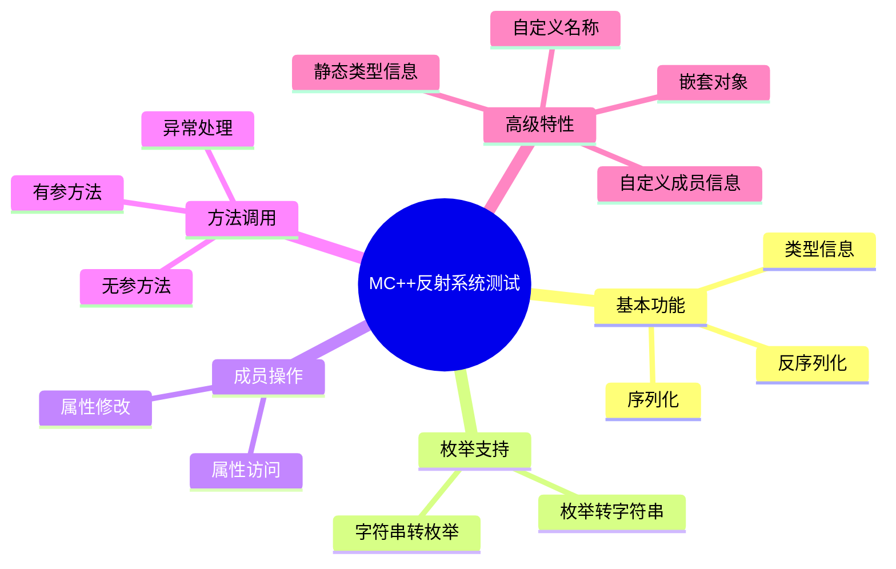

## 2. 测试文件结构

整个测试套件由以下文件组成：

1. `test_reflect.cpp` - 基本反射功能测试
2. `test_method_call.cpp` - 方法调用测试
3. `test_nested_reflect.cpp` - 嵌套对象反射测试
4. `test_reflect_custom_name.cpp` - 自定义名称反射测试
5. `test_custom_member_info.cpp` - 自定义成员信息提取测试
6. `test_reflect_static_info.cpp` - 静态类型信息测试

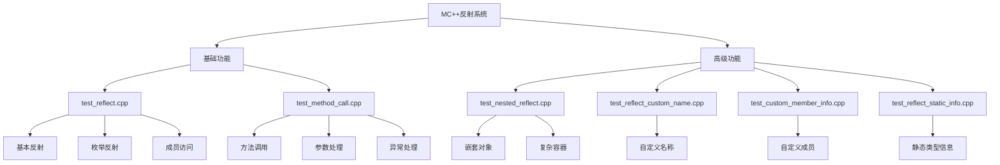

## 3. 测试场景详解

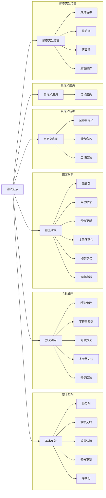

### 3.1 基本反射功能测试 (test_reflect.cpp)

#### 测试目标
验证MC_REFLECT和MC_REFLECT_ENUM宏的基本功能，包括类型标识、序列化、反序列化和成员访问。

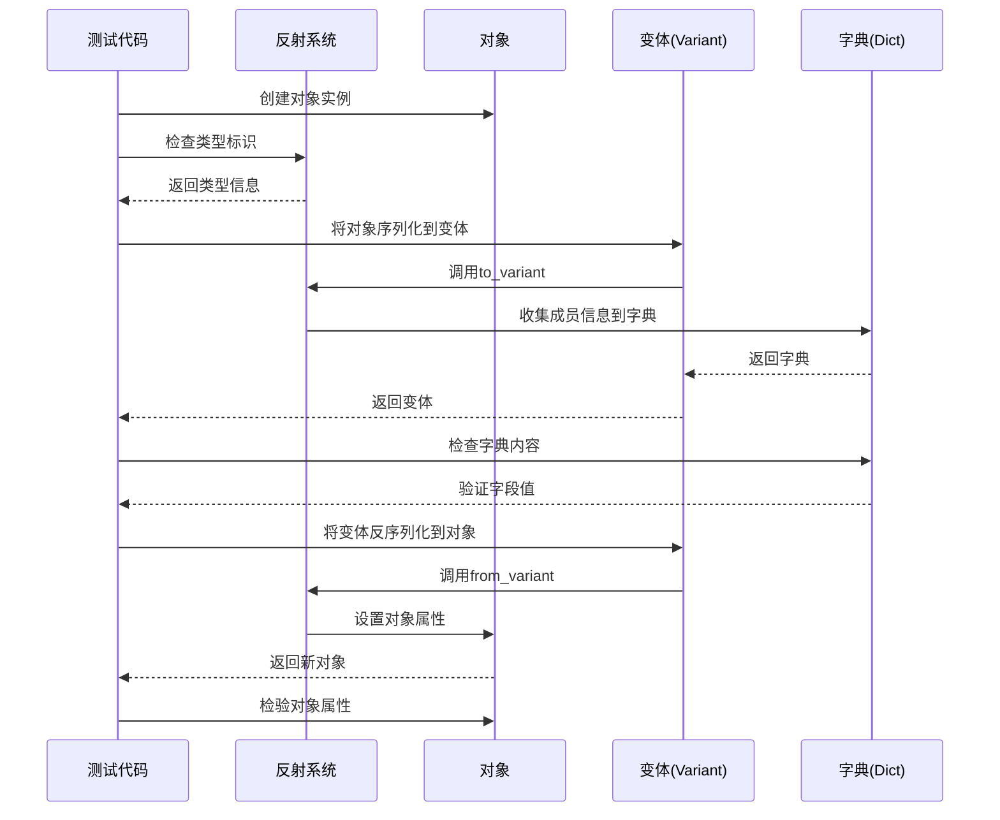

#### 测试场景
1. **类反射测试** (`ClassReflection`)
   - 检查类型标识（`is_reflectable`, `is_enum`, `name`）
   - 对象到变体的转换（序列化）
   - 变体到对象的转换（反序列化）
   - 字典内容验证

2. **枚举反射测试** (`EnumReflection`)
   - 枚举类型标识
   - 枚举值到字符串的转换
   - 字符串到枚举值的转换
   - 无效枚举值处理

3. **成员访问测试** (`MemberVisit`)
   - 使用访问者模式遍历成员
   - 检查成员名称和值

4. **部分更新测试** (`PartialUpdate`)
   - 通过字典更新对象的部分字段
   - 验证未更新字段保持不变

5. **嵌套对象测试** (`NestedObjects`)
   - 对象嵌套在字典中
   - 嵌套对象的序列化和反序列化

6. **变体互操作性测试** (`VariantInteroperability`)
   - 对象与变体的互相转换
   - 变体修改后转回对象

7. **序列化测试** (`Serialization`)
   - 对象到字符串的模拟序列化
   - 字符串到对象的模拟反序列化

8. **复杂嵌套结构测试** (`ComplexNestedStructure`)
   - 复杂类型（嵌套容器、对象）的序列化和反序列化

### 3.2 方法调用测试 (test_method_call.cpp)

#### 测试目标
验证反射系统对类方法的调用支持，包括无参数、单参数和多参数方法。

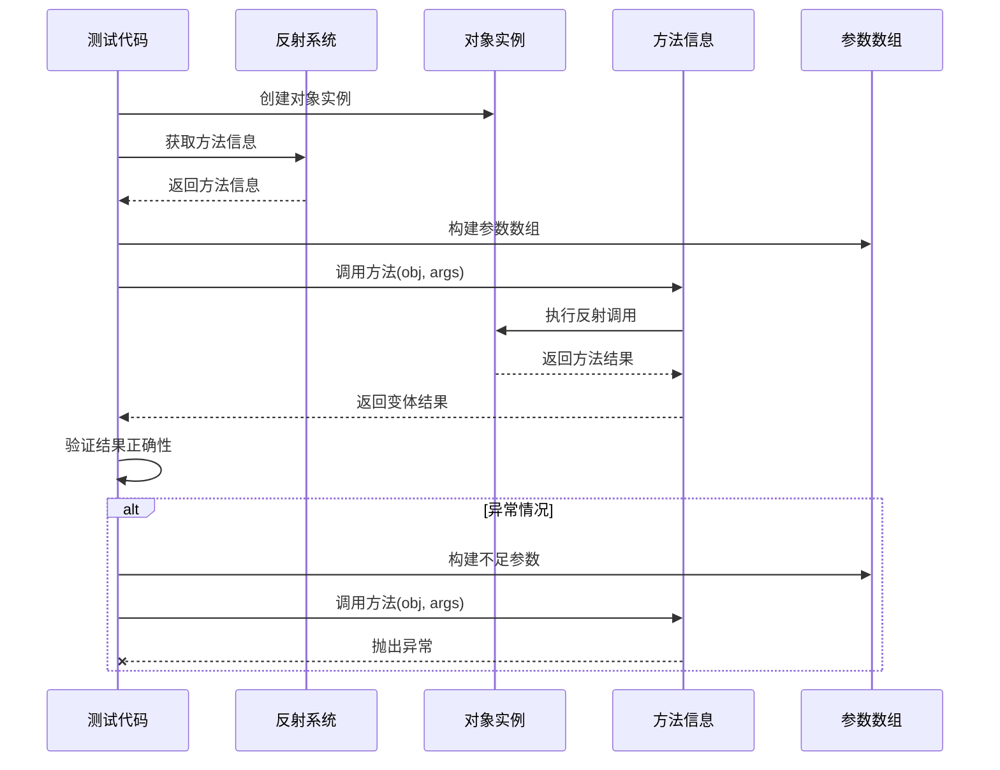

#### 测试场景
1. **精确参数方法调用** (`ExactArgsMethodCall`)
   - 手动获取方法信息并调用
   - 参数不足异常测试

2. **字符串参数方法调用** (`StringArgsMethodCall`)
   - 包含字符串参数的方法调用
   - 参数不足异常测试

3. **简单方法调用** (`SimpleMethodCall`)
   - 无参数和单参数方法调用

4. **三参数方法调用** (`ThreeArgsMethodCall`)
   - 包含多个参数的方法调用
   
5. **便捷函数调用** (`InvokeMethodCall`)
   - 使用`mc::reflect::invoke`简化方法调用
   - 各种参数组合测试
   - 异常处理测试

### 3.3 嵌套对象反射测试 (test_nested_reflect.cpp)

#### 测试目标
验证复杂嵌套对象的反射、序列化和反序列化。

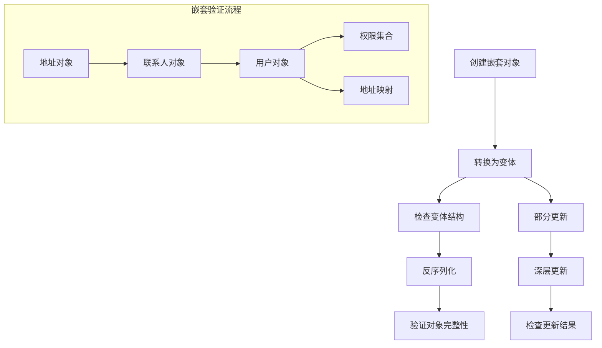

#### 测试场景
1. **嵌套类反射** (`NestedClassReflection`)
   - 对象嵌套对象的序列化
   - 嵌套对象的字段访问
   - 嵌套对象的完整反序列化

2. **嵌套枚举反射** (`NestedEnumReflection`)
   - 包含枚举成员的对象序列化
   - 枚举数组的序列化和反序列化

3. **部分嵌套更新** (`PartialNestedUpdate`)
   - 嵌套对象的部分字段更新
   - 嵌套层级的部分更新

4. **复杂嵌套序列化** (`ComplexNestedSerialization`)
   - 包含多层嵌套和各种容器的对象
   - 深度嵌套对象的序列化和反序列化

5. **动态嵌套修改** (`DynamicNestedModification`)
   - 通过变体API动态修改嵌套对象
   - 修改后的对象反序列化

6. **嵌套容器** (`NestedCollections`)
   - 各种STL容器的嵌套
   - 容器内嵌套对象的序列化和反序列化

### 3.4 自定义名称反射测试 (test_reflect_custom_name.cpp)

#### 测试目标
验证MC_REFLECT宏支持自定义成员名称的功能。

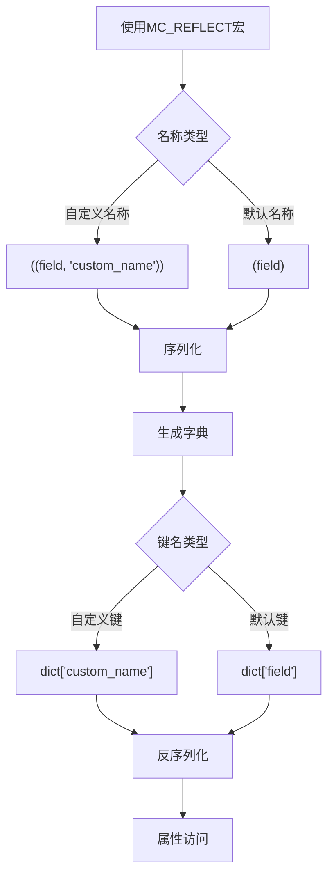

#### 测试场景
1. **自定义名称测试** (`custom_name`)
   - 全部使用自定义名称的类
   - 序列化后字典使用自定义键名
   - 通过自定义键名反序列化

2. **混合名称测试** (`mixed_names`)
   - 同时使用默认名称和自定义名称
   - 序列化和反序列化验证
   - 访问器使用正确的名称

3. **反射工具函数测试** (`reflection_utils`)
   - 类型名称获取
   - 类型反射检查
   - 枚举类型检查

### 3.5 自定义成员信息提取测试 (test_custom_member_info.cpp)

#### 测试目标
验证反射系统对自定义成员类型的支持。

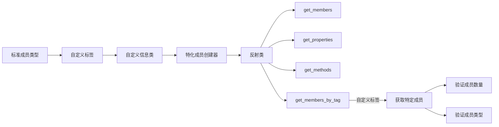

#### 测试场景
1. **信号成员信息测试** (`SignalMemberInfo`)
   - 自定义标签类型定义
   - 自定义信号成员信息类
   - 特化成员信息创建器
   - 使用自定义标签获取特定成员
   - 验证成员数量和类型

### 3.6 静态类型信息测试 (test_reflect_static_info.cpp)

#### 测试目标
验证反射系统的静态类型信息功能，包括成员指针查找和属性操作。

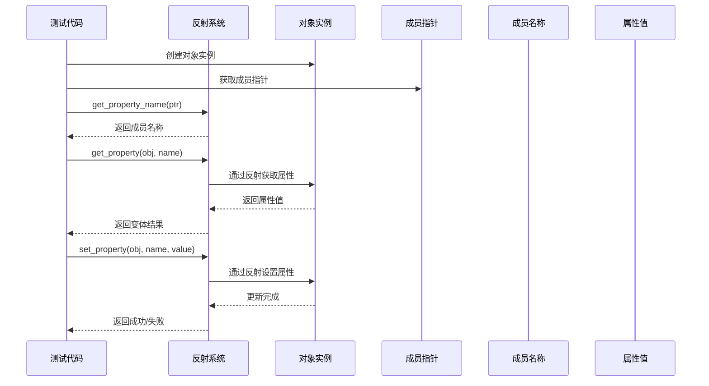

#### 测试场景
1. **成员名称获取** (`GetMemberName`)
   - 通过成员指针获取名称
   - 自定义名称的正确获取

2. **成员指针到值访问** (`MemberPtrToValueAccess`)
   - 通过成员指针找到名称
   - 通过名称获取值

3. **通过成员指针设置值** (`SetValueByMemberPtr`)
   - 获取成员名称
   - 通过名称设置值

4. **属性获取** (`GetProperty`)
   - 通过名称直接获取属性值
   - 获取不存在属性的处理
   - 使用自定义名称获取值

5. **属性设置** (`SetProperty`)
   - 通过名称设置属性值
   - 设置不存在属性的处理
   - 类型不匹配的处理
   - 使用自定义名称设置值

6. **组合属性访问** (`CombinedPropertyAccess`)
   - 综合使用get_property和set_property
   - 在对象间复制属性值

## 4. 测试设计原则

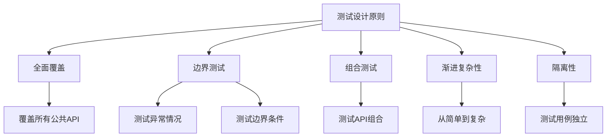

1. **全面覆盖**：测试所有反射系统的公共API
2. **边界测试**：测试异常情况和边界条件
3. **组合测试**：测试API组合使用的场景
4. **渐进复杂性**：从简单场景到复杂场景逐步测试
5. **隔离性**：每个测试用例独立，不依赖其他测试的状态

## 5. 使用示例

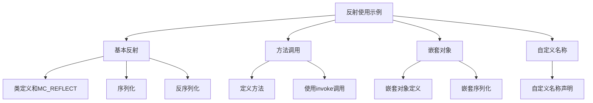

### 基本反射示例
```cpp
// 定义一个简单类
class Person {
public:
    std::string name;
    int age;
};
MC_REFLECT(Person, (name)(age))

// 使用反射进行序列化
Person p{"张三", 30};
mc::variant var(p);

// 反序列化
Person p2 = var.as<Person>();
```

### 方法调用示例
```cpp
class Calculator {
public:
    int add(int a, int b) { return a + b; }
};
MC_REFLECT(Calculator, (add))

// 使用反射调用方法
Calculator calc;
mc::variant result = mc::reflect::invoke(calc, "add", {5, 3});
```

### 嵌套对象示例
```cpp
class Address {
    std::string city;
    std::string street;
};
MC_REFLECT(Address, (city)(street))

class User {
    std::string name;
    Address address;
};
MC_REFLECT(User, (name)(address))

// 序列化嵌套对象
User user{"张三", {"北京", "中关村"}};
mc::variant var(user);
```

### 自定义名称示例
```cpp
class Product {
    int id;
    std::string name;
    double price;
};
MC_REFLECT(Product, ((id, "产品ID"))((name, "产品名称"))((price, "价格")))
```

## 6. 测试场景完整性审视

通过对已有测试用例的分析，目前已经覆盖了MC++反射系统的大部分基础功能。但仍有一些场景值得补充测试，以确保反射系统的全面性和健壮性。

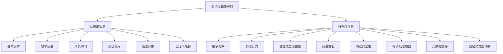

### 6.1 继承关系测试

目前的测试用例主要针对单一类型的反射，缺少对类继承关系的测试。

#### 测试目标
验证反射系统对类继承层次结构的支持，包括基类成员在派生类中的访问。

#### 测试场景设计
1. **基类反射** (`InheritanceBaseClass`)
   - 基类定义与反射
   - 基类成员访问

2. **派生类反射** (`InheritanceDerivedClass`)
   - 派生类定义与反射（只声明派生类自己的成员）
   - 通过派生类实例访问基类成员
   - 验证基类和派生类成员都能正确反射

3. **多层继承** (`MultiLevelInheritance`)
   - 构建三层继承结构
   - 验证所有层级的成员都能被访问

#### 示例代码
```cpp
// 基类
class Animal {
public:
    std::string species;
    int age;
};
MC_REFLECT(Animal, (species)(age))

// 派生类
class Dog : public Animal {
public:
    std::string breed;
    bool is_trained;
};
MC_REFLECT(Dog, (breed)(is_trained))

// 测试代码
TEST(InheritanceTest, DerivedClassReflection) {
    Dog dog;
    dog.species = "犬科";  // 基类成员
    dog.age = 3;          // 基类成员 
    dog.breed = "金毛";    // 派生类成员
    dog.is_trained = true; // 派生类成员
    
    // 序列化
    mc::variant var(dog);
    
    // 检查变体内容
    ASSERT_TRUE(var.is_dict());
    const mc::dict& d = var.as<mc::dict>();
    
    // 验证基类和派生类成员是否都存在
    // 可能需要不同的实现策略来处理继承关系
}
```

### 6.2 多态行为测试

#### 测试目标
验证通过基类指针/引用访问派生类对象的反射功能。

#### 测试场景设计
1. **基类指针反射** (`PolymorphicReflection`)
   - 通过基类指针指向派生类对象
   - 测试如何正确识别和反射实际对象类型

2. **虚函数反射** (`VirtualMethodReflection`)
   - 测试虚函数的反射调用
   - 验证多态调用的正确行为

#### 示例代码
```cpp
class Shape {
public:
    virtual std::string type() const { return "Shape"; }
    virtual double area() const { return 0.0; }
    virtual ~Shape() {}
};
MC_REFLECT(Shape, (type)(area))

class Circle : public Shape {
public:
    double radius;
    Circle(double r) : radius(r) {}
    std::string type() const override { return "Circle"; }
    double area() const override { return 3.14159 * radius * radius; }
};
MC_REFLECT(Circle, (radius)(type)(area))

// 测试代码
TEST(PolymorphismTest, PolymorphicReflection) {
    std::unique_ptr<Shape> shape = std::make_unique<Circle>(5.0);
    
    // 通过基类指针获取类型
    // 如何正确识别这是一个Circle对象？
    
    // 通过反射调用虚函数
    mc::variant result = mc::reflect::invoke(*shape, "area");
    // 应该得到Circle的面积，而不是Shape的面积
}
```

### 6.3 容器类型完整性测试

#### 测试目标
全面测试反射系统对各种STL容器的支持。

#### 测试场景设计
1. **序列容器测试** (`SequenceContainers`)
   - vector, list, deque, array等序列容器
   - 序列化和反序列化验证

2. **关联容器测试** (`AssociativeContainers`) 
   - map, set, unordered_map, unordered_set等关联容器
   - 序列化和反序列化验证

3. **适配器容器测试** (`ContainerAdapters`)
   - stack, queue, priority_queue等适配器
   - 序列化和反序列化验证

4. **智能指针测试** (`SmartPointers`)
   - unique_ptr, shared_ptr等智能指针
   - 特别关注所有权和生命周期

#### 示例代码
```cpp
struct ContainerTest {
    std::vector<int> vec;
    std::list<std::string> list;
    std::map<std::string, int> map;
    std::unordered_set<int> set;
    std::array<double, 3> arr;
    std::shared_ptr<std::string> shared;
    std::unique_ptr<int> unique;
    // 其他容器...
};
MC_REFLECT(ContainerTest, 
    (vec)(list)(map)(set)(arr)(shared)(unique))
```

### 6.4 反射性能测试

#### 测试目标
评估反射操作的性能开销，特别是与直接访问相比的性能差异。

#### 测试场景设计
1. **序列化性能** (`SerializationPerformance`)
   - 不同大小和复杂度对象的序列化性能
   - 与手写序列化代码的对比

2. **反序列化性能** (`DeserializationPerformance`)
   - 不同大小和复杂度数据的反序列化性能
   - 与手写反序列化代码的对比

3. **反射调用性能** (`ReflectionCallPerformance`) 
   - 反射方法调用与直接调用的性能对比
   - 不同参数数量和类型的影响

#### 示例代码
```cpp
// 性能测试用例
TEST(PerformanceTest, SerializationPerformance) {
    // 创建大量测试对象
    std::vector<LargeObject> objects(10000);
    
    // 反射序列化
    auto start_time = std::chrono::high_resolution_clock::now();
    for (const auto& obj : objects) {
        mc::variant var(obj);
    }
    auto end_time = std::chrono::high_resolution_clock::now();
    auto reflect_duration = std::chrono::duration_cast<std::chrono::microseconds>(
        end_time - start_time).count();
    
    // 手动序列化
    start_time = std::chrono::high_resolution_clock::now();
    for (const auto& obj : objects) {
        manual_serialize(obj);
    }
    end_time = std::chrono::high_resolution_clock::now();
    auto manual_duration = std::chrono::duration_cast<std::chrono::microseconds>(
        end_time - start_time).count();
    
    // 比较性能差异
    std::cout << "反射序列化时间: " << reflect_duration << "μs\n";
    std::cout << "手动序列化时间: " << manual_duration << "μs\n";
}
```

### 6.5 线程安全性测试

#### 测试目标
验证反射系统在多线程环境下的正确性和安全性。

#### 测试场景设计
1. **并发访问** (`ConcurrentAccess`)
   - 多线程同时访问同一对象的反射信息
   - 验证数据一致性

2. **并发修改** (`ConcurrentModification`)
   - 多线程同时修改对象属性
   - 验证线程安全

3. **元数据并发** (`MetadataConcurrency`)
   - 多线程同时访问反射元数据
   - 验证元数据缓存的线程安全

#### 示例代码
```cpp
TEST(ThreadSafetyTest, ConcurrentAccess) {
    // 共享对象
    SharedObject obj;
    
    // 创建多个线程同时访问对象
    std::vector<std::thread> threads;
    for (int i = 0; i < 10; ++i) {
        threads.emplace_back([&obj, i]() {
            // 每个线程执行不同的反射操作
            if (i % 3 == 0) {
                // 读取属性
                mc::variant value = mc::reflect::get_property(obj, "property");
            } else if (i % 3 == 1) {
                // 设置属性
                mc::reflect::set_property(obj, "property", i);
            } else {
                // 调用方法
                mc::reflect::invoke(obj, "method", {i});
            }
        });
    }
    
    // 等待所有线程完成
    for (auto& thread : threads) {
        thread.join();
    }
    
    // 验证对象状态的正确性
}
```

### 6.6 错误处理加强测试

#### 测试目标
全面测试反射系统的异常处理和错误恢复能力。

#### 测试场景设计
1. **无效类型测试** (`InvalidTypeHandling`)
   - 反射不支持的类型
   - 验证正确的异常抛出

2. **无效成员测试** (`InvalidMemberHandling`)
   - 访问不存在的属性或方法
   - 验证错误处理机制

3. **类型转换错误** (`TypeConversionErrors`)
   - 不兼容类型之间的转换
   - 验证异常信息的准确性

4. **方法调用错误** (`MethodCallErrors`)
   - 参数数量或类型不匹配
   - 异常传播机制

#### 示例代码
```cpp
TEST(ErrorHandlingTest, InvalidMemberHandling) {
    TestObject obj;
    
    // 测试访问不存在的属性
    EXPECT_THROW({
        mc::variant value = mc::reflect::get_property(obj, "non_existent_property");
    }, mc::reflect::property_not_found_exception);
    
    // 测试调用不存在的方法
    EXPECT_THROW({
        mc::reflect::invoke(obj, "non_existent_method", {});
    }, mc::reflect::method_not_found_exception);
    
    // 验证异常包含有用的错误信息
    try {
        mc::reflect::invoke(obj, "method", {1, 2, 3}); // 参数过多
    } catch (const mc::reflect::bad_function_call_exception& e) {
        std::string error_msg = e.what();
        EXPECT_TRUE(error_msg.find("参数数量") != std::string::npos);
    }
}
```

### 6.7 反射元数据缓存测试

#### 测试目标
验证反射系统的元数据缓存机制的正确性和性能优化效果。

#### 测试场景设计
1. **缓存命中测试** (`CacheHitTest`)
   - 重复访问同一类型的反射信息
   - 验证缓存命中提升性能

2. **缓存策略测试** (`CacheStrategyTest`)
   - 测试缓存的内存占用
   - 测试缓存淘汰策略（如果有）

#### 示例代码
```cpp
TEST(ReflectionCacheTest, CacheHitTest) {
    // 首次访问（缓存未命中）
    auto start_time = std::chrono::high_resolution_clock::now();
    auto property_info1 = mc::reflect::get_property_info<TestObject>("property");
    auto first_access_time = std::chrono::duration_cast<std::chrono::nanoseconds>(
        std::chrono::high_resolution_clock::now() - start_time).count();
    
    // 再次访问（应该命中缓存）
    start_time = std::chrono::high_resolution_clock::now();
    auto property_info2 = mc::reflect::get_property_info<TestObject>("property");
    auto second_access_time = std::chrono::duration_cast<std::chrono::nanoseconds>(
        std::chrono::high_resolution_clock::now() - start_time).count();
    
    // 缓存命中应该明显更快
    EXPECT_LT(second_access_time, first_access_time);
    
    // 验证两次获取的是同一个实例
    EXPECT_EQ(property_info1, property_info2);
}
```

### 6.8 自定义类型转换测试

#### 测试目标
验证反射系统对自定义类型转换的支持。

#### 测试场景设计
1. **基本转换测试** (`BasicConversionTest`)
   - 基本类型之间的转换（如int到double）
   - 字符串与数值类型的转换

2. **自定义转换函数** (`CustomConversionFunctions`)
   - 定义特殊类型的to_variant和from_variant函数
   - 验证转换正确性

3. **复杂类型转换** (`ComplexTypeConversion`)
   - 不同复杂类型之间的转换
   - 处理不完全匹配的结构

#### 示例代码
```cpp
// 自定义类型
struct CustomType {
    int value;
};

// 自定义转换函数
namespace mc {
namespace reflect {
    void to_variant(const CustomType& obj, variant& var) {
        var = obj.value * 2; // 特殊转换规则
    }
    
    void from_variant(const variant& var, CustomType& obj) {
        obj.value = var.as<int>() / 2; // 反向转换
    }
}
}

TEST(CustomConversionTest, CustomTypeConversion) {
    CustomType obj{10};
    
    // 序列化
    mc::variant var(obj);
    EXPECT_EQ(var, 20); // 应用了特殊转换规则
    
    // 反序列化
    CustomType obj2 = var.as<CustomType>();
    EXPECT_EQ(obj2.value, 10);
}
```

这些补充测试场景将帮助确保MC++反射系统在各种复杂应用场景中的稳定性和正确性，特别是对于边界情况和高级功能的测试，将进一步提升系统的健壮性。
